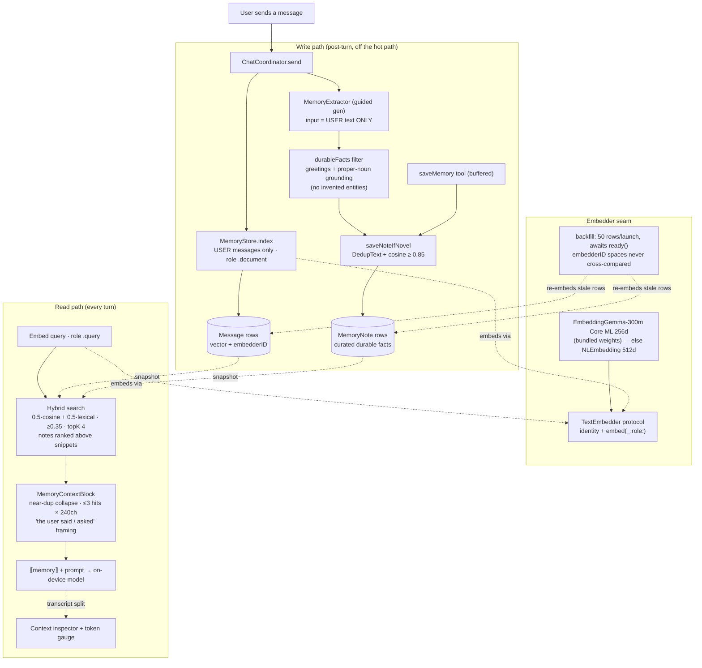

# 🔥 Ember

**A privacy-first, fully on-device AI chat app built on Apple's Foundation Models framework — with the model's working memory made visible.**

Ember runs entirely on-device (no servers, no network, no API keys). It feels like Claude/Codex — a conversation sidebar, streaming message bubbles, a clean composer — but adds a distinctive **transparency layer**: because the on-device model has a hard **4,096-token context window**, Ember makes that working memory *inspectable*. A **Context** view shows the exact prompt the model sees (instructions, tools, tool calls/outputs, retrieved memories); a **Tokens** gauge shows how much of the window is used, broken down line by line.

- **Platforms:** iOS 26 · iPadOS 26 · macOS 26 (Apple-Intelligence-capable devices)
- **Stack:** SwiftUI · MVVM + `@Observable` · SwiftData · FoundationModels · NaturalLanguage · Tuist · Swift Testing
- **No external runtime dependencies. No network entitlement.**

| Streaming chat + token gauge | Conversation memory (RAG) | Token budget inspector |
|---|---|---|
|  |  |  |

---

## ✨ Features

**Chat & UX**
- Streaming responses (cumulative snapshots → a single growing bubble), Stop to cancel, `isResponding` send-guard.
- Adaptive `NavigationSplitView` (sidebar + chat) with a right-hand `[Context | Tokens]` inspector and a toolbar token gauge.
- Markdown rendering in assistant bubbles (prose + fenced code blocks), via native `AttributedString`.
- Availability gating with a tailored screen per unavailable reason (device not eligible / Apple Intelligence off / model not ready), live re-checks, and a Settings deep-link.
- Persisted multi-conversation history (SwiftData), rename, and full-text search across titles + messages.

**Transparency**
- **Context inspector** renders the *literal* `session.transcript` — instructions, user/assistant turns, and every `TOOL CALL` / `TOOL OUTPUT` with formatted JSON args.
- **Tokens** tab: live gauge, per-line breakdown (instructions, each tool definition, each turn, tool usage), green/amber/red zones, "reserved for reply", and honest **exact (26.4+) vs estimated** labeling.

**On-device intelligence**
- **Tool calling** — three pure, on-device tools (`currentDateTime`, `calculator`, `unitConverter`) built on the FoundationModels `Tool` protocol with `@Generable`/`@Guide` arguments. No network, no permissions.
- **Guided generation** — model-generated conversation titles (`respond(to:generating:)`), with a deterministic fallback.
- **Conversation memory (RAG)** — **automatic** retrieve-before-generate: every turn embeds the prompt and injects the top-k relevant snippets from *past conversations* (on-device `NLEmbedding` cosine) into what the model sees, so recall no longer depends on the model choosing a tool. **Curated fact-notes are ranked above raw conversation snippets** (`search(preferNotes:)`), so durable facts aren't buried by near-identical past *questions* — which embed almost identically to each other. The `searchMemory` tool is retained as a fallback, and a `saveMemory` write tool lets the model deliberately persist curated facts. The app also **automatically extracts durable user facts after each turn** (guided generation, third-person, with greeting/assistant-chatter filtering) and stores them as deduped curated notes (`saveNoteIfNovel`: normalized-text, substring-containment, and cosine near-duplicate checks), so recall rides the reliable curated-note path rather than weak message embeddings (gated by `autoExtractMemories`). Every retrieved memory is visible in the inspector (teal **MEMORY**) and counted in the budget.
- **Advanced budgeting** — model-summarized context compaction (with a deterministic keep-first-last fallback) and reserve-for-reply: Ember compacts *proactively* before a turn would overflow, so replies always have headroom.
- **Resilient generation** — transient on-device runtime failures (e.g. an internal `com.apple.tokengeneration` error, distinct from context overflow) are detected and **retried once** before surfacing a friendly, recoverable banner instead of a raw `NSError`. An opt-in `os.Logger` diagnostic layer (`EmberLog`) traces every memory/RAG boundary for on-device debugging.

**Embeddings**
- **EmbeddingGemma-300m on Core ML** — a 256-dim Matryoshka-truncated on-device embedding model with role-aware query/document task prefixes, implemented behind the same `TextEmbedder` protocol seam as the `NLEmbedding` fallback. Weights are dev-fetched once per machine via `scripts/fetch_embeddinggemma.sh` (requires `pip install sentence-transformers coremltools torch numpy`, `huggingface-cli login`, and accepting the Gemma license) and land in a gitignored `Targets/Ember/Resources/Models/` directory — **never committed**. Contributors and CI without the weights build and run unmodified on the `NLEmbedding` fallback (`EmberApp.makeEmbedder()` picks whichever is bundled, and logs which one it chose).
- **Dependency caveat, stated plainly:** only the tokenizer is used, but `swift-transformers` vends a single umbrella `Transformers` library product (there is no narrower `Tokenizers` product to depend on), so the build transitively links a **dormant Hugging Face Hub client**. Nothing at runtime reaches it — the tokenizer is loaded from a local folder via `AutoTokenizer.from(modelFolder:)` — and the app declares no network entitlement, but the code is linked into the binary.
- Vectors are versioned by `embedderID` on `Message`/`MemoryNote` rows (`nil` = legacy NLEmbedding); different embedding spaces are never cross-compared, and a chunked background migration (`MemoryStore.backfill(chunkSize:)`) re-embeds stale rows on launch.
- **License:** the [Gemma Terms of Use](https://ai.google.dev/gemma/terms) require any distributed build that bundles the weights to flow down Google's [Prohibited Use Policy](https://ai.google.dev/gemma/prohibited_use_policy) in the app's own terms of use.

---

## 🧱 Architecture

Two Tuist targets. **All decision logic lives in the framework, behind a protocol seam**, so it's unit-testable with a mock on any machine — no Apple-Intelligence device required. The app target is a thin SwiftUI binding layer.

### How memory works

Editable diagram: [`docs/diagrams/ember-memory-architecture.excalidraw`](docs/diagrams/ember-memory-architecture.excalidraw) (open with [excalidraw.com](https://excalidraw.com) or the VS Code extension). Same flow inline:



```
┌──────────────────────── Ember (app, SwiftUI) ─────────────────────────┐
│  RootView (availability gate)                                          │
│   ├─ UnavailableView(reason)                                           │
│   └─ ChatScene ── NavigationSplitView ─┬─ ConversationListView (search,│
│                                        │   rename, new chat)           │
│                                        ├─ ChatView (MarkdownText        │
│                                        │   bubbles + ComposerView)      │
│                                        └─ .inspector → [Context|Tokens] │
└───────────────────────────────────────┬───────────────────────────────┘
                                         │ depends on
┌──────────────── FoundationChatKit (framework, no UI) ──────────────────┐
│  ChatCoordinator (@Observable @MainActor)  ── owns store + engine       │
│  ConversationEngine (@Observable)          turn lifecycle, budgeting    │
│  ChatModelProvider / ChatSessionHandle  ┐  the seam                     │
│     ├─ FoundationModelProvider (real)   ┘  wraps SystemLanguageModel    │
│     └─ MockModelProvider (tests)                                        │
│  Tools: Calculator/DateTime/UnitConverter/MemorySearch/SaveMemory       │
│  Memory: TextEmbedder · MemoryStore · MemoryContextBlock · MemoryNote   │
│          MemoryWriteBuffer · auto-retrieval seam · ContextCompactor      │
│  Tokens: TokenEstimator · TokenBudgetCalculator · TokenBudget           │
│  Context: ContextProjection · OverflowRecovery                          │
│  Persistence: Conversation · Message · ConversationStore (SwiftData)    │
└──────────────────────── depends only on: Apple frameworks ─────────────┘
```

**Key patterns:** MVVM + `@Observable`; dependency injection via protocols; **dual-truth persistence** (durable `Message` rows are the display source of truth; an encoded `Transcript` is a best-effort fast-resume cache); tools are pure `Sendable` `Tool` conformances; memory search runs over an immutable per-session snapshot so the tool stays pure.

---

## 📁 Project structure

```
AppleFoundationModels/
├── Project.swift            # Tuist project (targets, destinations, bundle ids)
├── Tuist.swift
├── CLAUDE.md                # Claude Code project guide (build/conventions/skills index)
├── CONTRIBUTING.md          # how to build, test, and submit changes
├── LICENSE                  # MIT
├── README.md
├── Targets/
│   ├── FoundationChatKit/   # framework: all logic + tests (Sources/, Tests/)
│   └── Ember/               # SwiftUI app (Sources/, Resources/)
├── docs/
│   ├── superpowers/
│   │   ├── specs/           # one design spec per phase
│   │   └── plans/           # one task-by-task implementation plan per phase
│   └── screenshots/
└── .claude/
    └── skills/              # reusable iOS/SwiftUI/Foundation-Models skills
```

---

## 🛠 Requirements

- **macOS 26 (Tahoe)** + **Xcode 26.x** (built against the 26.4 SDK so `contextSize`/`tokenCount(for:)` resolve).
- **[Tuist](https://docs.tuist.dev)** (`tuist generate` to produce the Xcode project).
- To run the real on-device model: an **Apple-Intelligence-capable device** (or the iOS 26 simulator, where the model is available) with **Apple Intelligence enabled**. The app degrades gracefully to a tailored "unavailable" screen otherwise.

## ▶️ Build & run

```bash
git clone https://github.com/Vvlladd/Ember.git
cd Ember
tuist generate            # creates Ember.xcworkspace
open Ember.xcworkspace    # ⌘R the "Ember" scheme (macOS or an iOS 26 simulator)
```

Or from the command line:

```bash
xcodebuild -workspace Ember.xcworkspace -scheme Ember \
  -destination 'platform=iOS Simulator,name=iPhone 17 Pro' build
```

### Optional: enable the EmbeddingGemma embedder

Without this, the app runs on the `NLEmbedding` fallback (fully functional, weaker semantic recall). One-time setup per machine:

```bash
# 1. Python deps for the conversion script
pip3 install sentence-transformers coremltools torch numpy

# 2. Hugging Face auth + Gemma license (both one-time)
huggingface-cli login     # token from huggingface.co/settings/tokens
# then accept the license at https://huggingface.co/google/embeddinggemma-300m

# 3. Fetch + convert to Core ML (writes to gitignored Targets/Ember/Resources/Models/;
#    must end with a parity check printing "OK")
./scripts/fetch_embeddinggemma.sh

# 4. Regenerate so the weights are bundled, then rebuild
tuist generate --no-open
```

On the next run, Console (subsystem `com.ember.FoundationChatKit`, category `embed`) logs `GemmaTextEmbedder ready (dim=256)`; new messages embed with Gemma and the existing store migrates automatically (50 rows per launch — old NLEmbedding vectors are never compared against Gemma vectors). Verify quality with the real-model ship gate:

```bash
TEST_RUNNER_EMBER_GEMMA_MODEL_DIR="$PWD/Targets/Ember/Resources/Models" \
xcodebuild -workspace Ember.xcworkspace -scheme FoundationChatKit \
  -destination 'platform=macOS' test 2>&1 | tail -20
```

The gate (`gemmaBeatsNLOnFixtures`) passes only if EmbeddingGemma beats NLEmbedding on the retrieval-fixture eval with a 0.75 recall floor. Notes: the app bundle grows ~200 MB with the weights, embedding currently runs on the main actor (async inference is a tracked follow-up), and any distributed build containing the weights must flow down the Gemma Prohibited Use Policy (see Embeddings above).

## ✅ Testing

All logic is TDD-covered in the framework (258 tests):

```bash
xcodebuild -workspace Ember.xcworkspace -scheme FoundationChatKit \
  -destination 'platform=macOS' test 2>&1 | tail -20    # ** TEST SUCCEEDED **
```

The `MockModelProvider`/`MockEmbedder` doubles mean the entire engine, tools, memory, budgeting, and compaction logic run green without an Apple-Intelligence device.

---

## 🗺 Roadmap status — **Phases 1–6 complete**

| Phase | Theme | Status |
|------|-------|--------|
| **1** | Streaming chat · availability gating · token gauge · Context inspector · persisted history · overflow recovery | ✅ Built |
| **2** | Tool calling (`Tool` + `@Generable`/`@Guide`) · guided/structured generation | ✅ Built |
| **3** | RAG (on-device conversation memory) · advanced budgeting (model-summarized compaction, reserve-for-reply) | ✅ Built |
| **4** | Memory upgrades — **automatic** retrieve-before-generate · embedder/snapshot caching · model-decided saves (`saveMemory`) | ✅ Built |
| **5** | Proactive memory — **automatic** post-turn extraction of durable user facts → deduped curated `MemoryNote`s (guided generation; `saveNoteIfNovel`; gated by `autoExtractMemories`) | ✅ Built |
| **6** | Recall & reliability hardening — notes-ranked-above-snippets retrieval (facts no longer buried by past questions), tighter extraction + de-dup, transient generation-error retry, `os.Logger` diagnostics | ✅ Built |

Each phase was developed spec-first (see `docs/superpowers/`) and verified end-to-end on the iOS 26 simulator — including a real on-device tool call (`calculator` → 8,673,516), cross-conversation memory recall (`searchMemory` → "Lisbon"), and a full retrieve → generate → save → de-dup turn traced live through the `EmberLog` diagnostics.

Possible future work (beyond the current roadmap): **hybrid lexical + semantic retrieval** (Plan 8, documented), attachments/images, iCloud/CloudKit sync, multilingual embeddings, and richer compaction strategies.

---

## 🤖 Working in this repo with Claude Code

- **`CLAUDE.md`** documents build/test commands, architecture, and conventions.
- **`.claude/skills/`** holds reusable skills (Foundation Models, SwiftUI, Swift Concurrency, Liquid Glass, performance audit, simulator debugging, GitHub issue flow, App Store changelog). Claude Code auto-discovers them; `CLAUDE.md` indexes when each applies.
- Specs and task-by-task plans for every phase live in `docs/superpowers/`.

---

## 🤝 Contributing

Contributions are welcome! Please read **[CONTRIBUTING.md](CONTRIBUTING.md)** for the build/test workflow, the TDD + granular-commit conventions, and the on-device/privacy constraints (no network, keep all logic behind the framework's protocol seam). In short: `tuist generate` after adding/removing files, and `xcodebuild … -scheme FoundationChatKit … test` must show **TEST SUCCEEDED** before you open a PR.

## 📄 License

Released under the **[MIT License](LICENSE)**. © 2026 Vlad Toma.

---

*Built with [Tuist](https://docs.tuist.dev) and Apple's [Foundation Models](https://developer.apple.com/documentation/foundationmodels) framework. On-device, private, and transparent by design.*
