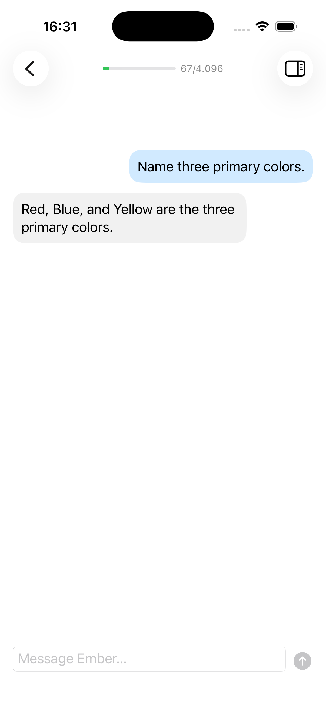
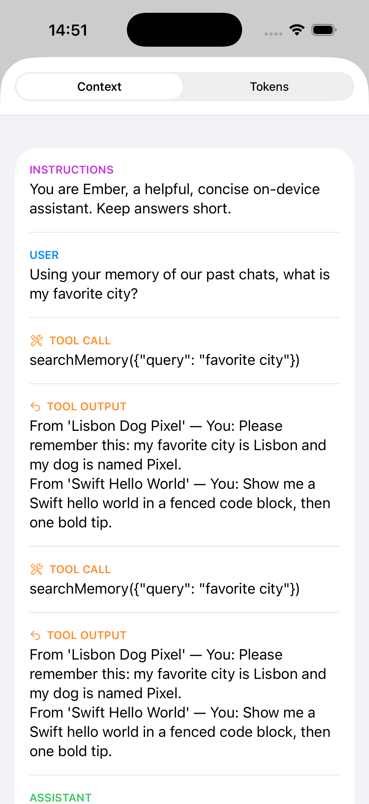
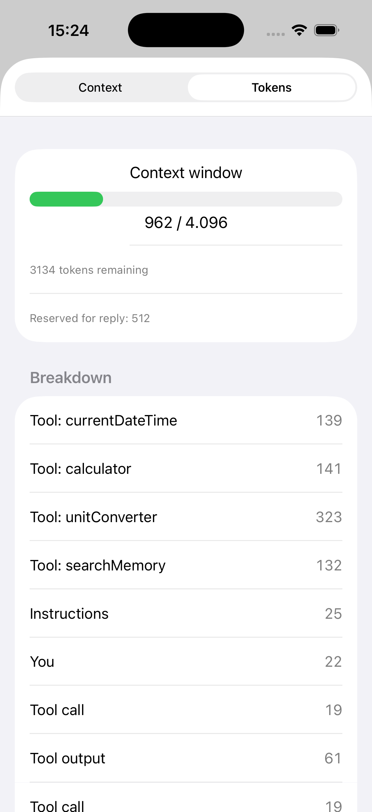
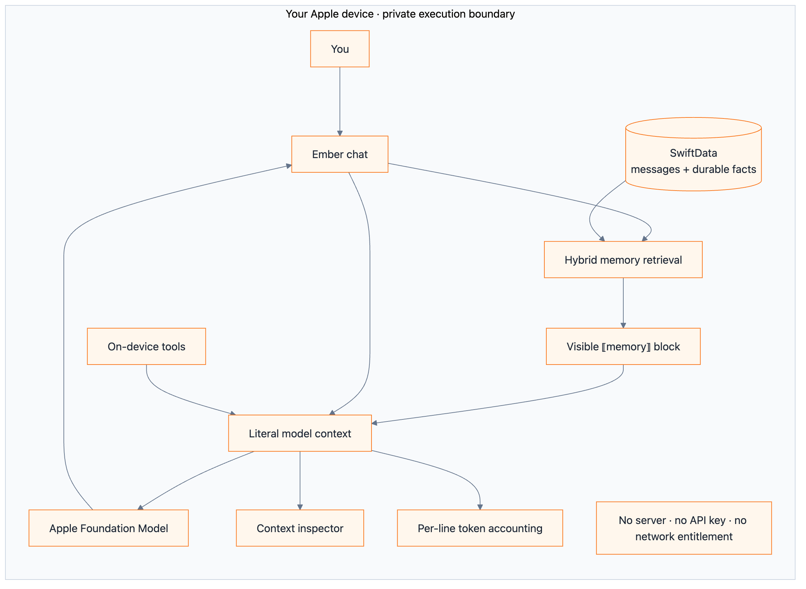
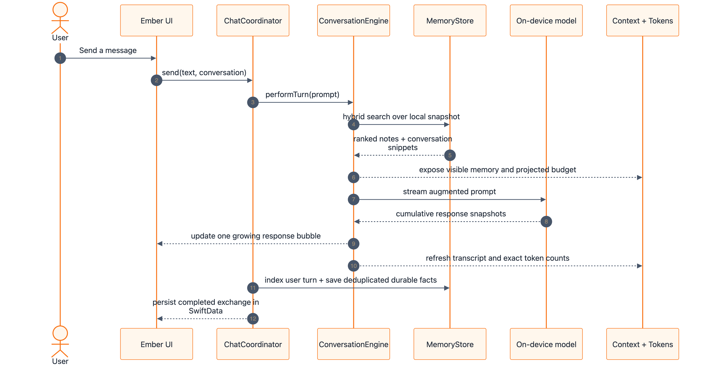
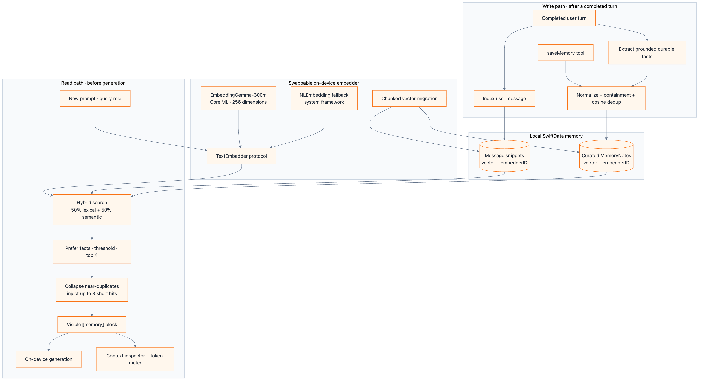
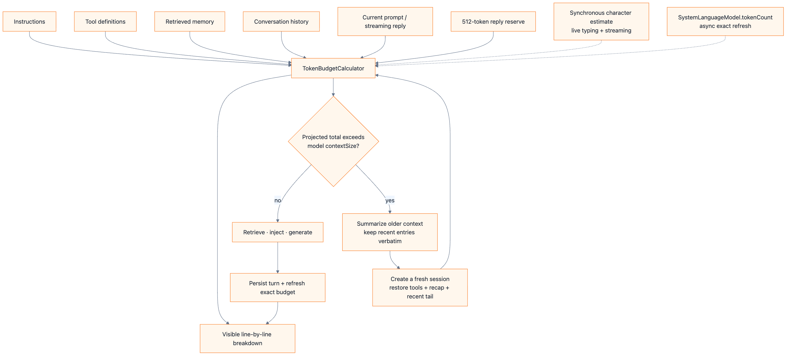
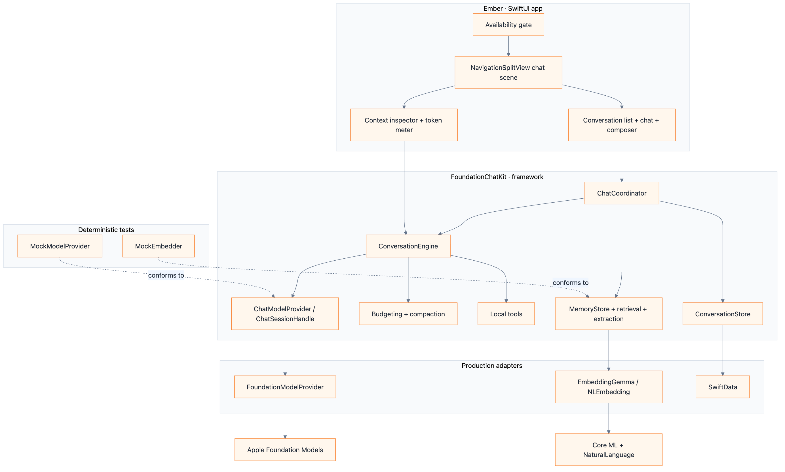

# 🔥 Ember

<p align="center">
  <strong>Private, on-device AI chat for Apple platforms—with inspectable memory and honest token accounting.</strong>
</p>

<p align="center">
  <a href="https://www.swift.org/"></a>
  <a href="https://developer.apple.com/documentation/foundationmodels"></a>
  
  
  <a href="LICENSE"></a>
</p>

Ember is an open-source SwiftUI chat app built on Apple's Foundation Models framework. It keeps generation, retrieval, storage, and tools on the user's device—without a cloud backend, API key, or network entitlement.

The differentiator is visibility. Ember shows the literal context sent to the model, including retrieved memories and tool activity, then accounts for that context line by line against the model's token window.

> [!NOTE]
> Ember is a developer preview for iOS, iPadOS, and macOS 26. Running the real model requires a compatible Apple Intelligence environment.

| Streaming chat | Transparent memory | Token budget inspector |
|---|---|---|
|  |  |  |

## Why Ember?

Most chat apps hide two important decisions: **what the model remembers** and **what consumes its context window**. Ember makes both inspectable.

[](docs/diagrams/rendered/ember-transparency-overview.png)

*Editable sources: [Mermaid](docs/diagrams/mermaid/ember-transparency-overview.mmd) · [Excalidraw app architecture](docs/diagrams/ember-app-architecture.excalidraw)*

### At a glance

| Concern | Ember's approach |
|---|---|
| Generation | Apple's on-device `SystemLanguageModel` with streaming output |
| Memory | Local hybrid lexical + semantic RAG over conversations and curated facts |
| Embeddings | EmbeddingGemma-300m on Core ML when locally bundled; `NLEmbedding` fallback |
| Transparency | The Context inspector renders the effective transcript, memory blocks, tool calls, and outputs |
| Token usage | Live estimates while typing/streaming, followed by asynchronous exact counts when available |
| Persistence | SwiftData rows plus a best-effort encoded transcript for fast resume |
| Networking | No backend and no network entitlement |
| Testability | Model and embedder protocol seams with deterministic test doubles |

## A private turn, end to end

[](docs/diagrams/rendered/ember-turn-lifecycle.png)

*Editable source: [Mermaid](docs/diagrams/mermaid/ember-turn-lifecycle.mmd) · Related: [Excalidraw app architecture](docs/diagrams/ember-app-architecture.excalidraw)*

## Features

### Chat and native UX

- Streaming replies with cancellation and duplicate-send protection.
- Adaptive `NavigationSplitView` for iPhone, iPad, and Mac.
- Persisted conversations with rename and full-text search.
- Markdown rendering using native `AttributedString`.
- Clear availability states when Apple Intelligence or the model is unavailable.

### Transparent context

- The Context inspector projects the effective model transcript.
- Instructions, messages, retrieved memories, tool calls, and tool outputs remain distinguishable.
- Every injected memory is shown as a `MEMORY` entry instead of silently influencing the response.
- Context entries are budgeted once, preventing hidden or double-counted memory cost.

### On-device intelligence

- Pure local tools for date/time, calculation, and unit conversion.
- Guided generation for titles, structured summaries, and durable-fact extraction.
- Automatic retrieve-before-generate memory on every eligible turn.
- Model-decided `saveMemory` plus grounded post-turn fact extraction.
- Proactive context compaction with deterministic fallback behavior.
- One automatic retry for recognized transient generation failures.

## Transparent memory

Ember stores two kinds of recall material: original user messages and concise, durable `MemoryNote` facts. It ranks notes above raw snippets, blends lexical and semantic relevance, collapses near-duplicates, and injects only a small visible memory block.

[](docs/diagrams/rendered/ember-memory-pipeline.png)

*Editable sources: [Mermaid](docs/diagrams/mermaid/ember-memory-pipeline.mmd) · [Excalidraw memory architecture](docs/diagrams/ember-memory-architecture.excalidraw)*

Important invariants are test-pinned:

- Different embedding spaces never mix; comparisons require a matching `embedderID`.
- Extracted facts may not introduce proper nouns absent from the user's text.
- The memory block round-trips into a distinct context entry and is counted exactly once.
- Embedding failure degrades to lexical retrieval instead of breaking chat.

## Honest token accounting

Everything competes for the model's context window: instructions, tool definitions, retrieved memory, conversation history, the new prompt, and room for the answer. The current fallback capacity is 4,096 tokens; Ember reads `contextSize` from the model when available. It uses a fast estimator on the interactive path, refreshes with Apple's asynchronous exact counter after a turn, and compacts before the projected total overflows.

[](docs/diagrams/rendered/ember-token-accounting.png)

*Editable sources: [Mermaid](docs/diagrams/mermaid/ember-token-accounting.mmd) · [Excalidraw context-window architecture](docs/diagrams/ember-context-window.excalidraw)*

The gauge labels estimated and exact states honestly and groups usage into instructions, tools, memory, history, and reserved reply space.

## Architecture

Ember has two Tuist targets. The app target is deliberately thin; decision logic lives in a framework behind protocols so it can be tested without an Apple Intelligence device.

[](docs/diagrams/rendered/ember-system-architecture.png)

*Editable sources: [Mermaid](docs/diagrams/mermaid/ember-system-architecture.mmd) · [Excalidraw app architecture](docs/diagrams/ember-app-architecture.excalidraw)*

See [the full architecture guide](docs/ARCHITECTURE.md) for context-window lifecycle and class-level diagrams. The [diagram asset guide](docs/diagrams/README.md) maps every rendered PNG to its editable Mermaid and Excalidraw source and documents the export command.

## Privacy and dependency notes

Public projects earn trust by being explicit about boundaries:

- Chat generation, retrieval, tools, and persistence run locally. Ember has no server component or network entitlement.
- Conversation data is stored locally in SwiftData. The repository contains no telemetry or analytics integration.
- EmbeddingGemma weights are **not committed**. Contributors fetch them locally and any distribution that bundles them must comply with the [Gemma Terms of Use](https://ai.google.dev/gemma/terms) and [Prohibited Use Policy](https://ai.google.dev/gemma/prohibited_use_policy).
- Ember uses only the local tokenizer API from `swift-transformers`, but that package exposes one umbrella `Transformers` product and therefore links a dormant Hugging Face Hub client. Ember does not call that client and has no network entitlement.
- Developer diagnostics currently write some short user-derived strings to Apple's local Unified Logging with public visibility. Do not share raw logs containing personal data; production distribution should gate or redact this instrumentation.

## Requirements

- macOS 26 and Xcode 26.x with the iOS/macOS 26 SDK.
- [Tuist](https://docs.tuist.dev) for project generation.
- A compatible Apple Intelligence environment to exercise the real model. The test suite uses mocks and does not require one.

## Build

```bash
git clone https://github.com/Vvlladd/Ember.git
cd Ember
tuist generate --no-open
open Ember.xcworkspace
```

Build from the command line:

```bash
xcodebuild -workspace Ember.xcworkspace -scheme Ember \
  -destination 'platform=macOS' build

xcodebuild -workspace Ember.xcworkspace -scheme Ember \
  -destination 'platform=iOS Simulator,name=iPhone 17 Pro' build
```

> [!IMPORTANT]
> Run `tuist generate --no-open` after adding or deleting any source or test file. Tuist resolves source globs during generation.

## Test

All decision logic is covered through `FoundationChatKit` using Swift Testing and deterministic model/embedder doubles:

```bash
xcodebuild -workspace Ember.xcworkspace -scheme FoundationChatKit \
  -destination 'platform=macOS' test 2>&1 | tail -40
```

The required result is `** TEST SUCCEEDED **`. SourceKit diagnostics are unreliable without the generated module graph; `xcodebuild` is the source of truth.

## Optional: EmbeddingGemma

Ember works without downloaded weights by falling back to `NLEmbedding`. To exercise the higher-quality Core ML embedder locally:

```bash
pip3 install sentence-transformers coremltools torch numpy
huggingface-cli login
./scripts/fetch_embeddinggemma.sh
tuist generate --no-open
```

Before running the script, accept the EmbeddingGemma license on its Hugging Face model page. The script writes only to the gitignored `Targets/Ember/Resources/Models/` directory and finishes with a parity check.

Run the real-model retrieval quality gate with:

```bash
TEST_RUNNER_EMBER_GEMMA_MODEL_DIR="$PWD/Targets/Ember/Resources/Models" \
xcodebuild -workspace Ember.xcworkspace -scheme FoundationChatKit \
  -destination 'platform=macOS' test 2>&1 | tail -20
```

## Project layout

```text
Ember/
├── AGENTS.md -> CLAUDE.md      # shared coding-agent guidance
├── CONTRIBUTING.md             # contribution workflow and PR checklist
├── LICENSE                     # MIT license for the source code
├── Project.swift               # Tuist targets and resources
├── Targets/
│   ├── FoundationChatKit/      # engine, memory, tools, persistence, tests
│   └── Ember/                  # SwiftUI app and resources
├── docs/
│   ├── ARCHITECTURE.md         # deeper GitHub-rendered diagrams
│   ├── diagrams/               # rendered PNG + Mermaid/Excalidraw sources
│   └── superpowers/            # feature specs and implementation plans
└── scripts/                    # local model preparation utilities
```

## Project status

Built today:

- Streaming multi-conversation chat and availability gating.
- Literal Context inspector and per-line token budget.
- On-device tools and guided generation.
- Hybrid conversation-memory RAG with automatic fact extraction and deduplication.
- Proactive compaction, overflow recovery, and transient-error retry.
- Optional EmbeddingGemma Core ML embeddings with versioned-vector migration.

Good next contributions include attachments, multilingual retrieval, iCloud/CloudKit sync, richer compaction, moving embedding inference off the main actor, and production-hardening diagnostic privacy.

## Contributing

Contributions are welcome. Start with [CONTRIBUTING.md](CONTRIBUTING.md), which covers the privacy constraints, TDD workflow, build matrix, and pull-request checklist.

For substantial changes, please open an issue first so the design can be agreed before implementation.

## License

Ember's source code is released under the [MIT License](LICENSE), © 2026 Vlad Toma.

EmbeddingGemma model weights are not part of this repository or the MIT-licensed source distribution; their separate terms apply if you fetch or distribute them.

---

Built with [SwiftUI](https://developer.apple.com/xcode/swiftui/), [Foundation Models](https://developer.apple.com/documentation/foundationmodels), and [Tuist](https://tuist.dev/). Ember is an independent project and is not affiliated with Apple, Google, Hugging Face, Anthropic, or OpenAI.
