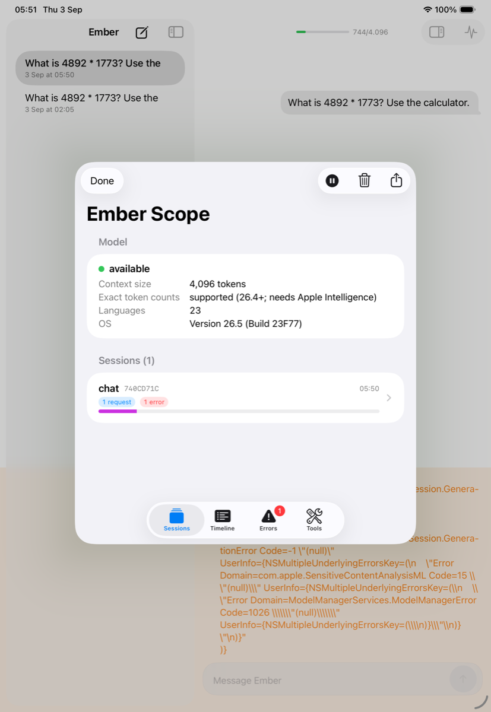
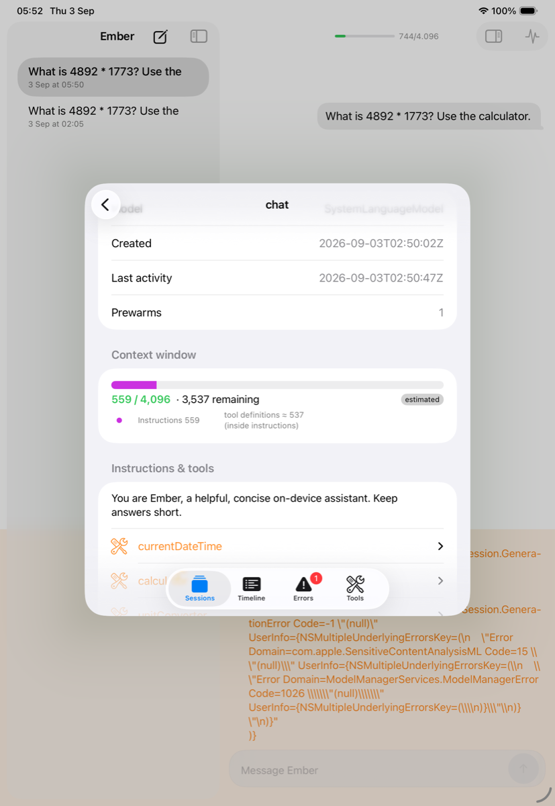
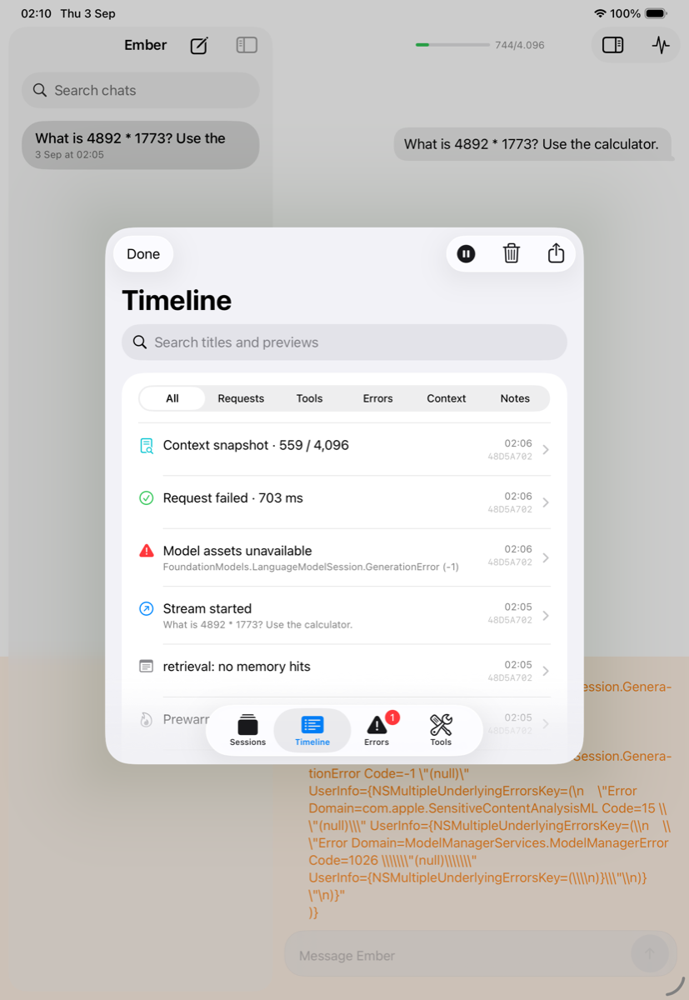
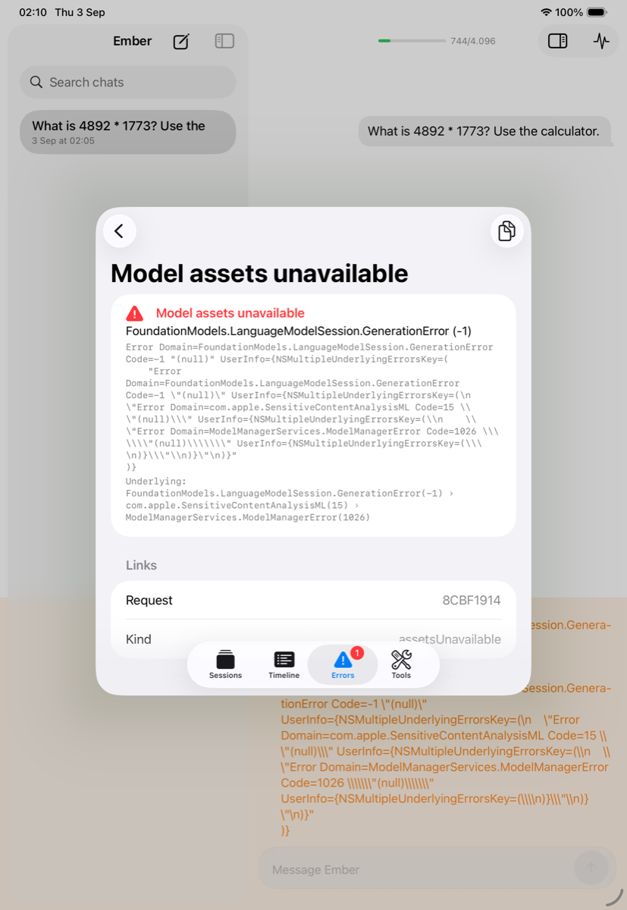
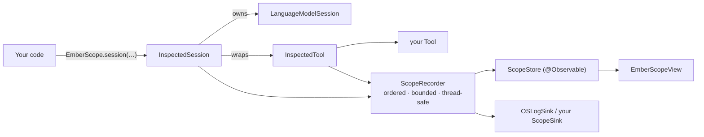

# EmberScope

**An in-app inspector for Apple Foundation Models — netfox for `LanguageModelSession`.**

Shake your phone (or press ⌘⇧E on the Mac) and see every session your app created: the exact context window
the model receives with per-entry token cost against `contextSize`, every `respond` / `streamResponse` with
its options, timing and output, every tool call with arguments and results, and every error with Apple's
`debugDescription`, recovery suggestion and underlying error chain. Everything stays in memory, on device.

> [!NOTE]
> Requires iOS 26 / macOS 26 (the same floor as Foundation Models). Exact token counts need 26.4+ **and**
> Apple Intelligence enabled; otherwise EmberScope shows estimates and labels them as such.

## What it looks like

| Sessions | Session detail |
|---|---|
| [](../../docs/screenshots/emberscope-sessions.png) | [](../../docs/screenshots/emberscope-session-detail.png) |

| Timeline | Error detail |
|---|---|
| [](../../docs/screenshots/emberscope-timeline.png) | [](../../docs/screenshots/emberscope-error-detail.png) |

*Captured on an iPad Pro simulator, which reports the model as available but has no on-device model assets —
which is why the run above ends in a classified `assetsUnavailable` error instead of a reply.*

## Quick start

```swift
import EmberScope

// 1. At launch — DEBUG only, like netfox
#if DEBUG
EmberScope.start()
#endif

// 2. Create sessions through EmberScope — the API mirrors LanguageModelSession
let session = EmberScope.session(tools: [WeatherTool()],
                                 instructions: "You are a concise assistant.",
                                 label: "chat")
let reply = try await session.respond(to: "Weather in Lisbon?")          // LanguageModelSession.Response<String>
for try await snapshot in session.streamResponse(to: "Pack list?") { … } // same Snapshot values as the SDK

// …or wrap a session you already have (tool calls then come from the transcript, not live):
let wrapped = LanguageModelSession(instructions: "…").inspected(label: "title")

// 3. Show it
ContentView().emberScope()                            // shake on iOS; EmberScope.present() from anywhere
WindowGroup { … }.commands { EmberScopeCommands() }   // Debug ▸ Ember Scope  ⌘⇧E
```

That is the whole integration: swap `LanguageModelSession(` for `EmberScope.session(` where you create
sessions, and pass tools there so their calls are timed. Return types are the SDK's own.

## What you see

| Screen | Contents |
|---|---|
| **Sessions** | Model status card (availability, `contextSize`, exact-count support, supported languages, OS). One row per session with request / tool / error counts and a mini context bar. |
| **Session detail** | Context-window bar by entry kind vs `contextSize`, with used / remaining and an *exact* / *estimated* badge · instructions and tool definitions with schema JSON · the transcript entry by entry with token cost · requests (kind, status, duration, time-to-first-token, chunks, guided-generation type) · tool calls · app notes. |
| **Timeline** | Every event in order across sessions, filterable (requests / tools / errors / context / notes) and searchable. Any event opens as raw JSON. |
| **Errors** | Grouped by kind: context window exceeded, model assets unavailable, guardrail violation, unsupported guide, unsupported language or locale, decoding failure, rate limited, concurrent requests, refusal, tool call failed, transient generation failure, cancelled, unknown — each with message, debug description, recovery suggestion, underlying `NSError` chain and a retryable flag. |
| **Tools** | Every tool the model could call: description, whether the schema is injected into the instructions, the JSON schema, call count, failures, mean duration. |
| **Export** | Share a Markdown report or a JSON archive, or copy Markdown from the toolbar. |

## API tour

- `EmberScope.start(configuration:model:)` / `stop()` / `clear()` / `isRecording` / `isActive` / `configuration`
  — `isActive` means *enabled and recording*, and is the gate for anything user-visible.
- `EmberScope.session(model:tools:instructions:label:)` (String and `Instructions` overloads),
  `EmberScope.session(model:tools:transcript:label:)` → `InspectedSession`
- `InspectedSession` — `respond(to:options:)`, `respond(to:generating:includeSchemaInPrompt:options:)`,
  `respond(to:schema:includeSchemaInPrompt:options:)`, the four `streamResponse` overloads,
  `prewarm(promptPrefix:)`, `transcript`, `isResponding`, `logFeedbackAttachment(sentiment:issues:desiredOutput:)`,
  `base` (the SDK session), `snapshotTranscript()`
- `EmberScope.wrap(_:)` / `tool.inspected()` → `InspectedTool` (forwards `name`, `description`, `parameters`,
  `includesSchemaInInstructions`)
- `EmberScope.note("compacted 7 → 3 entries", session: id)` — annotate the timeline from your app
- `EmberScope.present()` / `dismiss()`, `View.emberScope()`, `EmberScopeCommands`, `EmberScopeView`,
  `Notification.Name.emberScopeShake`
- `EmberScope.refreshModelStatus(_:)` — re-capture availability after the user enables Apple Intelligence
- `EmberScope.addSink(_:)` — implement `ScopeSink` to forward events anywhere; `OSLogSink` is built in
  (`log stream --predicate 'subsystem == "dev.iosunpi.emberscope"' --info --debug`)
- `ScopeExport.json(_:)` / `markdown(_:)` / `decode(_:)` over `ScopeArchive(projection: EmberScope.store.projection)`

### Configuration

```swift
EmberScope.start(configuration: ScopeConfiguration(
    isEnabled: true,          // default: true in DEBUG builds of the library, false otherwise
    maxEvents: 2_000,         // ring buffer
    maxSessions: 50,
    captureContent: true,     // false → prompts/outputs/arguments/error strings replaced by a redaction placeholder
    logToOSLog: true,         // metadata only …
    logContent: false,        // … unless you opt in (content is then .public in the unified log)
    streamProgressInterval: .milliseconds(250)))
```

`start()` is idempotent: calling it again replaces the configuration and reconfigures the already-installed
`OSLogSink` via `OSLogSink.update(isEnabled:logContent:)`.

## Privacy

- In memory only. Nothing is written to disk. Export is an explicit share-sheet action.
- `captureContent: false` redacts prompts, outputs, tool arguments, transcript text **and** the free-form
  error strings at record time; kinds, ids, lengths, the retryable flag and the underlying error chain remain.
- **`EmberScope.note(…)` is the one exception: note text is kept verbatim even in metadata-only mode**, because
  notes are developer annotations. Never put user content in a note.
- OSLog receives metadata (lengths, counts, kinds, error categories); every free-form string — prompts, outputs,
  tool arguments, instructions, error messages **and note text** — is `.private` unless `logContent`.
- No network capability, no entitlements, no dependencies beyond Apple frameworks.
- Disabled outside DEBUG by default; when disabled every wrapper is a zero-cost pass-through.

## How it works



`LanguageModelSession` is `final`, so EmberScope wraps rather than swizzles: `InspectedSession` forwards every
call, records `ScopeEvent`s (session created, request started / progress / finished, tool call started /
finished, error, transcript snapshot, exact token counts, model status, note) into a lock-protected ring
buffer, and a main-actor store folds the log into records the UI observes. Token cost per transcript entry is
estimated immediately (⌈chars / 3.5⌉ + one per CJK scalar) and replaced by `SystemLanguageModel.tokenCount(for:)`
values asynchronously where available.

## Limitations

- Prompts passed as `Prompt` values (not `String`) have no readable text until the request completes; the text
  is then recovered from the transcript. Pass a `String` to see it immediately.
- Wrapping an existing `LanguageModelSession` cannot time tool calls (tools are bound at construction); they
  still appear in the transcript. Use `EmberScope.session(tools:)` for live tool telemetry.
- `Transcript.ToolDefinition` does not expose the schema, so schema JSON comes from the `Tool` instances you
  pass in (encoded with sorted keys, because `GenerationSchema` does not encode deterministically).
- Tool definitions are counted inside the instructions entry; the separate tools figure is informational.
- Exact token counts need 26.4+ and Apple Intelligence; the counter throws otherwise and estimates stand.
- The shake hook overrides `UIWindow.motionEnded` for the whole app (the standard SwiftUI technique); it only
  posts a notification, and the inspector opens only when `EmberScope.isActive`.

## Using EmberScope in your own project

EmberScope is developed inside the [Ember](../../README.md) repository as the Tuist target `EmberScope`
(sources in `Targets/EmberScope/Sources`, tests in `Targets/EmberScope/Tests`). It does not depend on any
other Ember target. The folder is laid out as a Swift package; to publish it standalone, copy
`Targets/EmberScope` into its own repository and add this manifest:

```swift
// swift-tools-version: 6.0
import PackageDescription

let package = Package(
    name: "EmberScope",
    platforms: [.iOS("26.0"), .macOS("26.0")],
    products: [.library(name: "EmberScope", targets: ["EmberScope"])],
    targets: [
        .target(name: "EmberScope", path: "Sources/EmberScope"),
        .testTarget(name: "EmberScopeTests", dependencies: ["EmberScope"], path: "Tests/EmberScopeTests"),
    ]
)
```

The manifest is not checked in here, because Tuist treats any nested `Package.swift` as a project manifest.

Inside this repository, the suite runs as its own scheme:

```bash
xcodebuild -workspace Ember.xcworkspace -scheme EmberScope \
  -destination 'platform=macOS' test 2>&1 | tail -20
```

## License

MIT — same as Ember.
