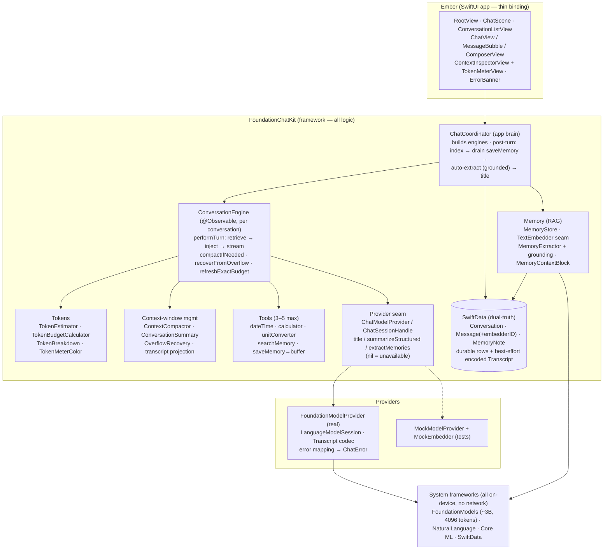
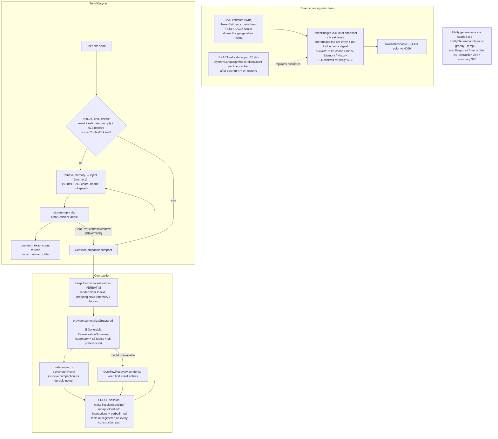
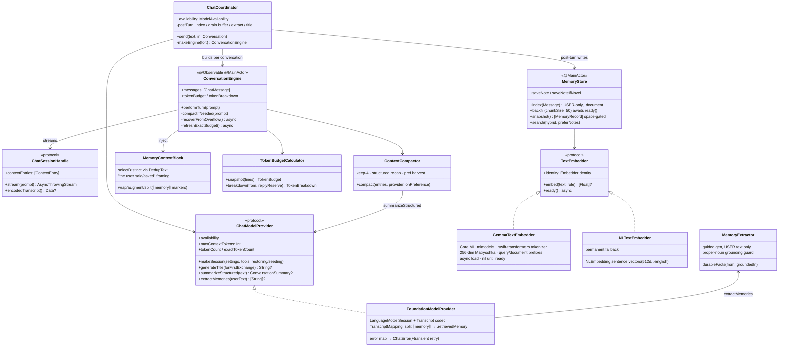
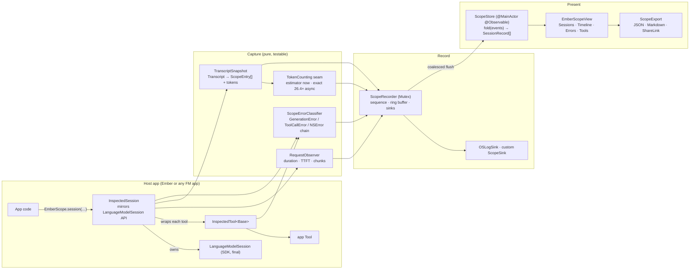

# Ember — Architecture

Four views of the system, from app-level down to classes and the developer inspector. Editable Excalidraw sources live in [`docs/diagrams/`](diagrams/) (open with [excalidraw.com](https://excalidraw.com) or the VS Code extension); the Mermaid versions below render on GitHub. The memory/RAG pipeline has its own diagram in the [README](../README.md#how-memory-works).

## 1. High-level architecture

Source: [`diagrams/ember-app-architecture.excalidraw`](diagrams/ember-app-architecture.excalidraw)

Three Tuist targets. All decision logic lives in **FoundationChatKit** behind protocol seams, testable with mocks on any machine (261 tests, no Apple-Intelligence device needed). The app target is thin SwiftUI binding. **EmberScope** (§4, 88 tests) is a self-contained inspector framework: both of the other targets link it, and it imports neither of them.

Key patterns: MVVM + `@Observable`; dependency injection via protocols; capability methods return `nil` when the model is unavailable so every feature degrades instead of failing; the embedder is swappable behind `TextEmbedder` (EmbeddingGemma on Core ML when bundled, NLEmbedding fallback otherwise) with `embedderID`-versioned vectors so vector spaces never mix.

## 2. Context-window management

Source: [`diagrams/ember-context-window.excalidraw`](diagrams/ember-context-window.excalidraw)

Everything competes for **4,096 tokens** (`SystemLanguageModel.contextSize`): instructions, tool definitions, the injected `⟦memory⟧` block, conversation history, and the streaming reply. Ember plans against it with a two-tier counting strategy and compacts before it overflows.

Rules of thumb encoded here: tools cost context (3–5 max, short `@Guide` texts — each definition is a visible budget line); the memory block is budget-accounted as its own line and never double-counted after the transcript split; compaction is **proactive first** (trigger math before sending) with the reactive overflow path as backstop; and the structured summary doubles as a preference harvest so durable facts survive the recap.

## 3. Low-level architecture (classes & seams)

Load-bearing invariants (each one is test-pinned):

- **Vector spaces never mix** — every cosine comparison is gated on `embedderID` matching the active `EmbedderIdentity`; stale rows behave as unembedded (lexical-only) until the chunked backfill re-embeds them.
- **The memory block round-trips** — `MemoryContextBlock.split(augment(p, hits)).userText == p`; the transcript split turns the injected block into a `.retrievedMemory` entry so it is displayed and budget-counted exactly once.
- **Extraction is grounded** — facts contain no proper noun the user didn't type (case/diacritic-folded), and the extractor never sees assistant text.
- **Every session-construction path re-registers tools** (initial, restore, overflow-seeded) — miss one and tools silently vanish.
- **Capability methods return `nil` on unavailability** — the app degrades (no title, no extraction, no compaction summary) instead of erroring.

## 4. EmberScope — developer inspector

Library README: [`Targets/EmberScope/README.md`](../Targets/EmberScope/README.md) (no Excalidraw source; the Mermaid below is the diagram)

**EmberScope** is the third target: a netfox-style in-app inspector for Apple Foundation Models, kept deliberately independent of the rest of Ember so it can be lifted into any Foundation Models app. `LanguageModelSession` is `final`, so EmberScope wraps rather than swizzles — `InspectedSession` mirrors the SDK's `respond` / `streamResponse` / `prewarm` surface and returns the SDK's own `Response` and `Snapshot` values, while `InspectedTool` forwards a `Tool` and times its calls. Four layers, each independently testable: **capture** (wrappers plus pure observers), **record** (one ordered event log), **present** (fold into an observable projection), **export**.

Ember plugs in at four points. `FoundationModelProvider` builds every chat session through `EmberScope.session(label: "chat")` on all three construction paths (fresh, restored, overflow-seeded); the hidden utility generations get their own labels (`title`, `summary`, `summary.structured`, `extract`), so the sessions the user never sees become visible. `ConversationEngine` annotates the timeline with `EmberScope.note` at the moments that are otherwise invisible — retrieval hits, proactive and overflow compaction, transient-error retries — carrying counts only, never user text. The app presents it: `EmberScope.start()` in `EmberApp.init`, a sheet plus shake gesture on iOS, a dedicated window and Debug ▸ Ember Scope (⌘⇧E) on macOS. Every one of those app surfaces is `#if DEBUG`, so a Release build of Ember contains none of them.

Load-bearing invariants (each one is test-pinned):

- **Wrappers rethrow unchanged** — an `InspectedSession` call records the classified error and then rethrows the original value, so inspection can never change what the host app catches.
- **Disabled means pass-through** — when `ScopeConfiguration.isEnabled` is false (the default outside DEBUG) every wrapper calls straight through to the SDK, records nothing, and allocates no observer.
- **Tool definitions are counted inside the instructions entry** — that is where the model actually sees them; the separate tools figure is informational and must never be added to the used total.
- **Events are immutable; the store folds** — the recorder only appends, and `ScopeStore.fold` is pure, so the same events in any order produce the same projection and the fold can run off the main actor.
