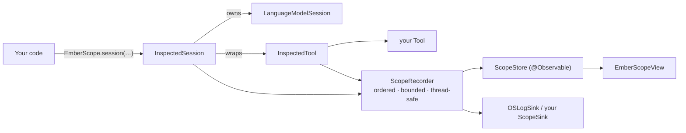

# EmberScope — Foundation Models Inspector Implementation Plan

> **For agentic workers:** REQUIRED SUB-SKILL: Use superpowers:subagent-driven-development (recommended) or superpowers:executing-plans to implement this plan task-by-task. Steps use checkbox (`- [ ]`) syntax for tracking.

**Goal:** Ship `EmberScope`, a drop-in debug inspector for Apple Foundation Models (netfox for `LanguageModelSession`): wrappers that record every session, request, tool call, error and context-window snapshot into an in-memory event log, a SwiftUI console to browse and export it, and Ember wired up as the first host.

**Architecture:** `InspectedSession` / `InspectedTool` mirror the SDK's `LanguageModelSession` / `Tool` API and forward every call, recording immutable `ScopeEvent`s into a lock-protected `ScopeRecorder`. A `@MainActor @Observable ScopeStore` folds the ordered event log into session records that the SwiftUI screens render. Token cost per transcript entry is estimated synchronously and replaced by exact `SystemLanguageModel.tokenCount(for:)` values asynchronously on 26.4+. Everything is in-memory, DEBUG-enabled by default, and inert when disabled.

**Tech Stack:** Swift (targets build in Swift 5 language mode; write Swift-6-strict-clean code), Swift Testing, Tuist, FoundationModels, SwiftUI, `os.Logger`, `Synchronization.Mutex`.

**Spec:** `docs/superpowers/specs/2026-09-02-emberscope-foundation-models-inspector-design.md` — read it first; this plan argues from it.

## Global Constraints

- Work in the worktree `/Users/vladtoma/Documents/iOSunPiDev/AppleFoundationModels-emberscope` on branch `feat/emberscope-inspector`. Every shell command below assumes that directory is the CWD (`cd` there first — the shell resets between commands).
- **Run `tuist generate --no-open` after ANY file add/delete** before xcodebuild. SourceKit squiggles are noise; **xcodebuild is ground truth**.
- Library test gate after every task: `xcodebuild -workspace Ember.xcworkspace -scheme EmberScope -destination 'platform=macOS' test 2>&1 | grep -E 'Test run with|TEST SUCCEEDED|TEST FAILED|error:'` → must print `** TEST SUCCEEDED **`.
- Framework gate (Tasks 15–17, and any task touching `FoundationChatKit`): `xcodebuild -workspace Ember.xcworkspace -scheme FoundationChatKit -destination 'platform=macOS' test 2>&1 | grep -E 'Test run with|TEST SUCCEEDED|TEST FAILED|error:'` → `** TEST SUCCEEDED **` (baseline: 258 tests).
- App must compile at every commit from Task 15 on: `xcodebuild -workspace Ember.xcworkspace -scheme Ember -destination 'platform=macOS' build 2>&1 | tail -3` and `… -destination 'platform=iOS Simulator,name=iPhone 17 Pro' build 2>&1 | tail -3` → `** BUILD SUCCEEDED **`.
- Deployment floor iOS 26.0 / macOS 26.0 (same as the rest of the project). Exact token counting is `#available(iOS 26.4, macOS 26.4, visionOS 26.4, *)`.
- **No network, no disk persistence, no new dependencies.** `EmberScope` imports only `Foundation`, `FoundationModels`, `SwiftUI`, `os`, `Synchronization` (and `UIKit`/`AppKit` behind `canImport`).
- `EmberScope` must not import `FoundationChatKit`. `FoundationChatKit` and `Ember` may import `EmberScope`.
- Privacy: OSLog interpolations of user-derived text use `privacy: .private` unless the configuration's `logContent` is on. No `.public` user text.
- Every public type in the event model is `Sendable`, `Codable`, `Equatable`. No `static var` anywhere in `EmberScope`; shared state lives in `ScopeRecorder` (Mutex) or `ScopeStore` (@MainActor).
- Names are fixed by this plan — do not rename: `EmberScope`, `ScopeConfiguration`, `ScopeEvent`, `ScopePayload`, `ScopeRecorder`, `ScopeSink`, `OSLogSink`, `ScopeTokenEstimator`, `ScopeEntry`, `TranscriptSnapshot`, `TokenCounts`, `TokenCounting`, `SystemTokenCounter`, `TokenCountResolver`, `ScopeErrorRecord`, `ScopeErrorClassifier`, `InspectedTool`, `RequestObserver`, `InspectedSession`, `InspectedResponseStream`, `ScopeStore`, `SessionRecord`, `RequestRecord`, `ToolCallRecord`, `NoteRecord`, `ToolRegistryEntry`, `ScopeArchive`, `ScopeExport`, `EmberScopeView`, `EmberScopeCommands`.
- Commit after every green step with an imperative subject and the trailer `Co-Authored-By: Claude Fable 5.1 <noreply@anthropic.com>`. Stage files explicitly (`git add <paths>`), never `git add -A`.
- When a step says "Run … Expected: FAIL", the failure must be a compile error or assertion in the new test — not an unrelated breakage.

## File Structure

```
Project.swift                                             MOD  EmberScope + EmberScopeTests targets; FoundationChatKit/Ember depend on EmberScope
Targets/EmberScope/
  README.md                                               NEW  library README (Task 16)
  Sources/EmberScope/Core/
    EmberScopeVersion.swift                               NEW  T0  library version string
    ScopeConfiguration.swift                              NEW  T1  knobs + DEBUG default
    ScopeTokenEstimator.swift                             NEW  T1  chars/3.5 + CJK heuristic
    ScopeEvent.swift                                      NEW  T2  ScopeEvent + ScopePayload enum
    ScopePayloads.swift                                   NEW  T2  SessionInfo, ToolInfo, RequestOptions, RequestStart/Progress/End, ToolCallStart/End, ModelStatus, TokenCounts
    ScopeErrorRecord.swift                                NEW  T2  error record value type (no FM import)
    ScopeRedaction.swift                                  NEW  T2  placeholder + ScopePayload.redacted()
    TranscriptSnapshot.swift                              NEW  T3  ScopeEntry + TranscriptSnapshot math + make(from: Transcript)
    ScopeRecorder.swift                                   NEW  T4  Mutex-protected ordered event log
    ScopeSink.swift                                       NEW  T4  ScopeSink protocol + OSLogSink + ScopeDiagnostics logger
    ScopeErrorClassifier.swift                            NEW  T5  Error → ScopeErrorRecord
    ToolInfo+Tool.swift                                   NEW  T3  ToolInfo(_ tool:) — schema JSON via JSONEncoder
    MonotonicClock.swift                                  NEW  T6  process-local monotonic Duration
    InspectedTool.swift                                   NEW  T6  Tool wrapper + ToolRendering + wrap(_:)
    RequestObserver.swift                                 NEW  T7  request lifecycle math
    TokenCounting.swift                                   NEW  T8  TokenCounting, SystemTokenCounter, TokenCountResolver
    InspectedSession.swift                                NEW  T9  LanguageModelSession wrapper
    InspectedResponseStream.swift                         NEW  T9  streaming wrapper + finalizer
    ScopeStore.swift                                      NEW  T10 @Observable projection + fold
    EmberScope.swift                                      NEW  T11 facade + extensions
    ScopeFormatting.swift                                 NEW  T12 duration/tokens/timestamp/preview formatting
    ScopeExport.swift                                     NEW  T12 ScopeArchive + JSON/Markdown
  Sources/EmberScope/UI/
    ScopeStyle.swift                                      NEW  T13 colors/icons/formatters
    ScopeClipboard.swift                                  NEW  T13 copy helper (UIKit/AppKit)
    PreviewFixtures.swift                                 NEW  T13 ScopeStore.preview
    EmberScopeView.swift                                  NEW  T13 root TabView
    ModelStatusCard.swift                                 NEW  T13
    SessionListView.swift                                 NEW  T13
    SessionDetailView.swift                               NEW  T13 context bar + transcript + requests + tool calls + notes
    ContextWindowBar.swift                                NEW  T13
    TranscriptEntryViews.swift                            NEW  T13 row + detail
    RequestViews.swift                                    NEW  T13 row + detail
    ToolCallViews.swift                                   NEW  T13 row + detail
    TimelineView.swift                                    NEW  T14
    ErrorsView.swift                                      NEW  T14 list + detail
    ToolsView.swift                                       NEW  T14 registry
    ExportMenu.swift                                      NEW  T14 ShareLink + copy
    Presentation.swift                                    NEW  T14 emberScope() modifier, shake hook, EmberScopeCommands
  Tests/EmberScopeTests/
    Fixtures.swift                                        NEW  T2  EchoTool, sample events, sample transcript
    ScopeConfigurationTests.swift, ScopeTokenEstimatorTests.swift          T1
    ScopeEventCodableTests.swift, ScopeRedactionTests.swift                T2
    TranscriptSnapshotTests.swift                                          T3
    ScopeRecorderTests.swift                                               T4
    ScopeErrorClassifierTests.swift                                        T5
    InspectedToolTests.swift                                               T6
    RequestObserverTests.swift                                             T7
    TokenCountingTests.swift                                               T8
    InspectedSessionTests.swift                                            T9
    ScopeStoreTests.swift                                                  T10
    EmberScopeFacadeTests.swift                                            T11
    ScopeExportTests.swift                                                 T12
Targets/FoundationChatKit/Sources/Provider/ChatModelProvider.swift        MOD  T15 inspectionID on ChatSessionHandle
Targets/FoundationChatKit/Sources/Provider/FoundationModelProvider.swift  MOD  T15 InspectedSession + labels
Targets/FoundationChatKit/Sources/Tools/ConversationTitler.swift          MOD  T15 label "title"
Targets/FoundationChatKit/Sources/Tools/MemoryExtractor.swift             MOD  T15 label "extract"
Targets/FoundationChatKit/Sources/Engine/ConversationEngine.swift         MOD  T15 notes
Targets/Ember/Sources/EmberApp.swift, ChatScene.swift, UnavailableView.swift  MOD  T15 start + presentation
README.md, CLAUDE.md, docs/ARCHITECTURE.md                                MOD  T16
```

---

### Task 0: Scaffold the `EmberScope` targets

**Files:**
- Modify: `Project.swift`
- Create: `Targets/EmberScope/Sources/EmberScope/Core/EmberScopeVersion.swift`
- Create: `Targets/EmberScope/Tests/EmberScopeTests/EmberScopeVersionTests.swift`

**Interfaces:**
- Produces: Tuist targets `EmberScope` (framework, bundle id `dev.iosunpi.emberscope`) and `EmberScopeTests`; scheme `EmberScope` runs the tests. `public enum EmberScopeVersion { public static let current = "0.1.0" }`.

- [ ] **Step 1: Add the targets to `Project.swift`**

Insert the two targets right after the `FoundationChatKitTests` target entry (keep the existing targets untouched for now — dependencies from `FoundationChatKit`/`Ember` are added in Task 15):

```swift
        .target(
            name: "EmberScope",
            destinations: appDestinations,
            product: .framework,
            bundleId: "dev.iosunpi.emberscope",
            deploymentTargets: deployment,
            sources: ["Targets/EmberScope/Sources/**"],
            settings: .settings(base: [
                // Keep the library adoptable by Swift-6-strict hosts even though this repo builds in
                // Swift 5 language mode (warnings here, errors there).
                "SWIFT_STRICT_CONCURRENCY": "complete",
            ])
        ),
        .target(
            name: "EmberScopeTests",
            destinations: appDestinations,
            product: .unitTests,
            bundleId: "dev.iosunpi.emberscope.tests",
            deploymentTargets: deployment,
            sources: ["Targets/EmberScope/Tests/**"],
            dependencies: [.target(name: "EmberScope")]
        ),
```

- [ ] **Step 2: Write the failing test**

`Targets/EmberScope/Tests/EmberScopeTests/EmberScopeVersionTests.swift`:

```swift
import Testing
@testable import EmberScope

struct EmberScopeVersionTests {
    @Test func versionIsSemver() {
        let parts = EmberScopeVersion.current.split(separator: ".")
        #expect(parts.count == 3)
        #expect(parts.allSatisfy { Int($0) != nil })
    }
}
```

- [ ] **Step 3: Write the minimal implementation**

`Targets/EmberScope/Sources/EmberScope/Core/EmberScopeVersion.swift`:

```swift
/// Library version, surfaced in exports and the UI footer.
public enum EmberScopeVersion {
    public static let current = "0.1.0"
}
```

- [ ] **Step 4: Generate and run the library tests**

```bash
tuist generate --no-open 2>&1 | tail -2
xcodebuild -workspace Ember.xcworkspace -scheme EmberScope -destination 'platform=macOS' test 2>&1 | grep -E 'Test run with|TEST SUCCEEDED|TEST FAILED|error:'
xcodebuild -list -workspace Ember.xcworkspace 2>/dev/null | sed -n '/Schemes/,$p'
```

Expected: `Test run with 1 tests in 1 suites passed`, `** TEST SUCCEEDED **`, and the scheme list contains `EmberScope` (plus the pre-existing `Ember`, `FoundationChatKit` schemes). If the `EmberScope` scheme does not run `EmberScopeTests`, add an explicit scheme to `Project.swift`:

```swift
    schemes: [
        .scheme(name: "EmberScope",
                buildAction: .buildAction(targets: ["EmberScope"]),
                testAction: .targets(["EmberScopeTests"]))
    ]
```

(as a `schemes:` argument of `Project(...)`; Tuist keeps auto-generating the others).

- [ ] **Step 5: Confirm the existing suites are untouched**

```bash
xcodebuild -workspace Ember.xcworkspace -scheme FoundationChatKit -destination 'platform=macOS' test 2>&1 | grep -E 'Test run with|TEST SUCCEEDED|TEST FAILED'
```

Expected: `258 tests … passed`, `** TEST SUCCEEDED **`.

- [ ] **Step 6: Commit**

```bash
git add Project.swift Targets/EmberScope
git commit -m "build(emberscope): add EmberScope framework + test targets

Co-Authored-By: Claude Fable 5.1 <noreply@anthropic.com>"
```

---

### Task 1: `ScopeConfiguration` + `ScopeTokenEstimator`

**Files:**
- Create: `Targets/EmberScope/Sources/EmberScope/Core/ScopeConfiguration.swift`
- Create: `Targets/EmberScope/Sources/EmberScope/Core/ScopeTokenEstimator.swift`
- Test: `Targets/EmberScope/Tests/EmberScopeTests/ScopeConfigurationTests.swift`, `Targets/EmberScope/Tests/EmberScopeTests/ScopeTokenEstimatorTests.swift`

**Interfaces:**
- Produces:
  - `public struct ScopeConfiguration: Sendable, Equatable` with `isEnabled`, `maxEvents`, `maxSessions`, `captureContent`, `logToOSLog`, `logContent`, `streamProgressInterval: Duration`; `init` with all defaults; `static var defaultIsEnabled: Bool`.
  - `public struct ScopeTokenEstimator: Sendable { init(); func estimate(_ text: String) -> Int }`.

- [ ] **Step 1: Write the failing tests**

`ScopeConfigurationTests.swift`:

```swift
import Testing
@testable import EmberScope

struct ScopeConfigurationTests {
    @Test func defaultsMatchSpec() {
        let c = ScopeConfiguration()
        #expect(c.maxEvents == 2_000)
        #expect(c.maxSessions == 50)
        #expect(c.captureContent)
        #expect(c.logToOSLog)
        #expect(!c.logContent)
        #expect(c.streamProgressInterval == .milliseconds(250))
    }

    @Test func enabledFollowsBuildConfigurationByDefault() {
        #if DEBUG
        #expect(ScopeConfiguration.defaultIsEnabled)
        #expect(ScopeConfiguration().isEnabled)
        #else
        #expect(!ScopeConfiguration.defaultIsEnabled)
        #endif
    }

    @Test func explicitEnableOverridesDefault() {
        #expect(ScopeConfiguration(isEnabled: true).isEnabled)
        #expect(!ScopeConfiguration(isEnabled: false).isEnabled)
    }
}
```

`ScopeTokenEstimatorTests.swift`:

```swift
import Testing
@testable import EmberScope

struct ScopeTokenEstimatorTests {
    let estimator = ScopeTokenEstimator()

    @Test func emptyIsZero() { #expect(estimator.estimate("") == 0) }

    @Test func latinTextUsesThreePointFiveCharsPerToken() {
        // 7 characters → ceil(7 / 3.5) = 2
        #expect(estimator.estimate("abcdefg") == 2)
        // 8 characters → ceil(8 / 3.5) = 3
        #expect(estimator.estimate("abcdefgh") == 3)
    }

    @Test func cjkCountsOneTokenPerScalar() {
        #expect(estimator.estimate("日本語") == 3)
        // mixed: 3 CJK + 5 Latin ("hello") → 3 + ceil(5/3.5)=2 → 5
        #expect(estimator.estimate("日本語hello") == 5)
    }
}
```

- [ ] **Step 2: Run to verify failure**

```bash
tuist generate --no-open 2>&1 | tail -1
xcodebuild -workspace Ember.xcworkspace -scheme EmberScope -destination 'platform=macOS' test 2>&1 | grep -E 'error:|TEST' | head -5
```

Expected: compile errors `cannot find 'ScopeConfiguration' in scope` / `cannot find 'ScopeTokenEstimator' in scope`.

- [ ] **Step 3: Implement**

`ScopeConfiguration.swift`:

```swift
import Foundation

/// Runtime knobs for EmberScope. Value type; the live copy lives in `ScopeRecorder`.
public struct ScopeConfiguration: Sendable, Equatable {
    /// Master switch. When false every wrapper is a zero-cost pass-through and nothing is recorded.
    public var isEnabled: Bool
    /// Ring-buffer capacity for events; oldest are evicted first.
    public var maxEvents: Int
    /// Oldest sessions are dropped from the projection beyond this count.
    public var maxSessions: Int
    /// When false, prompts / outputs / tool arguments / transcript text are replaced by a
    /// `ScopeRedaction` placeholder at record time (metadata-only inspector).
    public var captureContent: Bool
    /// Install the built-in `OSLogSink` on `EmberScope.start()`.
    public var logToOSLog: Bool
    /// Interpolate content into OSLog with `.public` privacy. Off by default: content stays `.private`.
    public var logContent: Bool
    /// Minimum spacing between `.streamProgress` events for one streamed request.
    public var streamProgressInterval: Duration

    public init(isEnabled: Bool = ScopeConfiguration.defaultIsEnabled,
                maxEvents: Int = 2_000,
                maxSessions: Int = 50,
                captureContent: Bool = true,
                logToOSLog: Bool = true,
                logContent: Bool = false,
                streamProgressInterval: Duration = .milliseconds(250)) {
        self.isEnabled = isEnabled
        self.maxEvents = maxEvents
        self.maxSessions = maxSessions
        self.captureContent = captureContent
        self.logToOSLog = logToOSLog
        self.logContent = logContent
        self.streamProgressInterval = streamProgressInterval
    }

    /// `true` when the library itself is compiled with `DEBUG` (netfox convention).
    public static var defaultIsEnabled: Bool {
        #if DEBUG
        return true
        #else
        return false
        #endif
    }
}
```

`ScopeTokenEstimator.swift`:

```swift
import Foundation

/// Synchronous token estimate used until exact counts arrive: ⌈non-CJK scalars / 3.5⌉ + one token
/// per CJK scalar. Same heuristic Ember uses for its live gauge.
public struct ScopeTokenEstimator: Sendable {
    public init() {}

    public func estimate(_ text: String) -> Int {
        guard !text.isEmpty else { return 0 }
        var cjk = 0
        var other = 0
        for scalar in text.unicodeScalars {
            if Self.isCJK(scalar) { cjk += 1 } else { other += 1 }
        }
        let latinTokens = other == 0 ? 0 : Int((Double(other) / 3.5).rounded(.up))
        return cjk + latinTokens
    }

    static func isCJK(_ scalar: Unicode.Scalar) -> Bool {
        switch scalar.value {
        case 0x4E00...0x9FFF, 0x3040...0x30FF, 0xAC00...0xD7AF, 0x3400...0x4DBF: return true
        default: return false
        }
    }
}
```

- [ ] **Step 4: Run to verify pass**

```bash
xcodebuild -workspace Ember.xcworkspace -scheme EmberScope -destination 'platform=macOS' test 2>&1 | grep -E 'Test run with|TEST SUCCEEDED|TEST FAILED|error:'
```

Expected: `Test run with 7 tests … passed`, `** TEST SUCCEEDED **`.

- [ ] **Step 5: Commit**

```bash
git add Targets/EmberScope
git commit -m "feat(emberscope): ScopeConfiguration + ScopeTokenEstimator

Co-Authored-By: Claude Fable 5.1 <noreply@anthropic.com>"
```

---

### Task 2: Event model, payloads, error record, redaction

**Files:**
- Create: `Targets/EmberScope/Sources/EmberScope/Core/ScopeEvent.swift`
- Create: `Targets/EmberScope/Sources/EmberScope/Core/ScopePayloads.swift`
- Create: `Targets/EmberScope/Sources/EmberScope/Core/ScopeErrorRecord.swift`
- Create: `Targets/EmberScope/Sources/EmberScope/Core/ScopeRedaction.swift`
- Create: `Targets/EmberScope/Tests/EmberScopeTests/Fixtures.swift`
- Test: `Targets/EmberScope/Tests/EmberScopeTests/ScopeEventCodableTests.swift`, `Targets/EmberScope/Tests/EmberScopeTests/ScopeRedactionTests.swift`

**Interfaces:**
- Produces (all `Sendable, Codable, Equatable`):
  - `ScopeEvent { id: UUID, sequence: UInt64, timestamp: Date, sessionID: UUID?, payload: ScopePayload }` (`Identifiable`).
  - `enum ScopePayload { sessionCreated(SessionInfo), prewarm, requestStarted(RequestStart), streamProgress(RequestProgress), requestFinished(RequestEnd), toolCallStarted(ToolCallStart), toolCallFinished(ToolCallEnd), error(ScopeErrorRecord), transcriptSnapshot(TranscriptSnapshot), tokenCountsResolved(TokenCounts), modelStatus(ModelStatus), note(String) }` with `func redacted() -> ScopePayload`.
  - Payload structs exactly as written in Step 3 below. `TranscriptSnapshot`/`ScopeEntry` are declared in Task 3 — Task 2 declares a **temporary stub** `public struct TranscriptSnapshot: Sendable, Codable, Equatable, Identifiable { public var id: UUID; public var sessionID: UUID }` in `ScopePayloads.swift` that Task 3 moves and completes.
  - `ScopeErrorRecord` + `ScopeErrorRecord.Kind` (13 cases).
  - `enum ScopeRedaction { static func placeholder(forCharacterCount:) -> String; static func isRedacted(_:) -> Bool }`.

- [ ] **Step 1: Write fixtures + failing tests**

`Fixtures.swift`:

```swift
import Foundation
import FoundationModels
@testable import EmberScope

/// A trivial tool for wrapper tests. `Arguments` is @Generable so JSON rendering is exercised.
struct EchoTool: Tool {
    let name = "echo"
    let description = "Echo the text back."
    @Generable struct Arguments {
        @Guide(description: "Text to echo") var text: String
    }
    var shouldThrow = false
    func call(arguments: Arguments) async throws -> String {
        if shouldThrow { throw EchoError.boom }
        return "echo: \(arguments.text)"
    }
}
enum EchoError: Error { case boom }

enum Fixtures {
    static let sessionID = UUID(uuidString: "11111111-1111-1111-1111-111111111111")!
    static let requestID = UUID(uuidString: "22222222-2222-2222-2222-222222222222")!
    static let callID = UUID(uuidString: "33333333-3333-3333-3333-333333333333")!
    static let date = Date(timeIntervalSince1970: 1_700_000_000)

    static func event(_ payload: ScopePayload, sequence: UInt64 = 1, sessionID: UUID? = sessionID,
                      at date: Date = date) -> ScopeEvent {
        ScopeEvent(id: UUID(), sequence: sequence, timestamp: date, sessionID: sessionID, payload: payload)
    }

    static let sessionInfo = SessionInfo(
        label: "chat", instructions: "You are terse.",
        tools: [ToolInfo(name: "echo", description: "Echo the text back.",
                         parametersJSON: "{\"type\":\"object\"}", includesSchemaInInstructions: true)],
        contextSize: 4096, modelDescription: "SystemLanguageModel", restoredFromTranscript: false)

    static let requestStart = RequestStart(
        requestID: requestID, kind: .stream, prompt: "Hello there",
        options: RequestOptions(temperature: 0.7, maximumResponseTokens: 200, samplingDescription: "default"),
        responseFormat: nil, includeSchemaInPrompt: nil)

    static let requestEnd = RequestEnd(
        requestID: requestID, status: .succeeded, duration: .milliseconds(1_250),
        timeToFirstToken: .milliseconds(300), chunkCount: 12, output: "Hi!", outputChars: 3,
        appendedEntryCount: 2, resolvedPrompt: nil)

    static let errorRecord = ScopeErrorRecord(
        id: UUID(uuidString: "44444444-4444-4444-4444-444444444444")!, kind: .rateLimited,
        requestID: requestID, toolCallID: nil, toolName: nil, message: "Rate limited",
        debugDescription: "too many requests", recoverySuggestion: "Try again later",
        failureReason: nil, underlyingChain: [], isRetryable: true)

    /// A synthetic transcript with every entry kind (used from Task 3 on).
    static func transcript() -> Transcript {
        let call = Transcript.ToolCall(id: "call-1", toolName: "echo",
                                       arguments: GeneratedContent(properties: ["text": "hi"]))
        return Transcript(entries: [
            .instructions(.init(id: "e-instr", segments: [.text(.init(id: "s1", content: "You are terse."))],
                                toolDefinitions: [.init(tool: EchoTool())])),
            .prompt(.init(id: "e-prompt", segments: [.text(.init(id: "s2", content: "Echo hi please"))],
                          options: GenerationOptions(sampling: .greedy, temperature: 0, maximumResponseTokens: 50),
                          responseFormat: nil)),
            .toolCalls(.init(id: "e-calls", [call])),
            .toolOutput(.init(id: "e-out", toolName: "echo", segments: [.text(.init(id: "s3", content: "echo: hi"))])),
            .response(.init(id: "e-resp", assetIDs: [], segments: [.text(.init(id: "s4", content: "Done: hi"))])),
        ])
    }
}
```

`ScopeEventCodableTests.swift`:

```swift
import Foundation
import Testing
@testable import EmberScope

struct ScopeEventCodableTests {
    private func roundTrip(_ payload: ScopePayload) throws -> ScopeEvent {
        let event = Fixtures.event(payload, sequence: 7)
        let data = try JSONEncoder().encode(event)
        let decoded = try JSONDecoder().decode(ScopeEvent.self, from: data)
        #expect(decoded == event)
        return decoded
    }

    @Test func sessionCreatedRoundTrips() throws {
        let e = try roundTrip(.sessionCreated(Fixtures.sessionInfo))
        #expect(e.sequence == 7)
        #expect(e.sessionID == Fixtures.sessionID)
    }

    @Test func requestLifecycleRoundTrips() throws {
        _ = try roundTrip(.requestStarted(Fixtures.requestStart))
        _ = try roundTrip(.streamProgress(RequestProgress(requestID: Fixtures.requestID, chunkCount: 3, contentChars: 40)))
        _ = try roundTrip(.requestFinished(Fixtures.requestEnd))
        let failed = RequestEnd(requestID: Fixtures.requestID, status: .failed(errorID: Fixtures.errorRecord.id),
                                duration: .seconds(2), timeToFirstToken: nil, chunkCount: 0, output: nil,
                                outputChars: 0, appendedEntryCount: 0, resolvedPrompt: "resolved")
        _ = try roundTrip(.requestFinished(failed))
    }

    @Test func toolErrorStatusAndNoteRoundTrip() throws {
        _ = try roundTrip(.toolCallStarted(ToolCallStart(callID: Fixtures.callID, toolName: "echo", arguments: "{\"text\":\"hi\"}")))
        _ = try roundTrip(.toolCallFinished(ToolCallEnd(callID: Fixtures.callID, toolName: "echo", status: .succeeded,
                                                        duration: .milliseconds(4), output: "echo: hi")))
        _ = try roundTrip(.error(Fixtures.errorRecord))
        _ = try roundTrip(.modelStatus(ModelStatus(availability: "available", isAvailable: true, contextSize: 4096,
                                                   supportsExactTokenCounts: true, supportedLanguageCount: 23,
                                                   osVersion: "26.6")))
        _ = try roundTrip(.tokenCountsResolved(TokenCounts(snapshotID: UUID(), entryTokens: ["e-1": 12], toolsTokens: 40)))
        _ = try roundTrip(.prewarm)
        _ = try roundTrip(.note("compacted"))
    }

    @Test func errorKindsAreStableStrings() {
        #expect(ScopeErrorRecord.Kind.allCases.count == 13)
        #expect(ScopeErrorRecord.Kind.exceededContextWindowSize.rawValue == "exceededContextWindowSize")
    }
}
```

`ScopeRedactionTests.swift`:

```swift
import Testing
@testable import EmberScope

struct ScopeRedactionTests {
    @Test func placeholderCarriesLength() {
        let p = ScopeRedaction.placeholder(forCharacterCount: 42)
        #expect(p == "«redacted · 42 chars»")
        #expect(ScopeRedaction.isRedacted(p))
        #expect(!ScopeRedaction.isRedacted("hello"))
    }

    @Test func redactedPayloadKeepsMetadataDropsContent() {
        let start = ScopePayload.requestStarted(Fixtures.requestStart).redacted()
        guard case .requestStarted(let r) = start else { Issue.record("wrong case"); return }
        #expect(r.prompt == ScopeRedaction.placeholder(forCharacterCount: 11))
        #expect(r.kind == .stream)
        #expect(r.options == Fixtures.requestStart.options)

        let end = ScopePayload.requestFinished(Fixtures.requestEnd).redacted()
        guard case .requestFinished(let e) = end else { Issue.record("wrong case"); return }
        #expect(e.output == ScopeRedaction.placeholder(forCharacterCount: 3))
        #expect(e.chunkCount == 12)

        let created = ScopePayload.sessionCreated(Fixtures.sessionInfo).redacted()
        guard case .sessionCreated(let s) = created else { Issue.record("wrong case"); return }
        #expect(s.instructions == ScopeRedaction.placeholder(forCharacterCount: 14))
        #expect(s.tools == Fixtures.sessionInfo.tools)   // developer content stays

        let tool = ScopePayload.toolCallStarted(ToolCallStart(callID: Fixtures.callID, toolName: "echo", arguments: "{\"text\":\"hi\"}")).redacted()
        guard case .toolCallStarted(let t) = tool else { Issue.record("wrong case"); return }
        #expect(ScopeRedaction.isRedacted(t.arguments))
        #expect(t.toolName == "echo")
    }

    @Test func nonContentPayloadsAreUnchanged() {
        #expect(ScopePayload.prewarm.redacted() == .prewarm)
        #expect(ScopePayload.note("n").redacted() == .note("n"))
    }

    /// Ruling (Task 2 review): Apple's and tool authors' error messages can quote prompt text, so a
    /// metadata-only inspector redacts the four free-form strings but keeps every structured field.
    @Test func errorDiagnosticsAreRedactedButStructureIsKept() {
        guard case .error(let e) = ScopePayload.error(Fixtures.errorRecord).redacted() else { Issue.record("wrong case"); return }
        #expect(e.id == Fixtures.errorRecord.id && e.kind == .rateLimited && e.isRetryable)
        #expect(e.requestID == Fixtures.requestID && e.underlyingChain == Fixtures.errorRecord.underlyingChain)
        #expect(e.message == ScopeRedaction.placeholder(forCharacterCount: 12))
        #expect(e.debugDescription.map(ScopeRedaction.isRedacted) == true)
        #expect(e.recoverySuggestion.map(ScopeRedaction.isRedacted) == true)
        #expect(e.failureReason == nil)
    }
}
```

- [ ] **Step 2: Run to verify failure**

```bash
tuist generate --no-open 2>&1 | tail -1
xcodebuild -workspace Ember.xcworkspace -scheme EmberScope -destination 'platform=macOS' test 2>&1 | grep -E 'error:' | head -5
```

Expected: `cannot find type 'ScopeEvent' in scope` and friends.

- [ ] **Step 3: Implement**

`ScopeEvent.swift`:

```swift
import Foundation

/// One immutable record in the inspector's log. Ordered by `sequence` (assigned by `ScopeRecorder`).
public struct ScopeEvent: Sendable, Codable, Equatable, Identifiable {
    public let id: UUID
    public let sequence: UInt64
    public let timestamp: Date
    /// The `InspectedSession` this belongs to; nil for global events (model status, global notes).
    public let sessionID: UUID?
    public let payload: ScopePayload

    public init(id: UUID, sequence: UInt64, timestamp: Date, sessionID: UUID?, payload: ScopePayload) {
        self.id = id
        self.sequence = sequence
        self.timestamp = timestamp
        self.sessionID = sessionID
        self.payload = payload
    }
}

public enum ScopePayload: Sendable, Codable, Equatable {
    case sessionCreated(SessionInfo)
    case prewarm
    case requestStarted(RequestStart)
    case streamProgress(RequestProgress)
    case requestFinished(RequestEnd)
    case toolCallStarted(ToolCallStart)
    case toolCallFinished(ToolCallEnd)
    case error(ScopeErrorRecord)
    case transcriptSnapshot(TranscriptSnapshot)
    case tokenCountsResolved(TokenCounts)
    case modelStatus(ModelStatus)
    case note(String)
}
```

`ScopePayloads.swift`:

```swift
import Foundation

public struct SessionInfo: Sendable, Codable, Equatable {
    public var label: String
    public var instructions: String?
    public var tools: [ToolInfo]
    public var contextSize: Int
    public var modelDescription: String
    public var restoredFromTranscript: Bool
    public init(label: String, instructions: String?, tools: [ToolInfo], contextSize: Int,
                modelDescription: String, restoredFromTranscript: Bool) {
        self.label = label; self.instructions = instructions; self.tools = tools
        self.contextSize = contextSize; self.modelDescription = modelDescription
        self.restoredFromTranscript = restoredFromTranscript
    }
}

public struct ToolInfo: Sendable, Codable, Equatable, Identifiable {
    public var id: String { name }
    public var name: String
    public var description: String
    /// `GenerationSchema` encoded as JSON (nil when encoding failed or the tool is only known by name).
    public var parametersJSON: String?
    public var includesSchemaInInstructions: Bool
    public init(name: String, description: String, parametersJSON: String?, includesSchemaInInstructions: Bool) {
        self.name = name; self.description = description
        self.parametersJSON = parametersJSON; self.includesSchemaInInstructions = includesSchemaInInstructions
    }
}

/// Plain-value mirror of `GenerationOptions` (its `SamplingMode` has no public cases).
public struct RequestOptions: Sendable, Codable, Equatable {
    public var temperature: Double?
    public var maximumResponseTokens: Int?
    /// "default" (nil sampling), "greedy", or "random".
    public var samplingDescription: String
    public init(temperature: Double?, maximumResponseTokens: Int?, samplingDescription: String) {
        self.temperature = temperature; self.maximumResponseTokens = maximumResponseTokens
        self.samplingDescription = samplingDescription
    }
}

public enum RequestKind: String, Sendable, Codable { case respond, stream }

public struct RequestStart: Sendable, Codable, Equatable {
    public var requestID: UUID
    public var kind: RequestKind
    /// Known immediately for `String` prompts; nil for `Prompt` values (resolved at finish from the transcript).
    public var prompt: String?
    public var options: RequestOptions
    /// Guided-generation type name (`String(describing: Content.self)`) or nil for plain text.
    public var responseFormat: String?
    public var includeSchemaInPrompt: Bool?
    public init(requestID: UUID, kind: RequestKind, prompt: String?, options: RequestOptions,
                responseFormat: String?, includeSchemaInPrompt: Bool?) {
        self.requestID = requestID; self.kind = kind; self.prompt = prompt; self.options = options
        self.responseFormat = responseFormat; self.includeSchemaInPrompt = includeSchemaInPrompt
    }
}

public struct RequestProgress: Sendable, Codable, Equatable {
    public var requestID: UUID
    public var chunkCount: Int
    public var contentChars: Int
    public init(requestID: UUID, chunkCount: Int, contentChars: Int) {
        self.requestID = requestID; self.chunkCount = chunkCount; self.contentChars = contentChars
    }
}

public enum RequestStatus: Sendable, Codable, Equatable {
    case succeeded
    case failed(errorID: UUID)
    case cancelled
}

public struct RequestEnd: Sendable, Codable, Equatable {
    public var requestID: UUID
    public var status: RequestStatus
    public var duration: Duration
    public var timeToFirstToken: Duration?
    public var chunkCount: Int
    /// Final text (or JSON for guided generation). nil on failure/cancellation.
    public var output: String?
    public var outputChars: Int
    /// Transcript entries the SDK appended for this request (prompt + tool calls/outputs + response).
    public var appendedEntryCount: Int
    /// Prompt text recovered from the transcript when the request was made with a `Prompt` value.
    public var resolvedPrompt: String?
    public init(requestID: UUID, status: RequestStatus, duration: Duration, timeToFirstToken: Duration?,
                chunkCount: Int, output: String?, outputChars: Int, appendedEntryCount: Int, resolvedPrompt: String?) {
        self.requestID = requestID; self.status = status; self.duration = duration
        self.timeToFirstToken = timeToFirstToken; self.chunkCount = chunkCount; self.output = output
        self.outputChars = outputChars; self.appendedEntryCount = appendedEntryCount; self.resolvedPrompt = resolvedPrompt
    }
}

public struct ToolCallStart: Sendable, Codable, Equatable {
    public var callID: UUID
    public var toolName: String
    /// Arguments rendered as JSON when possible.
    public var arguments: String
    public init(callID: UUID, toolName: String, arguments: String) {
        self.callID = callID; self.toolName = toolName; self.arguments = arguments
    }
}

public enum ToolCallStatus: Sendable, Codable, Equatable {
    case succeeded
    case failed(errorID: UUID)
}

public struct ToolCallEnd: Sendable, Codable, Equatable {
    public var callID: UUID
    public var toolName: String
    public var status: ToolCallStatus
    public var duration: Duration
    public var output: String?
    public init(callID: UUID, toolName: String, status: ToolCallStatus, duration: Duration, output: String?) {
        self.callID = callID; self.toolName = toolName; self.status = status; self.duration = duration; self.output = output
    }
}

public struct ModelStatus: Sendable, Codable, Equatable {
    public var availability: String
    public var isAvailable: Bool
    public var contextSize: Int
    public var supportsExactTokenCounts: Bool
    public var supportedLanguageCount: Int
    public var osVersion: String
    public init(availability: String, isAvailable: Bool, contextSize: Int, supportsExactTokenCounts: Bool,
                supportedLanguageCount: Int, osVersion: String) {
        self.availability = availability; self.isAvailable = isAvailable; self.contextSize = contextSize
        self.supportsExactTokenCounts = supportsExactTokenCounts; self.supportedLanguageCount = supportedLanguageCount
        self.osVersion = osVersion
    }
}

/// Exact token counts for one `TranscriptSnapshot`, keyed by `ScopeEntry.id`.
public struct TokenCounts: Sendable, Codable, Equatable {
    public var snapshotID: UUID
    public var entryTokens: [String: Int]
    public var toolsTokens: Int?
    public init(snapshotID: UUID, entryTokens: [String: Int], toolsTokens: Int?) {
        self.snapshotID = snapshotID; self.entryTokens = entryTokens; self.toolsTokens = toolsTokens
    }
}

// Temporary stub — Task 3 replaces this with the real snapshot type in TranscriptSnapshot.swift.
public struct TranscriptSnapshot: Sendable, Codable, Equatable, Identifiable {
    public var id: UUID
    public var sessionID: UUID
    public init(id: UUID, sessionID: UUID) { self.id = id; self.sessionID = sessionID }
}
```

`ScopeErrorRecord.swift`:

```swift
import Foundation

/// A classified error captured by a wrapper. Pure value type (no FoundationModels import) so it is
/// Codable/exportable; `ScopeErrorClassifier` (Task 5) produces it.
public struct ScopeErrorRecord: Sendable, Codable, Equatable, Identifiable {
    public enum Kind: String, Sendable, Codable, CaseIterable {
        case exceededContextWindowSize, assetsUnavailable, guardrailViolation, unsupportedGuide,
             unsupportedLanguageOrLocale, decodingFailure, rateLimited, concurrentRequests, refusal,
             toolCallFailed, transientGeneration, cancelled, unknown
    }
    public var id: UUID
    public var kind: Kind
    public var requestID: UUID?
    public var toolCallID: UUID?
    public var toolName: String?
    /// `errorDescription` when available, else `String(describing:)`.
    public var message: String
    /// `GenerationError.Context.debugDescription`.
    public var debugDescription: String?
    public var recoverySuggestion: String?
    public var failureReason: String?
    /// "domain(code)" for each underlying NSError, depth-first.
    public var underlyingChain: [String]
    public var isRetryable: Bool

    public init(id: UUID = UUID(), kind: Kind, requestID: UUID?, toolCallID: UUID?, toolName: String?,
                message: String, debugDescription: String?, recoverySuggestion: String?, failureReason: String?,
                underlyingChain: [String], isRetryable: Bool) {
        self.id = id; self.kind = kind; self.requestID = requestID; self.toolCallID = toolCallID
        self.toolName = toolName; self.message = message; self.debugDescription = debugDescription
        self.recoverySuggestion = recoverySuggestion; self.failureReason = failureReason
        self.underlyingChain = underlyingChain; self.isRetryable = isRetryable
    }
}
```

`ScopeRedaction.swift`:

```swift
import Foundation

public enum ScopeRedaction {
    static let prefix = "«redacted"

    public static func placeholder(forCharacterCount count: Int) -> String {
        "«redacted · \(count) chars»"
    }

    public static func isRedacted(_ text: String) -> Bool { text.hasPrefix(prefix) }

    static func redact(_ text: String?) -> String? { text.map { placeholder(forCharacterCount: $0.count) } }
    static func redact(_ text: String) -> String { placeholder(forCharacterCount: text.count) }
}

public extension ScopePayload {
    /// Content-free copy: user-derived text is replaced by a length placeholder; developer metadata
    /// (tool names/descriptions/schemas, options, counts, durations, notes, structured error fields) is kept;
    /// free-form error strings are redacted too because they can quote prompt text.
    func redacted() -> ScopePayload {
        switch self {
        case .sessionCreated(var info):
            info.instructions = ScopeRedaction.redact(info.instructions)
            return .sessionCreated(info)
        case .requestStarted(var start):
            start.prompt = ScopeRedaction.redact(start.prompt)
            return .requestStarted(start)
        case .requestFinished(var end):
            end.output = ScopeRedaction.redact(end.output)
            end.resolvedPrompt = ScopeRedaction.redact(end.resolvedPrompt)
            return .requestFinished(end)
        case .toolCallStarted(var start):
            start.arguments = ScopeRedaction.redact(start.arguments)
            return .toolCallStarted(start)
        case .toolCallFinished(var end):
            end.output = ScopeRedaction.redact(end.output)
            return .toolCallFinished(end)
        case .transcriptSnapshot(let snapshot):
            return .transcriptSnapshot(snapshot.redacted())
        case .error(var record):
            // Free-form strings can quote prompt text; structured diagnostics (kind, retryable, chain, ids) stay.
            record.message = ScopeRedaction.redact(record.message)
            record.debugDescription = ScopeRedaction.redact(record.debugDescription)
            record.recoverySuggestion = ScopeRedaction.redact(record.recoverySuggestion)
            record.failureReason = ScopeRedaction.redact(record.failureReason)
            return .error(record)
        case .prewarm, .streamProgress, .tokenCountsResolved, .modelStatus, .note:
            return self
        }
    }
}

extension TranscriptSnapshot {
    // Task 3 replaces this with a real implementation once entries exist.
    func redacted() -> TranscriptSnapshot { self }
}
```

- [ ] **Step 4: Run to verify pass**

```bash
xcodebuild -workspace Ember.xcworkspace -scheme EmberScope -destination 'platform=macOS' test 2>&1 | grep -E 'Test run with|TEST SUCCEEDED|TEST FAILED|error:'
```

Expected: `Test run with 14 tests … passed`, `** TEST SUCCEEDED **`.

- [ ] **Step 5: Commit**

```bash
git add Targets/EmberScope
git commit -m "feat(emberscope): event model, payloads, error record, redaction

Co-Authored-By: Claude Fable 5.1 <noreply@anthropic.com>"
```

---

### Task 3: `ScopeEntry` + `TranscriptSnapshot` (mapping from `Transcript`, token math)

**Files:**
- Create: `Targets/EmberScope/Sources/EmberScope/Core/TranscriptSnapshot.swift` (replaces the stub in `ScopePayloads.swift` — delete the stub struct and the stub `redacted()` in `ScopeRedaction.swift`)
- Create: `Targets/EmberScope/Sources/EmberScope/Core/ToolInfo+Tool.swift`
- Test: `Targets/EmberScope/Tests/EmberScopeTests/TranscriptSnapshotTests.swift`

**Interfaces:**
- Consumes: `ScopeTokenEstimator`, `RequestOptions`, `TokenCounts`, `ToolInfo` (Tasks 1–2).
- Produces:
  - `public struct ToolDefinitionInfo: Sendable, Codable, Equatable { name, description }`
  - `public struct ScopeEntry: Sendable, Codable, Equatable, Identifiable` with `Kind` (`instructions, prompt, response, toolCalls, toolOutput`), `id: String`, `kind`, `text`, `structuredJSON: String?`, `toolName: String?`, `toolDefinitions: [ToolDefinitionInfo]`, `options: RequestOptions?`, `responseFormat: String?`, `tokens: Int`, `isExact: Bool`.
  - `public struct TranscriptSnapshot` with `id, sessionID, takenAt, contextSize, entries, toolsTokens: Int?`, computed `isExact`, `usedTokens`, `remainingTokens`, `fraction`, `tokens(by:)`, `applying(_ counts: TokenCounts)`, internal `redacted()`, and `static func make(from transcript: Transcript, sessionID: UUID, contextSize: Int, tools: [any Tool] = [], takenAt: Date = Date(), estimator: ScopeTokenEstimator = .init()) -> TranscriptSnapshot`.
  - `public extension RequestOptions { init(_ options: GenerationOptions) }` and `enum TranscriptRendering { static func text(of:) ; static func structuredJSON(of:) ; static func samplingDescription(_:) }`.
  - `public extension ToolInfo { init(_ tool: some Tool) }` — `parametersJSON` via `JSONEncoder().encode(tool.parameters)`.

- [ ] **Step 1: Write the failing tests**

```swift
import Foundation
import FoundationModels
import Testing
@testable import EmberScope

struct TranscriptSnapshotTests {
    let sessionID = Fixtures.sessionID

    @Test func mapsEveryEntryKindInOrder() {
        let snap = TranscriptSnapshot.make(from: Fixtures.transcript(), sessionID: sessionID, contextSize: 4096)
        #expect(snap.entries.map(\.kind) == [.instructions, .prompt, .toolCalls, .toolOutput, .response])
        #expect(snap.entries.map(\.id) == ["e-instr", "e-prompt", "e-calls", "e-out", "e-resp"])
        let instructions = snap.entries[0]
        #expect(instructions.text == "You are terse.")
        #expect(instructions.toolDefinitions.map(\.name) == ["echo"])
        let prompt = snap.entries[1]
        #expect(prompt.text == "Echo hi please")
        #expect(prompt.options == RequestOptions(temperature: 0, maximumResponseTokens: 50, samplingDescription: "greedy"))
        #expect(prompt.responseFormat == nil)
        let calls = snap.entries[2]
        #expect(calls.toolName == "echo")
        #expect(calls.text.hasPrefix("echo("))
        #expect(calls.text.contains("\"hi\""))
        #expect(calls.structuredJSON?.contains("\"text\"") == true)
        #expect(snap.entries[3].toolName == "echo")
        #expect(snap.entries[3].text == "echo: hi")
        #expect(snap.entries[4].text == "Done: hi")
        #expect(snap.entries.allSatisfy { !$0.isExact && $0.tokens > 0 })
        #expect(snap.sessionID == sessionID)
    }

    @Test func totalsAndRemaining() {
        let snap = TranscriptSnapshot.make(from: Fixtures.transcript(), sessionID: sessionID, contextSize: 100)
        let sum = snap.entries.reduce(0) { $0 + $1.tokens }
        #expect(snap.usedTokens == sum)
        #expect(snap.remainingTokens == max(0, 100 - sum))
        #expect(snap.tokens(by: .instructions) == snap.entries[0].tokens)
        #expect(snap.tokens(by: .toolCalls) + snap.tokens(by: .toolOutput) == snap.entries[2].tokens + snap.entries[3].tokens)
        #expect(snap.fraction == min(1, Double(sum) / 100))
        #expect(!snap.isExact)
    }

    @Test func toolSchemasRaiseTheInstructionsEstimate() {
        let without = TranscriptSnapshot.make(from: Fixtures.transcript(), sessionID: sessionID, contextSize: 4096)
        let with = TranscriptSnapshot.make(from: Fixtures.transcript(), sessionID: sessionID, contextSize: 4096, tools: [EchoTool()])
        #expect(with.entries[0].tokens > without.entries[0].tokens)
        #expect(with.toolsTokens != nil)
        #expect((with.toolsTokens ?? 0) > (without.toolsTokens ?? 0))
    }

    @Test func applyingExactCountsMarksEntriesExact() {
        let snap = TranscriptSnapshot.make(from: Fixtures.transcript(), sessionID: sessionID, contextSize: 4096)
        let partial = snap.applying(TokenCounts(snapshotID: snap.id, entryTokens: ["e-instr": 30, "e-prompt": 9], toolsTokens: 21))
        #expect(partial.entries[0].tokens == 30 && partial.entries[0].isExact)
        #expect(partial.entries[1].tokens == 9 && partial.entries[1].isExact)
        #expect(partial.entries[2] == snap.entries[2])
        #expect(partial.toolsTokens == 21)
        #expect(!partial.isExact)
        let all = Dictionary(uniqueKeysWithValues: snap.entries.map { ($0.id, 5) })
        let full = snap.applying(TokenCounts(snapshotID: snap.id, entryTokens: all, toolsTokens: nil))
        #expect(full.isExact)
        #expect(full.usedTokens == 25)
        #expect(full.toolsTokens == snap.toolsTokens)   // nil counts keep the previous value
    }

    @Test func redactionKeepsShapeDropsText() {
        let snap = TranscriptSnapshot.make(from: Fixtures.transcript(), sessionID: sessionID, contextSize: 4096)
        let red = snap.redacted()
        #expect(red.entries.map(\.kind) == snap.entries.map(\.kind))
        #expect(red.entries.map(\.tokens) == snap.entries.map(\.tokens))
        #expect(red.entries.allSatisfy { ScopeRedaction.isRedacted($0.text) })
        #expect(red.entries[2].structuredJSON.map(ScopeRedaction.isRedacted) == true)
        #expect(red.entries[0].toolDefinitions == snap.entries[0].toolDefinitions)
    }

    @Test func requestOptionsMirrorGenerationOptions() {
        #expect(RequestOptions(GenerationOptions()).samplingDescription == "default")
        #expect(RequestOptions(GenerationOptions(sampling: .greedy)).samplingDescription == "greedy")
        #expect(RequestOptions(GenerationOptions(sampling: .random(top: 40))).samplingDescription == "random")
        let o = RequestOptions(GenerationOptions(temperature: 0.3, maximumResponseTokens: 99))
        #expect(o.temperature == 0.3 && o.maximumResponseTokens == 99)
    }

    @Test func toolInfoEncodesSchema() {
        let info = ToolInfo(EchoTool())
        #expect(info.name == "echo")
        #expect(info.description == "Echo the text back.")
        #expect(info.includesSchemaInInstructions)
        #expect(info.parametersJSON?.contains("\"text\"") == true)
    }
}
```

- [ ] **Step 2: Run to verify failure**

```bash
tuist generate --no-open 2>&1 | tail -1
xcodebuild -workspace Ember.xcworkspace -scheme EmberScope -destination 'platform=macOS' test 2>&1 | grep -E 'error:' | head -5
```

Expected: `type 'TranscriptSnapshot' has no member 'make'`, `cannot find 'ToolDefinitionInfo'`, etc.

- [ ] **Step 3: Implement**

Delete the stub `TranscriptSnapshot` struct from `ScopePayloads.swift` and the stub `extension TranscriptSnapshot { func redacted() }` from `ScopeRedaction.swift`. Then:

`TranscriptSnapshot.swift`:

```swift
import Foundation
import FoundationModels

public struct ToolDefinitionInfo: Sendable, Codable, Equatable {
    public var name: String
    public var description: String
    public init(name: String, description: String) { self.name = name; self.description = description }
}

/// Framework-agnostic mirror of one `Transcript.Entry`, plus its token cost.
public struct ScopeEntry: Sendable, Codable, Equatable, Identifiable {
    public enum Kind: String, Sendable, Codable, CaseIterable {
        case instructions, prompt, response, toolCalls, toolOutput
    }
    /// `Transcript.Entry.id` — stable across snapshots of the same session.
    public var id: String
    public var kind: Kind
    /// Text segments joined; tool calls rendered as `name(argumentsJSON)` one per line.
    public var text: String
    /// JSON of structured segments / single tool-call arguments.
    public var structuredJSON: String?
    public var toolName: String?
    /// Instructions only: the tool definitions the model sees.
    public var toolDefinitions: [ToolDefinitionInfo]
    /// Prompt only.
    public var options: RequestOptions?
    /// Prompt only: guided-generation type name.
    public var responseFormat: String?
    public var tokens: Int
    public var isExact: Bool

    public init(id: String, kind: Kind, text: String, structuredJSON: String? = nil, toolName: String? = nil,
                toolDefinitions: [ToolDefinitionInfo] = [], options: RequestOptions? = nil,
                responseFormat: String? = nil, tokens: Int, isExact: Bool = false) {
        self.id = id; self.kind = kind; self.text = text; self.structuredJSON = structuredJSON
        self.toolName = toolName; self.toolDefinitions = toolDefinitions; self.options = options
        self.responseFormat = responseFormat; self.tokens = tokens; self.isExact = isExact
    }
}

/// The context window of one session at one moment, with per-entry token cost.
public struct TranscriptSnapshot: Sendable, Codable, Equatable, Identifiable {
    public var id: UUID
    public var sessionID: UUID
    public var takenAt: Date
    public var contextSize: Int
    public var entries: [ScopeEntry]
    /// Cost of the tool definitions (name + description + schema). Informational: the model receives
    /// them inside the instructions entry, whose count already includes them — never add this to `usedTokens`.
    public var toolsTokens: Int?

    public init(id: UUID = UUID(), sessionID: UUID, takenAt: Date, contextSize: Int, entries: [ScopeEntry], toolsTokens: Int?) {
        self.id = id; self.sessionID = sessionID; self.takenAt = takenAt
        self.contextSize = contextSize; self.entries = entries; self.toolsTokens = toolsTokens
    }

    public var isExact: Bool { !entries.isEmpty && entries.allSatisfy(\.isExact) }
    public var usedTokens: Int { entries.reduce(0) { $0 + $1.tokens } }
    public var remainingTokens: Int { max(0, contextSize - usedTokens) }
    public var fraction: Double { contextSize <= 0 ? 0 : min(1, Double(usedTokens) / Double(contextSize)) }

    public func tokens(by kind: ScopeEntry.Kind) -> Int {
        entries.filter { $0.kind == kind }.reduce(0) { $0 + $1.tokens }
    }

    /// Replace estimates with exact counts for matching entry ids. Unknown ids are ignored; a nil
    /// `toolsTokens` keeps the current value.
    public func applying(_ counts: TokenCounts) -> TranscriptSnapshot {
        var copy = self
        copy.entries = entries.map { entry in
            guard let exact = counts.entryTokens[entry.id] else { return entry }
            var e = entry
            e.tokens = exact
            e.isExact = true
            return e
        }
        if let tools = counts.toolsTokens { copy.toolsTokens = tools }
        return copy
    }

    func redacted() -> TranscriptSnapshot {
        var copy = self
        copy.entries = entries.map { entry in
            var e = entry
            e.text = ScopeRedaction.redact(entry.text)
            e.structuredJSON = ScopeRedaction.redact(entry.structuredJSON)
            return e
        }
        return copy
    }
}

public extension RequestOptions {
    init(_ options: GenerationOptions) {
        self.init(temperature: options.temperature,
                  maximumResponseTokens: options.maximumResponseTokens,
                  samplingDescription: TranscriptRendering.samplingDescription(options))
    }
}

enum TranscriptRendering {
    static func text(of segments: [Transcript.Segment]) -> String {
        segments.map { segment -> String in
            switch segment {
            case .text(let t): return t.content
            case .structure(let s): return s.content.jsonString
            @unknown default: return String(describing: segment)
            }
        }.joined()
    }

    static func structuredJSON(of segments: [Transcript.Segment]) -> String? {
        let parts = segments.compactMap { segment -> String? in
            if case .structure(let s) = segment { return s.content.jsonString }
            return nil
        }
        return parts.isEmpty ? nil : parts.joined(separator: "\n")
    }

    static func samplingDescription(_ options: GenerationOptions) -> String {
        guard let sampling = options.sampling else { return "default" }
        return sampling == .greedy ? "greedy" : "random"
    }

    /// Estimated cost of the tool definitions as the model sees them (name + description + schema JSON).
    static func estimatedToolsTokens(tools: [any Tool], fallback definitions: [ToolDefinitionInfo],
                                     estimator: ScopeTokenEstimator) -> Int {
        if !tools.isEmpty {
            return tools.reduce(0) { sum, tool in
                let info = ToolInfo(tool)
                return sum + estimator.estimate(info.name + " " + info.description + " " + (info.parametersJSON ?? ""))
            }
        }
        return definitions.reduce(0) { $0 + estimator.estimate($1.name + " " + $1.description) }
    }
}

public extension TranscriptSnapshot {
    /// Pure mapping. `tools` (when the session was created through EmberScope) lets the instructions
    /// estimate include each tool's schema JSON; otherwise only the transcript's name + description.
    static func make(from transcript: Transcript, sessionID: UUID, contextSize: Int, tools: [any Tool] = [],
                     takenAt: Date = Date(), estimator: ScopeTokenEstimator = ScopeTokenEstimator()) -> TranscriptSnapshot {
        var toolsTokens: Int? = nil
        let entries = transcript.map { entry -> ScopeEntry in
            switch entry {
            case .instructions(let i):
                let text = TranscriptRendering.text(of: i.segments)
                let defs = i.toolDefinitions.map { ToolDefinitionInfo(name: $0.name, description: $0.description) }
                let toolCost = TranscriptRendering.estimatedToolsTokens(tools: tools, fallback: defs, estimator: estimator)
                if !defs.isEmpty || !tools.isEmpty { toolsTokens = toolCost }
                return ScopeEntry(id: i.id, kind: .instructions, text: text, toolDefinitions: defs,
                                  tokens: estimator.estimate(text) + toolCost)
            case .prompt(let p):
                let text = TranscriptRendering.text(of: p.segments)
                return ScopeEntry(id: p.id, kind: .prompt, text: text,
                                  structuredJSON: TranscriptRendering.structuredJSON(of: p.segments),
                                  options: RequestOptions(p.options), responseFormat: p.responseFormat?.name,
                                  tokens: estimator.estimate(text))
            case .response(let r):
                let text = TranscriptRendering.text(of: r.segments)
                return ScopeEntry(id: r.id, kind: .response, text: text,
                                  structuredJSON: TranscriptRendering.structuredJSON(of: r.segments),
                                  tokens: estimator.estimate(text))
            case .toolCalls(let calls):
                let lines = calls.map { "\($0.toolName)(\($0.arguments.jsonString))" }
                let text = lines.joined(separator: "\n")
                let single = calls.count == 1 ? calls.first : nil
                return ScopeEntry(id: calls.id, kind: .toolCalls, text: text,
                                  structuredJSON: single?.arguments.jsonString, toolName: single?.toolName,
                                  tokens: estimator.estimate(text))
            case .toolOutput(let o):
                let text = TranscriptRendering.text(of: o.segments)
                return ScopeEntry(id: o.id, kind: .toolOutput, text: text,
                                  structuredJSON: TranscriptRendering.structuredJSON(of: o.segments),
                                  toolName: o.toolName, tokens: estimator.estimate(text))
            @unknown default:
                let text = String(describing: entry)
                return ScopeEntry(id: entry.id, kind: .response, text: text, tokens: estimator.estimate(text))
            }
        }
        return TranscriptSnapshot(sessionID: sessionID, takenAt: takenAt, contextSize: contextSize,
                                  entries: entries, toolsTokens: toolsTokens)
    }
}
```

`ToolInfo+Tool.swift`:

```swift
import Foundation
import FoundationModels

public extension ToolInfo {
    /// Snapshot of a tool's metadata. The schema is `GenerationSchema` encoded as JSON (it is `Codable`).
    init(_ tool: some Tool) {
        let json = (try? JSONEncoder().encode(tool.parameters)).flatMap { String(data: $0, encoding: .utf8) }
        self.init(name: tool.name, description: tool.description, parametersJSON: json,
                  includesSchemaInInstructions: tool.includesSchemaInInstructions)
    }
}
```

- [ ] **Step 4: Run to verify pass**

```bash
xcodebuild -workspace Ember.xcworkspace -scheme EmberScope -destination 'platform=macOS' test 2>&1 | grep -E 'Test run with|TEST SUCCEEDED|TEST FAILED|error:'
```

Expected: `Test run with 21 tests … passed`, `** TEST SUCCEEDED **`. (If the compiler complains that `.random(top: 40)` is ambiguous, write `GenerationOptions.SamplingMode.random(top: 40)`.)

- [ ] **Step 5: Commit**

```bash
git add Targets/EmberScope
git commit -m "feat(emberscope): TranscriptSnapshot — Transcript → ScopeEntry mapping + token math

Co-Authored-By: Claude Fable 5.1 <noreply@anthropic.com>"
```

---

### Task 4: `ScopeRecorder` + `ScopeSink` / `OSLogSink`

**Files:**
- Create: `Targets/EmberScope/Sources/EmberScope/Core/ScopeRecorder.swift`
- Create: `Targets/EmberScope/Sources/EmberScope/Core/ScopeSink.swift`
- Test: `Targets/EmberScope/Tests/EmberScopeTests/ScopeRecorderTests.swift`

**Interfaces:**
- Consumes: `ScopeConfiguration`, `ScopeEvent`, `ScopePayload.redacted()`.
- Produces:
  - `public protocol ScopeSink: Sendable { func receive(_ event: ScopeEvent) }`
  - `public struct OSLogSink: ScopeSink { static let subsystem = "dev.emberscope"; init(logContent: Bool = false) }`
  - `enum ScopeDiagnostics { static let log: Logger }` (internal, category "EmberScope") — the library's own failures go here.
  - `public final class ScopeRecorder: Sendable` — `init(configuration: ScopeConfiguration = .init(), isRecording: Bool = false, clock: @escaping @Sendable () -> Date = Date.init)`; `var configuration`, `var isRecording`, `var isActive` (enabled && recording), `var evictedEventCount`; `func update(configuration:)`, `func setRecording(_:)`, `func addSink(_:)`, `func setFlushHandler(_ handler: (@Sendable () -> Void)?)`, `@discardableResult func record(_ payload: ScopePayload, sessionID: UUID? = nil) -> ScopeEvent?`, `func snapshot() -> [ScopeEvent]` (also re-arms the flush handler), `func clear()`.

- [ ] **Step 1: Write the failing tests**

```swift
import Foundation
import Synchronization
import Testing
@testable import EmberScope

final class CollectingSink: ScopeSink {
    let events = Mutex<[ScopeEvent]>([])
    func receive(_ event: ScopeEvent) { events.withLock { $0.append(event) } }
    var count: Int { events.withLock { $0.count } }
}

struct ScopeRecorderTests {
    private func recorder(_ config: ScopeConfiguration = ScopeConfiguration(isEnabled: true)) -> ScopeRecorder {
        ScopeRecorder(configuration: config, isRecording: true, clock: { Fixtures.date })
    }

    @Test func assignsIncreasingSequenceAndTimestamp() {
        let r = recorder()
        let a = r.record(.prewarm, sessionID: Fixtures.sessionID)
        let b = r.record(.note("x"))
        #expect(a?.sequence == 1)
        #expect(b?.sequence == 2)
        #expect(a?.timestamp == Fixtures.date)
        #expect(a?.sessionID == Fixtures.sessionID && b?.sessionID == nil)
        #expect(r.snapshot().map(\.sequence) == [1, 2])
    }

    @Test func disabledOrPausedIsNoop() {
        let disabled = ScopeRecorder(configuration: ScopeConfiguration(isEnabled: false), isRecording: true)
        #expect(disabled.record(.prewarm) == nil)
        #expect(disabled.snapshot().isEmpty)
        #expect(!disabled.isActive)

        let paused = ScopeRecorder(configuration: ScopeConfiguration(isEnabled: true), isRecording: false)
        #expect(paused.record(.prewarm) == nil)
        paused.setRecording(true)
        #expect(paused.record(.prewarm) != nil)
        #expect(paused.isActive)
    }

    @Test func evictsOldestBeyondCapacity() {
        let r = recorder(ScopeConfiguration(isEnabled: true, maxEvents: 3))
        for i in 0..<5 { r.record(.note("\(i)")) }
        let notes = r.snapshot().compactMap { if case .note(let n) = $0.payload { return n } else { return nil } }
        #expect(notes == ["2", "3", "4"])
        #expect(r.evictedEventCount == 2)
    }

    @Test func redactsAtRecordTimeWhenCaptureContentIsOff() {
        let r = recorder(ScopeConfiguration(isEnabled: true, captureContent: false))
        let e = r.record(.requestStarted(Fixtures.requestStart))
        guard case .requestStarted(let start)? = e?.payload else { Issue.record("wrong payload"); return }
        #expect(ScopeRedaction.isRedacted(start.prompt ?? ""))
        // Ruling (Task 2 review): metadata-only mode must also scrub error diagnostics on the failure path.
        let f = r.record(.error(Fixtures.errorRecord))
        guard case .error(let record)? = f?.payload else { Issue.record("wrong payload"); return }
        #expect(ScopeRedaction.isRedacted(record.message))
        #expect(record.kind == .rateLimited && record.isRetryable)
    }

    @Test func sinksReceiveEveryEvent() {
        let r = recorder()
        let sink = CollectingSink()
        r.addSink(sink)
        r.record(.prewarm); r.record(.note("n"))
        #expect(sink.count == 2)
    }

    @Test func flushHandlerFiresOncePerBatch() {
        let r = recorder()
        let calls = Mutex(0)
        r.setFlushHandler { calls.withLock { $0 += 1 } }
        r.record(.prewarm); r.record(.prewarm); r.record(.prewarm)
        #expect(calls.withLock { $0 } == 1)
        _ = r.snapshot()                       // consumer drained → re-armed
        r.record(.prewarm)
        #expect(calls.withLock { $0 } == 2)
    }

    @Test func clearDropsEventsAndResetsEviction() {
        let r = recorder(ScopeConfiguration(isEnabled: true, maxEvents: 1))
        r.record(.prewarm); r.record(.prewarm)
        r.clear()
        #expect(r.snapshot().isEmpty)
        #expect(r.evictedEventCount == 0)
        #expect(r.record(.prewarm)?.sequence == 3)   // sequence keeps growing (ids stay unique across clears)
    }

    @Test func updatingConfigurationAppliesImmediately() {
        let r = recorder()
        r.update(configuration: ScopeConfiguration(isEnabled: false))
        #expect(r.record(.prewarm) == nil)
        #expect(r.configuration.isEnabled == false)
    }

    @Test func osLogSinkDoesNotCrashOnAnyPayload() {
        let sink = OSLogSink(logContent: true)
        sink.receive(Fixtures.event(.sessionCreated(Fixtures.sessionInfo)))
        sink.receive(Fixtures.event(.requestStarted(Fixtures.requestStart)))
        sink.receive(Fixtures.event(.requestFinished(Fixtures.requestEnd)))
        sink.receive(Fixtures.event(.error(Fixtures.errorRecord)))
        sink.receive(Fixtures.event(.note("n")))
        #expect(OSLogSink.subsystem == "dev.emberscope")
    }
}
```

- [ ] **Step 2: Run to verify failure**

```bash
tuist generate --no-open 2>&1 | tail -1
xcodebuild -workspace Ember.xcworkspace -scheme EmberScope -destination 'platform=macOS' test 2>&1 | grep -E 'error:' | head -5
```

Expected: `cannot find type 'ScopeSink' in scope`, `cannot find 'ScopeRecorder' in scope`.

- [ ] **Step 3: Implement**

`ScopeSink.swift`:

```swift
import Foundation
import os
import Synchronization

/// Receives every recorded event synchronously (outside the recorder's lock). Must be cheap and thread-safe.
public protocol ScopeSink: Sendable {
    func receive(_ event: ScopeEvent)
}

/// The library's own diagnostics (never user content).
enum ScopeDiagnostics {
    static let log = Logger(subsystem: OSLogSink.subsystem, category: "EmberScope")
}

/// Unified-logging sink. Metadata only by default; content is interpolated `.private` unless `logContent`.
/// Filter: `log stream --predicate 'subsystem == "dev.emberscope"' --info --debug`
public final class OSLogSink: ScopeSink {
    public static let subsystem = "dev.emberscope"
    private let session = Logger(subsystem: OSLogSink.subsystem, category: "Session")
    private let request = Logger(subsystem: OSLogSink.subsystem, category: "Request")
    private let tool = Logger(subsystem: OSLogSink.subsystem, category: "Tool")
    private let error = Logger(subsystem: OSLogSink.subsystem, category: "Error")
    private let tokens = Logger(subsystem: OSLogSink.subsystem, category: "Tokens")
    private let model = Logger(subsystem: OSLogSink.subsystem, category: "Model")
    private struct Settings: Sendable { var isEnabled: Bool; var logContent: Bool }
    private let settings: Mutex<Settings>

    public init(logContent: Bool = false, isEnabled: Bool = true) {
        settings = Mutex(Settings(isEnabled: isEnabled, logContent: logContent))
    }

    /// Live reconfiguration — `EmberScope.start()` calls this on EVERY start, so a second start with a
    /// changed configuration takes effect on the already-installed sink (Task 11 review ruling).
    public func update(isEnabled: Bool, logContent: Bool) {
        settings.withLock { $0 = Settings(isEnabled: isEnabled, logContent: logContent) }
    }
    public var isEnabled: Bool { settings.withLock { $0.isEnabled } }
    public var logsContent: Bool { settings.withLock { $0.logContent } }

    public func receive(_ event: ScopeEvent) {
        let current = settings.withLock { $0 }
        guard current.isEnabled else { return }
        let logContent = current.logContent
        let sid = event.sessionID.map { String($0.uuidString.prefix(8)) } ?? "-"
        switch event.payload {
        case .sessionCreated(let info):
            session.info("[\(sid, privacy: .public)] created label=\(info.label, privacy: .public) tools=\(info.tools.count) contextSize=\(info.contextSize) restored=\(info.restoredFromTranscript)")
            content(session, "instructions", info.instructions, logContent: logContent)
        case .prewarm:
            session.debug("[\(sid, privacy: .public)] prewarm")
        case .requestStarted(let r):
            request.info("[\(sid, privacy: .public)] \(r.kind.rawValue, privacy: .public) start id=\(r.requestID.uuidString.prefix(8), privacy: .public) promptChars=\(r.prompt?.count ?? -1) format=\(r.responseFormat ?? "text", privacy: .public) temp=\(r.options.temperature ?? -1) maxTokens=\(r.options.maximumResponseTokens ?? -1) sampling=\(r.options.samplingDescription, privacy: .public)")
            content(request, "prompt", r.prompt, logContent: logContent)
        case .streamProgress(let p):
            request.debug("[\(sid, privacy: .public)] progress id=\(p.requestID.uuidString.prefix(8), privacy: .public) chunks=\(p.chunkCount) chars=\(p.contentChars)")
        case .requestFinished(let e):
            request.info("[\(sid, privacy: .public)] finished id=\(e.requestID.uuidString.prefix(8), privacy: .public) status=\(String(describing: e.status), privacy: .public) duration=\(String(describing: e.duration), privacy: .public) ttft=\(e.timeToFirstToken.map { String(describing: $0) } ?? "-", privacy: .public) chunks=\(e.chunkCount) outputChars=\(e.outputChars) appended=\(e.appendedEntryCount)")
            content(request, "output", e.output, logContent: logContent)
        case .toolCallStarted(let t):
            tool.info("[\(sid, privacy: .public)] call \(t.toolName, privacy: .public) id=\(t.callID.uuidString.prefix(8), privacy: .public) argChars=\(t.arguments.count)")
            content(tool, "arguments", t.arguments, logContent: logContent)
        case .toolCallFinished(let t):
            tool.info("[\(sid, privacy: .public)] \(t.toolName, privacy: .public) \(String(describing: t.status), privacy: .public) duration=\(String(describing: t.duration), privacy: .public) outputChars=\(t.output?.count ?? 0)")
            content(tool, "output", t.output, logContent: logContent)
        case .error(let e):
            // kind / retryable / tool / chain are structured metadata; message + debugDescription can quote
            // prompt text (see ScopeRedaction), so they follow the logContent gate like every content field.
            let message = e.message
            let debug = e.debugDescription ?? "-"
            let chain = e.underlyingChain.joined(separator: " > ")
            if logContent {
                error.error("[\(sid, privacy: .public)] \(e.kind.rawValue, privacy: .public) retryable=\(e.isRetryable) tool=\(e.toolName ?? "-", privacy: .public) chain=\(chain, privacy: .public) message=\(message, privacy: .public) debug=\(debug, privacy: .public)")
            } else {
                error.error("[\(sid, privacy: .public)] \(e.kind.rawValue, privacy: .public) retryable=\(e.isRetryable) tool=\(e.toolName ?? "-", privacy: .public) chain=\(chain, privacy: .public) message=\(message, privacy: .private) debug=\(debug, privacy: .private)")
            }
        case .transcriptSnapshot(let s):
            tokens.info("[\(sid, privacy: .public)] snapshot entries=\(s.entries.count) used=\(s.usedTokens)/\(s.contextSize) exact=\(s.isExact)")
        case .tokenCountsResolved(let c):
            tokens.info("[\(sid, privacy: .public)] exact counts resolved entries=\(c.entryTokens.count) tools=\(c.toolsTokens ?? -1)")
        case .modelStatus(let m):
            model.info("availability=\(m.availability, privacy: .public) contextSize=\(m.contextSize) exactTokens=\(m.supportsExactTokenCounts) languages=\(m.supportedLanguageCount) os=\(m.osVersion, privacy: .public)")
        case .note(let text):
            session.info("[\(sid, privacy: .public)] note: \(text, privacy: .public)")
        }
    }

    /// User-derived content: `.private` unless the developer opted into `logContent`.
    private func content(_ logger: Logger, _ label: String, _ text: String?, logContent: Bool) {
        guard let text else { return }
        if logContent {
            logger.debug("\(label, privacy: .public): \(text, privacy: .public)")
        } else {
            logger.debug("\(label, privacy: .public): \(text, privacy: .private)")
        }
    }
}
```

`ScopeRecorder.swift`:

```swift
import Foundation
import Synchronization

/// The single shared mutable state on the hot path: an ordered, capacity-bounded event log guarded by a
/// `Mutex`. Recording is synchronous and cheap; sinks run outside the lock; the UI is refreshed through a
/// coalesced flush handler (installed by `ScopeStore`).
public final class ScopeRecorder: Sendable {
    private struct State: Sendable {
        var configuration: ScopeConfiguration
        var isRecording: Bool
        var nextSequence: UInt64 = 1
        var events: [ScopeEvent] = []
        var evictedCount = 0
        var sinks: [any ScopeSink] = []
        var flushHandler: (@Sendable () -> Void)?
        var flushScheduled = false
    }

    private let state: Mutex<State>
    private let clock: @Sendable () -> Date

    public init(configuration: ScopeConfiguration = ScopeConfiguration(),
                isRecording: Bool = false,
                clock: @escaping @Sendable () -> Date = Date.init) {
        self.state = Mutex(State(configuration: configuration, isRecording: isRecording))
        self.clock = clock
    }

    public var configuration: ScopeConfiguration { state.withLock { $0.configuration } }
    public var isRecording: Bool { state.withLock { $0.isRecording } }
    /// True when events are actually being kept (enabled AND recording).
    public var isActive: Bool { state.withLock { $0.configuration.isEnabled && $0.isRecording } }
    public var evictedEventCount: Int { state.withLock { $0.evictedCount } }

    public func update(configuration: ScopeConfiguration) { state.withLock { $0.configuration = configuration } }
    public func setRecording(_ on: Bool) { state.withLock { $0.isRecording = on } }
    public func addSink(_ sink: any ScopeSink) { state.withLock { $0.sinks.append(sink) } }
    /// Called (at most once per batch) after new events arrive; the handler must eventually call `snapshot()`.
    public func setFlushHandler(_ handler: (@Sendable () -> Void)?) {
        state.withLock { $0.flushHandler = handler; $0.flushScheduled = false }
    }

    /// Append one event. Returns nil (and does nothing) when disabled or paused.
    @discardableResult
    public func record(_ payload: ScopePayload, sessionID: UUID? = nil) -> ScopeEvent? {
        let now = clock()
        let (event, sinks, flush) = state.withLock { s -> (ScopeEvent?, [any ScopeSink], (@Sendable () -> Void)?) in
            guard s.configuration.isEnabled, s.isRecording else { return (nil, [], nil) }
            let stored = s.configuration.captureContent ? payload : payload.redacted()
            let event = ScopeEvent(id: UUID(), sequence: s.nextSequence, timestamp: now,
                                   sessionID: sessionID, payload: stored)
            s.nextSequence += 1
            s.events.append(event)
            let overflow = s.events.count - max(1, s.configuration.maxEvents)
            if overflow > 0 {
                s.events.removeFirst(overflow)
                s.evictedCount += overflow
            }
            var flush: (@Sendable () -> Void)? = nil
            if !s.flushScheduled, let handler = s.flushHandler {
                s.flushScheduled = true
                flush = handler
            }
            return (event, s.sinks, flush)
        }
        guard let event else { return nil }
        for sink in sinks { sink.receive(event) }
        flush?()
        return event
    }

    /// Ordered copy of the log. Re-arms the flush handler for the next batch.
    public func snapshot() -> [ScopeEvent] {
        state.withLock { s in
            s.flushScheduled = false
            return s.events
        }
    }

    public func clear() {
        state.withLock { s in
            s.events.removeAll()
            s.evictedCount = 0
        }
    }
}
```

- [ ] **Step 4: Run to verify pass**

```bash
xcodebuild -workspace Ember.xcworkspace -scheme EmberScope -destination 'platform=macOS' test 2>&1 | grep -E 'Test run with|TEST SUCCEEDED|TEST FAILED|error:'
```

Expected: `Test run with 30 tests … passed`, `** TEST SUCCEEDED **`.

- [ ] **Step 5: Commit**

```bash
git add Targets/EmberScope
git commit -m "feat(emberscope): ScopeRecorder (ordered, bounded, redacting) + OSLogSink

Co-Authored-By: Claude Fable 5.1 <noreply@anthropic.com>"
```

---

### Task 5: `ScopeErrorClassifier`

**Files:**
- Create: `Targets/EmberScope/Sources/EmberScope/Core/ScopeErrorClassifier.swift`
- Test: `Targets/EmberScope/Tests/EmberScopeTests/ScopeErrorClassifierTests.swift`

**Interfaces:**
- Consumes: `ScopeErrorRecord` (Task 2), `EchoTool`/`EchoError` fixtures.
- Produces: `public enum ScopeErrorClassifier { static func classify(_ error: any Error, requestID: UUID? = nil, toolCallID: UUID? = nil, toolName: String? = nil) -> ScopeErrorRecord; static func isTransientGenerationFailure(_ error: any Error) -> Bool; static func underlyingChain(of error: any Error) -> [String] }` and `extension ScopeErrorRecord.Kind { var isRetryable: Bool; var title: String }`.

- [ ] **Step 1: Write the failing tests**

```swift
import Foundation
import FoundationModels
import Testing
@testable import EmberScope

struct ScopeErrorClassifierTests {
    typealias GenerationError = LanguageModelSession.GenerationError
    private func ctx(_ s: String = "ctx") -> GenerationError.Context { .init(debugDescription: s) }

    @Test func mapsEveryGenerationErrorCase() {
        let cases: [(GenerationError, ScopeErrorRecord.Kind, Bool)] = [
            (.exceededContextWindowSize(ctx()), .exceededContextWindowSize, false),
            (.assetsUnavailable(ctx()), .assetsUnavailable, false),
            (.guardrailViolation(ctx()), .guardrailViolation, false),
            (.unsupportedGuide(ctx()), .unsupportedGuide, false),
            (.unsupportedLanguageOrLocale(ctx()), .unsupportedLanguageOrLocale, false),
            (.decodingFailure(ctx()), .decodingFailure, false),
            (.rateLimited(ctx()), .rateLimited, true),
            (.concurrentRequests(ctx()), .concurrentRequests, true),
            (.refusal(.init(transcriptEntries: []), ctx("refused")), .refusal, false),
        ]
        for (error, kind, retryable) in cases {
            let record = ScopeErrorClassifier.classify(error, requestID: Fixtures.requestID)
            #expect(record.kind == kind, "\(error)")
            #expect(record.isRetryable == retryable, "\(error)")
            #expect(record.requestID == Fixtures.requestID)
            #expect(record.debugDescription != nil)
            #expect(!record.message.isEmpty)
        }
        let refusal = ScopeErrorClassifier.classify(GenerationError.refusal(.init(transcriptEntries: []), ctx("refused")))
        #expect(refusal.debugDescription == "refused")
    }

    @Test func mapsToolCallError() {
        let error = LanguageModelSession.ToolCallError(tool: EchoTool(), underlyingError: EchoError.boom)
        let record = ScopeErrorClassifier.classify(error, requestID: Fixtures.requestID)
        #expect(record.kind == .toolCallFailed)
        #expect(record.toolName == "echo")
        #expect(record.debugDescription?.contains("boom") == true)
        #expect(!record.isRetryable)
    }

    @Test func mapsCancellation() {
        let record = ScopeErrorClassifier.classify(CancellationError())
        #expect(record.kind == .cancelled)
        #expect(!record.isRetryable)
    }

    @Test func detectsTransientTokenGenerationFailureInChain() {
        let underlying = NSError(domain: "com.apple.tokengeneration", code: 10)
        let wrapper = NSError(domain: "FoundationModels.LanguageModelSession.GenerationError", code: -1,
                              userInfo: [NSMultipleUnderlyingErrorsKey: [underlying]])
        let record = ScopeErrorClassifier.classify(wrapper)
        #expect(record.kind == .transientGeneration)
        #expect(record.isRetryable)
        #expect(record.underlyingChain == ["com.apple.tokengeneration(10)"])

        let single = NSError(domain: "Outer", code: 1, userInfo: [NSUnderlyingErrorKey: underlying])
        #expect(ScopeErrorClassifier.isTransientGenerationFailure(single))
        #expect(ScopeErrorClassifier.classify(underlying).kind == .transientGeneration)
    }

    @Test func mapsModelManagerFailureToAssetsUnavailable() {
        // Shape observed on a Mac without Apple Intelligence: GenerationError Code=-1 → ModelManagerError 1026.
        let mm = NSError(domain: "ModelManagerServices.ModelManagerError", code: 1026)
        let wrapper = NSError(domain: "FoundationModels.LanguageModelSession.GenerationError", code: -1,
                              userInfo: [NSMultipleUnderlyingErrorsKey: [mm]])
        let record = ScopeErrorClassifier.classify(wrapper)
        #expect(record.kind == .assetsUnavailable)
        #expect(record.underlyingChain == ["ModelManagerServices.ModelManagerError(1026)"])
        // Own-domain form, and a look-alike domain must NOT match.
        #expect(ScopeErrorClassifier.classify(mm).kind == .assetsUnavailable)
        #expect(ScopeErrorClassifier.classify(NSError(domain: "ModelManagerServices.ModelManagerErrorX", code: 1)).kind == .unknown)
    }

    @Test func unknownErrorsPassThroughWithDescription() {
        let record = ScopeErrorClassifier.classify(NSError(domain: "com.example", code: 42), toolCallID: Fixtures.callID, toolName: "echo")
        #expect(record.kind == .unknown)
        #expect(record.toolCallID == Fixtures.callID)
        #expect(record.toolName == "echo")
        #expect(record.message.contains("com.example"))
        #expect(record.underlyingChain.isEmpty)
    }

    @Test func kindsHaveTitles() {
        for kind in ScopeErrorRecord.Kind.allCases { #expect(!kind.title.isEmpty) }
        #expect(ScopeErrorRecord.Kind.rateLimited.isRetryable)
        #expect(!ScopeErrorRecord.Kind.refusal.isRetryable)
    }
}
```

- [ ] **Step 2: Run to verify failure**

```bash
tuist generate --no-open 2>&1 | tail -1
xcodebuild -workspace Ember.xcworkspace -scheme EmberScope -destination 'platform=macOS' test 2>&1 | grep -E 'error:' | head -5
```

Expected: `cannot find 'ScopeErrorClassifier' in scope`.

- [ ] **Step 3: Implement**

```swift
import Foundation
import FoundationModels

public extension ScopeErrorRecord.Kind {
    var isRetryable: Bool {
        switch self {
        case .rateLimited, .concurrentRequests, .transientGeneration: return true
        default: return false
        }
    }

    var title: String {
        switch self {
        case .exceededContextWindowSize: return "Context window exceeded"
        case .assetsUnavailable: return "Model assets unavailable"
        case .guardrailViolation: return "Guardrail violation"
        case .unsupportedGuide: return "Unsupported guide"
        case .unsupportedLanguageOrLocale: return "Unsupported language"
        case .decodingFailure: return "Decoding failure"
        case .rateLimited: return "Rate limited"
        case .concurrentRequests: return "Concurrent requests"
        case .refusal: return "Refusal"
        case .toolCallFailed: return "Tool call failed"
        case .transientGeneration: return "Transient generation failure"
        case .cancelled: return "Cancelled"
        case .unknown: return "Unknown error"
        }
    }
}

/// Turns any error thrown by Foundation Models (or a tool) into a `ScopeErrorRecord`. Pure.
public enum ScopeErrorClassifier {
    public static func classify(_ error: any Error, requestID: UUID? = nil, toolCallID: UUID? = nil,
                                toolName: String? = nil) -> ScopeErrorRecord {
        let chain = underlyingChain(of: error)

        if error is CancellationError {
            return ScopeErrorRecord(kind: .cancelled, requestID: requestID, toolCallID: toolCallID, toolName: toolName,
                                    message: "Cancelled", debugDescription: nil, recoverySuggestion: nil,
                                    failureReason: nil, underlyingChain: chain, isRetryable: false)
        }

        if let toolError = error as? LanguageModelSession.ToolCallError {
            return ScopeErrorRecord(kind: .toolCallFailed, requestID: requestID, toolCallID: toolCallID,
                                    toolName: toolError.tool.name,
                                    message: toolError.errorDescription ?? "Tool '\(toolError.tool.name)' failed",
                                    debugDescription: String(describing: toolError.underlyingError),
                                    recoverySuggestion: nil, failureReason: nil,
                                    underlyingChain: underlyingChain(of: toolError.underlyingError),
                                    isRetryable: false)
        }

        if let generation = error as? LanguageModelSession.GenerationError {
            let mapped = kindAndContext(of: generation)
            // An unmapped (future) case can still wrap a known transient / asset failure — same as the
            // `default:` arm of Ember's FoundationModelProvider.map.
            let kind = mapped.kind == .unknown ? heuristicKind(for: error, chain: chain) : mapped.kind
            return ScopeErrorRecord(kind: kind, requestID: requestID, toolCallID: toolCallID, toolName: toolName,
                                    message: generation.errorDescription ?? String(describing: generation),
                                    debugDescription: mapped.context?.debugDescription,
                                    recoverySuggestion: generation.recoverySuggestion,
                                    failureReason: generation.failureReason,
                                    underlyingChain: chain, isRetryable: kind.isRetryable)
        }

        // NSError-shaped failures that do not bridge to a GenerationError case.
        let ns = error as NSError
        let kind = heuristicKind(for: error, chain: chain)
        let localized = (error as? LocalizedError)
        return ScopeErrorRecord(kind: kind, requestID: requestID, toolCallID: toolCallID, toolName: toolName,
                                message: localized?.errorDescription ?? "\(ns.domain) (\(ns.code))",
                                debugDescription: String(describing: error),
                                recoverySuggestion: localized?.recoverySuggestion,
                                failureReason: localized?.failureReason,
                                underlyingChain: chain, isRetryable: kind.isRetryable)
    }

    /// Domain heuristics for errors that are not (or not yet) a mapped `GenerationError` case.
    private static func heuristicKind(for error: any Error, chain: [String]) -> ScopeErrorRecord.Kind {
        if isTransientGenerationFailure(error) { return .transientGeneration }
        let domain = (error as NSError).domain
        if domain == "ModelManagerServices.ModelManagerError"
            || chain.contains(where: { $0.hasPrefix("ModelManagerServices.ModelManagerError(") }) {
            return .assetsUnavailable
        }
        return .unknown
    }

    private static func kindAndContext(of error: LanguageModelSession.GenerationError)
        -> (kind: ScopeErrorRecord.Kind, context: LanguageModelSession.GenerationError.Context?) {
        switch error {
        case .exceededContextWindowSize(let c): return (.exceededContextWindowSize, c)
        case .assetsUnavailable(let c): return (.assetsUnavailable, c)
        case .guardrailViolation(let c): return (.guardrailViolation, c)
        case .unsupportedGuide(let c): return (.unsupportedGuide, c)
        case .unsupportedLanguageOrLocale(let c): return (.unsupportedLanguageOrLocale, c)
        case .decodingFailure(let c): return (.decodingFailure, c)
        case .rateLimited(let c): return (.rateLimited, c)
        case .concurrentRequests(let c): return (.concurrentRequests, c)
        case .refusal(_, let c): return (.refusal, c)
        @unknown default: return (.unknown, nil)
        }
    }

    /// `com.apple.tokengeneration` anywhere in the error or its underlying chain — the intermittent
    /// on-device runtime hiccup that is worth one retry. Mirrors FoundationChatKit's
    /// `FoundationModelProvider.map`, applied here to both the enum-typed and the NSError-typed shapes.
    public static func isTransientGenerationFailure(_ error: any Error) -> Bool {
        let ns = error as NSError
        if ns.domain == "com.apple.tokengeneration" { return true }
        return underlyingChain(of: error).contains { $0.hasPrefix("com.apple.tokengeneration(") }
    }

    /// "domain(code)" for every underlying NSError, depth-first, following both the single and the
    /// multiple underlying-error keys. Bounded depth so a cyclic chain cannot hang.
    public static func underlyingChain(of error: any Error) -> [String] {
        var out: [String] = []
        func walk(_ e: any Error, depth: Int) {
            guard depth < 8 else { return }
            let ns = e as NSError
            if let single = ns.userInfo[NSUnderlyingErrorKey] as? any Error {
                out.append(describe(single)); walk(single, depth: depth + 1)
            }
            if let many = ns.userInfo[NSMultipleUnderlyingErrorsKey] as? [any Error] {
                for u in many { out.append(describe(u)); walk(u, depth: depth + 1) }
            }
        }
        walk(error, depth: 0)
        return out
    }

    private static func describe(_ error: any Error) -> String {
        let ns = error as NSError
        return "\(ns.domain)(\(ns.code))"
    }
}
```

- [ ] **Step 4: Run to verify pass**

```bash
xcodebuild -workspace Ember.xcworkspace -scheme EmberScope -destination 'platform=macOS' test 2>&1 | grep -E 'Test run with|TEST SUCCEEDED|TEST FAILED|error:'
```

Expected: `Test run with 37 tests … passed`, `** TEST SUCCEEDED **`. If `ns.userInfo[NSMultipleUnderlyingErrorsKey] as? [any Error]` fails to match at runtime for the NSError fixtures, also try `as? [NSError]` in the same branch.

- [ ] **Step 5: Commit**

```bash
git add Targets/EmberScope
git commit -m "feat(emberscope): ScopeErrorClassifier — every GenerationError case, tool errors, NSError chains

Co-Authored-By: Claude Fable 5.1 <noreply@anthropic.com>"
```

---

### Task 6: `InspectedTool` + `EmberScope.wrap` + the facade's shared recorder

**Files:**
- Create: `Targets/EmberScope/Sources/EmberScope/Core/InspectedTool.swift`
- Create: `Targets/EmberScope/Sources/EmberScope/Core/EmberScope.swift` (only the shared recorder for now — Task 11 adds the rest in the same file)
- Create: `Targets/EmberScope/Sources/EmberScope/Core/MonotonicClock.swift`
- Test: `Targets/EmberScope/Tests/EmberScopeTests/InspectedToolTests.swift`

**Interfaces:**
- Consumes: `ScopeRecorder`, `ScopeErrorClassifier`, `ToolCallStart/End`, `ToolInfo(_ tool:)`.
- Produces:
  - `public enum EmberScope { public static let recorder = ScopeRecorder() }`
  - `enum MonotonicClock { static func now() -> Duration }` — elapsed since process-local origin (`ContinuousClock`).
  - `protocol InspectedToolMarker {}` (internal) and `public struct InspectedTool<Base: Tool>: Tool` with `base`, `sessionID`, `init(_ base: Base, sessionID: UUID? = nil, recorder: ScopeRecorder = EmberScope.recorder)`, forwarded `name/description/parameters/includesSchemaInInstructions`, recording `call(arguments:)`.
  - `enum ToolRendering { static func render<T>(_ value: T) -> String }` (String → itself, `ConvertibleToGeneratedContent` → JSON, else `String(describing:)`).
  - `public extension EmberScope { static func wrap(_ tools: [any Tool], sessionID: UUID? = nil, recorder: ScopeRecorder = EmberScope.recorder) -> [any Tool] }` (never double-wraps) and `public extension Tool { func inspected(sessionID: UUID? = nil, recorder: ScopeRecorder = EmberScope.recorder) -> InspectedTool<Self> }`.

- [ ] **Step 1: Write the failing tests**

```swift
import Foundation
import FoundationModels
import Testing
@testable import EmberScope

struct InspectedToolTests {
    private func activeRecorder() -> ScopeRecorder {
        ScopeRecorder(configuration: ScopeConfiguration(isEnabled: true), isRecording: true)
    }

    @Test func forwardsMetadata() throws {
        let tool = InspectedTool(EchoTool(), sessionID: nil, recorder: activeRecorder())
        #expect(tool.name == "echo")
        #expect(tool.description == "Echo the text back.")
        #expect(tool.includesSchemaInInstructions == EchoTool().includesSchemaInInstructions)
        let a = try JSONEncoder().encode(tool.parameters)
        let b = try JSONEncoder().encode(EchoTool().parameters)
        #expect(a == b)
    }

    @Test func recordsSuccessfulCall() async throws {
        let r = activeRecorder()
        let tool = InspectedTool(EchoTool(), sessionID: Fixtures.sessionID, recorder: r)
        let out = try await tool.call(arguments: .init(text: "hi"))
        #expect(out == "echo: hi")
        let events = r.snapshot()
        #expect(events.count == 2)
        #expect(events.allSatisfy { $0.sessionID == Fixtures.sessionID })
        guard case .toolCallStarted(let start) = events[0].payload else { Issue.record("expected start"); return }
        #expect(start.toolName == "echo")
        #expect(start.arguments.contains("\"text\"") && start.arguments.contains("hi"))
        guard case .toolCallFinished(let end) = events[1].payload else { Issue.record("expected end"); return }
        #expect(end.callID == start.callID)
        #expect(end.status == .succeeded)
        #expect(end.output == "echo: hi")
        #expect(end.duration >= .zero)
    }

    @Test func recordsFailureAndRethrows() async {
        let r = activeRecorder()
        var base = EchoTool(); base.shouldThrow = true
        let tool = InspectedTool(base, sessionID: Fixtures.sessionID, recorder: r)
        await #expect(throws: EchoError.self) { try await tool.call(arguments: .init(text: "x")) }
        let events = r.snapshot()
        #expect(events.count == 3)
        guard case .toolCallStarted(let start) = events[0].payload,
              case .error(let error) = events[1].payload,
              case .toolCallFinished(let end) = events[2].payload else { Issue.record("unexpected shape"); return }
        #expect(error.kind == .toolCallFailed)
        #expect(error.toolName == "echo")
        #expect(error.toolCallID == start.callID)
        #expect(end.status == .failed(errorID: error.id))
        #expect(end.output == nil)
    }

    @Test func passesThroughWhenRecorderInactive() async throws {
        let r = ScopeRecorder(configuration: ScopeConfiguration(isEnabled: true), isRecording: false)
        let tool = InspectedTool(EchoTool(), recorder: r)
        #expect(try await tool.call(arguments: .init(text: "quiet")) == "echo: quiet")
        #expect(r.snapshot().isEmpty)
    }

    @Test func wrapPreservesOrderAndNeverDoubleWraps() {
        let r = activeRecorder()
        let tools: [any Tool] = [EchoTool(), EchoTool()]
        let wrapped = EmberScope.wrap(tools, sessionID: Fixtures.sessionID, recorder: r)
        #expect(wrapped.map(\.name) == ["echo", "echo"])
        #expect(wrapped.allSatisfy { $0 is any InspectedToolMarker })
        let twice = EmberScope.wrap(wrapped, recorder: r)
        #expect(twice.count == 2)
        #expect(twice[0] is InspectedTool<EchoTool>)
    }

    @Test func inspectedSugarAndSharedRecorder() {
        let tool = EchoTool().inspected(sessionID: Fixtures.sessionID)
        #expect(tool.name == "echo")
        #expect(tool.sessionID == Fixtures.sessionID)
        #expect(EmberScope.recorder.isRecording == false)   // nothing records until EmberScope.start()
    }
}
```

- [ ] **Step 2: Run to verify failure**

```bash
tuist generate --no-open 2>&1 | tail -1
xcodebuild -workspace Ember.xcworkspace -scheme EmberScope -destination 'platform=macOS' test 2>&1 | grep -E 'error:' | head -5
```

Expected: `cannot find 'InspectedTool' in scope`, `cannot find 'EmberScope' in scope`.

- [ ] **Step 3: Implement**

`MonotonicClock.swift`:

```swift
import Foundation

/// Process-local monotonic time as a `Duration` since first use — easy to inject and to compare.
enum MonotonicClock {
    private static let origin = ContinuousClock.now
    static func now() -> Duration { ContinuousClock.now - origin }
}
```

`EmberScope.swift` (Task 11 appends the rest of the facade to this same file):

```swift
import Foundation

/// EmberScope — an in-app inspector for Apple Foundation Models.
///
/// The facade is a namespace; all mutable state lives in `recorder` (thread-safe) and `store` (main actor).
public enum EmberScope {
    /// The process-wide event log every wrapper records into by default.
    public static let recorder = ScopeRecorder()
}
```

`InspectedTool.swift`:

```swift
import Foundation
import FoundationModels

/// Lets `EmberScope.wrap` recognise tools that are already inspected.
protocol InspectedToolMarker {}

/// Wraps any `Tool`, forwarding its metadata and recording each call (arguments, output, duration,
/// failures) into a `ScopeRecorder`. The model sees exactly the same tool definition.
public struct InspectedTool<Base: Tool>: Tool, InspectedToolMarker {
    public typealias Arguments = Base.Arguments
    public typealias Output = Base.Output

    public let base: Base
    /// The `InspectedSession` this tool was registered with (nil when wrapped standalone).
    public let sessionID: UUID?
    let recorder: ScopeRecorder
    let now: @Sendable () -> Duration

    public init(_ base: Base, sessionID: UUID? = nil, recorder: ScopeRecorder = EmberScope.recorder) {
        self.init(base, sessionID: sessionID, recorder: recorder, now: MonotonicClock.now)
    }

    init(_ base: Base, sessionID: UUID?, recorder: ScopeRecorder, now: @escaping @Sendable () -> Duration) {
        self.base = base
        self.sessionID = sessionID
        self.recorder = recorder
        self.now = now
    }

    public var name: String { base.name }
    public var description: String { base.description }
    public var parameters: GenerationSchema { base.parameters }
    public var includesSchemaInInstructions: Bool { base.includesSchemaInInstructions }

    public func call(arguments: Arguments) async throws -> Output {
        guard recorder.isActive else { return try await base.call(arguments: arguments) }
        let callID = UUID()
        let started = now()
        recorder.record(.toolCallStarted(ToolCallStart(callID: callID, toolName: base.name,
                                                       arguments: ToolRendering.render(arguments))),
                        sessionID: sessionID)
        do {
            let output = try await base.call(arguments: arguments)
            recorder.record(.toolCallFinished(ToolCallEnd(callID: callID, toolName: base.name, status: .succeeded,
                                                          duration: now() - started,
                                                          output: ToolRendering.render(output))),
                            sessionID: sessionID)
            return output
        } catch {
            var record = ScopeErrorClassifier.classify(error, toolCallID: callID, toolName: base.name)
            if record.kind == .unknown { record.kind = .toolCallFailed }
            recorder.record(.error(record), sessionID: sessionID)
            recorder.record(.toolCallFinished(ToolCallEnd(callID: callID, toolName: base.name,
                                                          status: .failed(errorID: record.id),
                                                          duration: now() - started, output: nil)),
                            sessionID: sessionID)
            throw error
        }
    }
}

enum ToolRendering {
    /// Strings as-is, `@Generable`/`ConvertibleToGeneratedContent` values as JSON, anything else described.
    static func render<T>(_ value: T) -> String {
        if let text = value as? String { return text }
        if let convertible = value as? any ConvertibleToGeneratedContent { return convertible.generatedContent.jsonString }
        return String(describing: value)
    }
}

public extension EmberScope {
    /// Wrap every tool for live call telemetry. Order and names are preserved; already-inspected tools
    /// are returned untouched.
    static func wrap(_ tools: [any Tool], sessionID: UUID? = nil,
                     recorder: ScopeRecorder = EmberScope.recorder) -> [any Tool] {
        tools.map { wrapOne($0, sessionID: sessionID, recorder: recorder) }
    }

    private static func wrapOne(_ tool: some Tool, sessionID: UUID?, recorder: ScopeRecorder) -> any Tool {
        if tool is any InspectedToolMarker { return tool }
        return InspectedTool(tool, sessionID: sessionID, recorder: recorder)
    }
}

public extension Tool {
    /// `myTool.inspected()` — record this tool's calls.
    func inspected(sessionID: UUID? = nil, recorder: ScopeRecorder = EmberScope.recorder) -> InspectedTool<Self> {
        InspectedTool(self, sessionID: sessionID, recorder: recorder)
    }
}
```

- [ ] **Step 4: Run to verify pass**

```bash
xcodebuild -workspace Ember.xcworkspace -scheme EmberScope -destination 'platform=macOS' test 2>&1 | grep -E 'Test run with|TEST SUCCEEDED|TEST FAILED|error:'
```

Expected: `Test run with 43 tests … passed`, `** TEST SUCCEEDED **`. If `$0 is any InspectedToolMarker` is rejected, write `($0 as Any) is InspectedToolMarker`.

- [ ] **Step 5: Commit**

```bash
git add Targets/EmberScope
git commit -m "feat(emberscope): InspectedTool wrapper + EmberScope.wrap

Co-Authored-By: Claude Fable 5.1 <noreply@anthropic.com>"
```

---

### Task 7: `RequestObserver` — request lifecycle math

**Files:**
- Create: `Targets/EmberScope/Sources/EmberScope/Core/RequestObserver.swift`
- Test: `Targets/EmberScope/Tests/EmberScopeTests/RequestObserverTests.swift`

**Interfaces:**
- Consumes: `ScopeRecorder`, `RequestStart/Progress/End`, `RequestOptions(GenerationOptions)`, `ScopeErrorClassifier`, `MonotonicClock`.
- Produces: `public final class RequestObserver: Sendable` with nested `public struct Handle: Sendable, Hashable { requestID: UUID; startedAt: Duration; transcriptCountAtStart: Int }`; `init(recorder: ScopeRecorder, sessionID: UUID, progressInterval: Duration = .milliseconds(250), now: (@Sendable () -> Duration)? = nil)`; `start(kind:prompt:options:responseFormat:includeSchemaInPrompt:transcriptCount:) -> Handle`; `chunk(_:contentChars:)`; `@discardableResult finish(_:output:resolvedPrompt:transcriptCount:) -> RequestEnd`; `@discardableResult fail(_:error:transcriptCount:) -> RequestEnd`; `@discardableResult cancel(_:transcriptCount:) -> RequestEnd`.

- [ ] **Step 1: Write the failing tests**

```swift
import Foundation
import FoundationModels
import Synchronization
import Testing
@testable import EmberScope

final class FakeClock: Sendable {
    private let value = Mutex<Duration>(.zero)
    func advance(_ d: Duration) { value.withLock { $0 += d } }
    // `Mutex` is ~Copyable, so it cannot be captured by value; capture the (Sendable) clock itself.
    var now: @Sendable () -> Duration { { [self] in self.value.withLock { $0 } } }
}

struct RequestObserverTests {
    private func make(interval: Duration = .milliseconds(250)) -> (RequestObserver, ScopeRecorder, FakeClock) {
        let recorder = ScopeRecorder(configuration: ScopeConfiguration(isEnabled: true), isRecording: true)
        let clock = FakeClock()
        let observer = RequestObserver(recorder: recorder, sessionID: Fixtures.sessionID,
                                       progressInterval: interval, now: clock.now)
        return (observer, recorder, clock)
    }

    private func payloads(_ r: ScopeRecorder) -> [ScopePayload] { r.snapshot().map(\.payload) }

    @Test func startRecordsRequestStarted() {
        let (o, r, _) = make()
        let h = o.start(kind: .respond, prompt: "hi", options: GenerationOptions(temperature: 0.5, maximumResponseTokens: 10),
                        responseFormat: "Echo", includeSchemaInPrompt: true, transcriptCount: 1)
        guard case .requestStarted(let s)? = payloads(r).first else { Issue.record("no start"); return }
        #expect(s.requestID == h.requestID)
        #expect(s.kind == .respond && s.prompt == "hi" && s.responseFormat == "Echo" && s.includeSchemaInPrompt == true)
        #expect(s.options == RequestOptions(temperature: 0.5, maximumResponseTokens: 10, samplingDescription: "default"))
        #expect(r.snapshot().first?.sessionID == Fixtures.sessionID)
    }

    @Test func finishComputesTimingChunksAndAppendedEntries() {
        let (o, r, clock) = make()
        let h = o.start(kind: .stream, prompt: "p", options: GenerationOptions(), responseFormat: nil,
                        includeSchemaInPrompt: nil, transcriptCount: 1)
        clock.advance(.milliseconds(100)); o.chunk(h, contentChars: 20)
        clock.advance(.milliseconds(100)); o.chunk(h, contentChars: 45)     // 100 ms after last progress → throttled
        clock.advance(.milliseconds(300))
        let end = o.finish(h, output: "hello", transcriptCount: 3)
        #expect(end.status == .succeeded)
        #expect(end.duration == .milliseconds(500))
        #expect(end.timeToFirstToken == .milliseconds(100))
        #expect(end.chunkCount == 2)
        #expect(end.output == "hello" && end.outputChars == 5)
        #expect(end.appendedEntryCount == 2)
        let kinds = payloads(r).map { p -> String in
            switch p {
            case .requestStarted: return "start"
            case .streamProgress: return "progress"
            case .requestFinished: return "end"
            default: return "other"
            }
        }
        #expect(kinds == ["start", "progress", "end"])
    }

    @Test func progressIsThrottledByInterval() {
        let (o, r, clock) = make(interval: .milliseconds(250))
        let h = o.start(kind: .stream, prompt: "p", options: GenerationOptions(), responseFormat: nil,
                        includeSchemaInPrompt: nil, transcriptCount: 0)
        o.chunk(h, contentChars: 1)                                  // t=0 → emitted
        clock.advance(.milliseconds(100)); o.chunk(h, contentChars: 2) // suppressed
        clock.advance(.milliseconds(200)); o.chunk(h, contentChars: 3) // t=300 → emitted
        let progress = payloads(r).compactMap { if case .streamProgress(let p) = $0 { return p } else { return nil } }
        #expect(progress.map(\.chunkCount) == [1, 3])
        #expect(progress.map(\.contentChars) == [1, 3])
    }

    @Test func failRecordsErrorThenFinishedLinkedByErrorID() {
        let (o, r, clock) = make()
        let h = o.start(kind: .respond, prompt: "p", options: GenerationOptions(), responseFormat: nil,
                        includeSchemaInPrompt: nil, transcriptCount: 2)
        clock.advance(.seconds(1))
        let end = o.fail(h, error: LanguageModelSession.GenerationError.rateLimited(.init(debugDescription: "busy")),
                         transcriptCount: 2)
        let all = payloads(r)
        guard case .error(let record) = all[1], case .requestFinished(let recorded) = all[2] else {
            Issue.record("expected start, error, end"); return
        }
        #expect(record.kind == .rateLimited && record.requestID == h.requestID)
        #expect(recorded == end)
        #expect(end.status == .failed(errorID: record.id))
        #expect(end.duration == .seconds(1) && end.appendedEntryCount == 0 && end.output == nil)
    }

    @Test func cancelRecordsCancelledWithoutErrorEvent() {
        let (o, r, _) = make()
        let h = o.start(kind: .stream, prompt: nil, options: GenerationOptions(), responseFormat: nil,
                        includeSchemaInPrompt: nil, transcriptCount: 0)
        o.chunk(h, contentChars: 4)
        let end = o.cancel(h, transcriptCount: 1)
        #expect(end.status == .cancelled && end.chunkCount == 1 && end.outputChars == 4)
        #expect(!payloads(r).contains { if case .error = $0 { return true } else { return false } })
    }

    @Test func resolvedPromptIsCarriedOnFinish() {
        let (o, _, _) = make()
        let h = o.start(kind: .respond, prompt: nil, options: GenerationOptions(), responseFormat: nil,
                        includeSchemaInPrompt: nil, transcriptCount: 0)
        let end = o.finish(h, output: "o", resolvedPrompt: "the prompt", transcriptCount: 2)
        #expect(end.resolvedPrompt == "the prompt")
    }

    @Test func inactiveRecorderProducesNoEventsButStillReturnsEnds() {
        let recorder = ScopeRecorder(configuration: ScopeConfiguration(isEnabled: false), isRecording: true)
        let o = RequestObserver(recorder: recorder, sessionID: Fixtures.sessionID)
        let h = o.start(kind: .respond, prompt: "p", options: GenerationOptions(), responseFormat: nil,
                        includeSchemaInPrompt: nil, transcriptCount: 0)
        let end = o.finish(h, output: "x", transcriptCount: 1)
        #expect(end.status == .succeeded)
        #expect(recorder.snapshot().isEmpty)
    }
}
```

- [ ] **Step 2: Run to verify failure**

```bash
tuist generate --no-open 2>&1 | tail -1
xcodebuild -workspace Ember.xcworkspace -scheme EmberScope -destination 'platform=macOS' test 2>&1 | grep -E 'error:' | head -5
```

Expected: `cannot find 'RequestObserver' in scope`.

- [ ] **Step 3: Implement**

```swift
import Foundation
import FoundationModels
import Synchronization

/// Pure request-lifecycle bookkeeping for one session: emits `requestStarted`, throttled
/// `streamProgress`, `error` and `requestFinished` events with duration / time-to-first-token / chunk counts.
/// Time is injected as a monotonic `Duration` so tests are deterministic.
public final class RequestObserver: Sendable {
    public struct Handle: Sendable, Hashable {
        public let requestID: UUID
        let startedAt: Duration
        let transcriptCountAtStart: Int
    }

    private struct State: Sendable {
        var chunkCount = 0
        var firstChunkAt: Duration?
        var lastProgressAt: Duration?
        var contentChars = 0
    }

    private let recorder: ScopeRecorder
    private let sessionID: UUID
    private let progressInterval: Duration
    private let now: @Sendable () -> Duration
    private let states = Mutex<[UUID: State]>([:])

    public init(recorder: ScopeRecorder, sessionID: UUID, progressInterval: Duration = .milliseconds(250),
                now: (@Sendable () -> Duration)? = nil) {
        self.recorder = recorder
        self.sessionID = sessionID
        self.progressInterval = progressInterval
        self.now = now ?? { MonotonicClock.now() }   // closure literal: a bare function reference warns under strict concurrency
    }

    public func start(kind: RequestKind, prompt: String?, options: GenerationOptions, responseFormat: String?,
                      includeSchemaInPrompt: Bool?, transcriptCount: Int) -> Handle {
        let id = UUID()
        let t = now()
        states.withLock { $0[id] = State() }
        recorder.record(.requestStarted(RequestStart(requestID: id, kind: kind, prompt: prompt,
                                                     options: RequestOptions(options), responseFormat: responseFormat,
                                                     includeSchemaInPrompt: includeSchemaInPrompt)),
                        sessionID: sessionID)
        return Handle(requestID: id, startedAt: t, transcriptCountAtStart: transcriptCount)
    }

    /// One streamed snapshot arrived. Emits `.streamProgress` at most once per `progressInterval`
    /// (the first chunk always emits).
    public func chunk(_ handle: Handle, contentChars: Int) {
        let t = now()
        let progress: RequestProgress? = states.withLock { dict in
            guard var s = dict[handle.requestID] else { return nil }
            s.chunkCount += 1
            s.contentChars = contentChars
            if s.firstChunkAt == nil { s.firstChunkAt = t }
            let due = s.lastProgressAt.map { t - $0 >= progressInterval } ?? true
            if due { s.lastProgressAt = t }
            dict[handle.requestID] = s
            return due ? RequestProgress(requestID: handle.requestID, chunkCount: s.chunkCount, contentChars: contentChars) : nil
        }
        if let progress { recorder.record(.streamProgress(progress), sessionID: sessionID) }
    }

    @discardableResult
    public func finish(_ handle: Handle, output: String?, resolvedPrompt: String? = nil, transcriptCount: Int) -> RequestEnd {
        end(handle, status: .succeeded, output: output, resolvedPrompt: resolvedPrompt, transcriptCount: transcriptCount)
    }

    @discardableResult
    public func fail(_ handle: Handle, error: any Error, transcriptCount: Int) -> RequestEnd {
        let record = ScopeErrorClassifier.classify(error, requestID: handle.requestID)
        recorder.record(.error(record), sessionID: sessionID)
        return end(handle, status: .failed(errorID: record.id), output: nil, resolvedPrompt: nil, transcriptCount: transcriptCount)
    }

    @discardableResult
    public func cancel(_ handle: Handle, transcriptCount: Int) -> RequestEnd {
        end(handle, status: .cancelled, output: nil, resolvedPrompt: nil, transcriptCount: transcriptCount)
    }

    private func end(_ handle: Handle, status: RequestStatus, output: String?, resolvedPrompt: String?,
                     transcriptCount: Int) -> RequestEnd {
        let t = now()
        let s = states.withLock { $0.removeValue(forKey: handle.requestID) } ?? State()
        let end = RequestEnd(requestID: handle.requestID, status: status, duration: t - handle.startedAt,
                             timeToFirstToken: s.firstChunkAt.map { $0 - handle.startedAt },
                             chunkCount: s.chunkCount, output: output,
                             outputChars: output?.count ?? s.contentChars,
                             appendedEntryCount: max(0, transcriptCount - handle.transcriptCountAtStart),
                             resolvedPrompt: resolvedPrompt)
        recorder.record(.requestFinished(end), sessionID: sessionID)
        return end
    }
}
```

- [ ] **Step 4: Run to verify pass**

```bash
xcodebuild -workspace Ember.xcworkspace -scheme EmberScope -destination 'platform=macOS' test 2>&1 | grep -E 'Test run with|TEST SUCCEEDED|TEST FAILED|error:'
```

Expected: `Test run with 50 tests … passed`, `** TEST SUCCEEDED **`.

- [ ] **Step 5: Commit**

```bash
git add Targets/EmberScope
git commit -m "feat(emberscope): RequestObserver — duration, TTFT, throttled progress, error linking

Co-Authored-By: Claude Fable 5.1 <noreply@anthropic.com>"
```

---

### Task 8: `TokenCounting` seam + `TokenCountResolver`

**Files:**
- Create: `Targets/EmberScope/Sources/EmberScope/Core/TokenCounting.swift`
- Test: `Targets/EmberScope/Tests/EmberScopeTests/TokenCountingTests.swift`

**Interfaces:**
- Consumes: `TranscriptSnapshot`, `TokenCounts`, `ScopeRecorder`, `ScopeDiagnostics`.
- Produces:
  - `public protocol TokenCounting: Sendable { var supportsExactCounts: Bool { get }; func count(entry: Transcript.Entry) async throws -> Int; func count(tools: [any Tool]) async throws -> Int }`
  - `public struct SystemTokenCounter: TokenCounting { init(model: SystemLanguageModel = .default) }` — `SystemLanguageModel.tokenCount(for:)` behind `#available(iOS 26.4, macOS 26.4, visionOS 26.4, *)`; throws `TokenCountingError.unsupported` below that.
  - `public enum TokenCountingError: Error { case unsupported }`
  - `public struct TokenCountResolver: Sendable { let counter: any TokenCounting; init(counter:recorder:); func resolve(snapshot: TranscriptSnapshot, transcript: Transcript, tools: [any Tool]) async }` — records exactly one `.tokenCountsResolved` on success; records nothing (logs to `ScopeDiagnostics`) on failure or when unsupported.

- [ ] **Step 1: Write the failing tests**

```swift
import Foundation
import FoundationModels
import Testing
@testable import EmberScope

struct MockTokenCounter: TokenCounting {
    var supportsExactCounts = true
    var perEntry: Int = 7
    var perTools: Int = 11
    var failing = false
    func count(entry: Transcript.Entry) async throws -> Int {
        if failing { throw TokenCountingError.unsupported }
        return perEntry
    }
    func count(tools: [any Tool]) async throws -> Int {
        if failing { throw TokenCountingError.unsupported }
        return perTools
    }
}

struct TokenCountingTests {
    private func recorder() -> ScopeRecorder {
        ScopeRecorder(configuration: ScopeConfiguration(isEnabled: true), isRecording: true)
    }

    @Test func resolverRecordsExactCountsForEveryEntryAndTools() async {
        let r = recorder()
        let transcript = Fixtures.transcript()
        let snapshot = TranscriptSnapshot.make(from: transcript, sessionID: Fixtures.sessionID, contextSize: 4096)
        let resolver = TokenCountResolver(counter: MockTokenCounter(), recorder: r)
        await resolver.resolve(snapshot: snapshot, transcript: transcript, tools: [EchoTool()])
        let events = r.snapshot()
        #expect(events.count == 1)
        guard case .tokenCountsResolved(let counts)? = events.first?.payload else { Issue.record("no counts"); return }
        #expect(counts.snapshotID == snapshot.id)
        #expect(counts.entryTokens.count == 5)
        #expect(counts.entryTokens["e-prompt"] == 7)
        #expect(counts.toolsTokens == 11)
        #expect(events.first?.sessionID == Fixtures.sessionID)
        let exact = snapshot.applying(counts)
        #expect(exact.isExact && exact.usedTokens == 35)
    }

    @Test func noToolsMeansNilToolsTokens() async {
        let r = recorder()
        let transcript = Fixtures.transcript()
        let snapshot = TranscriptSnapshot.make(from: transcript, sessionID: Fixtures.sessionID, contextSize: 4096)
        await TokenCountResolver(counter: MockTokenCounter(), recorder: r).resolve(snapshot: snapshot, transcript: transcript, tools: [])
        guard case .tokenCountsResolved(let counts)? = r.snapshot().first?.payload else { Issue.record("no counts"); return }
        #expect(counts.toolsTokens == nil)
    }

    @Test func failuresAndUnsupportedRecordNothing() async {
        let r = recorder()
        let transcript = Fixtures.transcript()
        let snapshot = TranscriptSnapshot.make(from: transcript, sessionID: Fixtures.sessionID, contextSize: 4096)
        await TokenCountResolver(counter: MockTokenCounter(failing: true), recorder: r).resolve(snapshot: snapshot, transcript: transcript, tools: [])
        await TokenCountResolver(counter: MockTokenCounter(supportsExactCounts: false), recorder: r).resolve(snapshot: snapshot, transcript: transcript, tools: [])
        #expect(r.snapshot().isEmpty)
    }

    @Test func systemCounterAdvertisesSupportByOSVersion() {
        let expected: Bool
        if #available(iOS 26.4, macOS 26.4, visionOS 26.4, *) { expected = true } else { expected = false }
        #expect(SystemTokenCounter().supportsExactCounts == expected)
    }
}
```

- [ ] **Step 2: Run to verify failure**

```bash
tuist generate --no-open 2>&1 | tail -1
xcodebuild -workspace Ember.xcworkspace -scheme EmberScope -destination 'platform=macOS' test 2>&1 | grep -E 'error:' | head -5
```

Expected: `cannot find type 'TokenCounting' in scope`.

- [ ] **Step 3: Implement**

```swift
import Foundation
import FoundationModels
import os

/// Seam over `SystemLanguageModel.tokenCount(for:)` so exact accounting is testable without a model.
public protocol TokenCounting: Sendable {
    var supportsExactCounts: Bool { get }
    func count(entry: Transcript.Entry) async throws -> Int
    func count(tools: [any Tool]) async throws -> Int
}

public enum TokenCountingError: Error { case unsupported }

/// Real counter. `tokenCount(for:)` is 26.4+; it also throws when Apple Intelligence is disabled —
/// callers must treat failure as "keep the estimates".
public struct SystemTokenCounter: TokenCounting {
    public let model: SystemLanguageModel
    public init(model: SystemLanguageModel = .default) { self.model = model }

    public var supportsExactCounts: Bool {
        if #available(iOS 26.4, macOS 26.4, visionOS 26.4, *) { return true }
        return false
    }

    public func count(entry: Transcript.Entry) async throws -> Int {
        guard #available(iOS 26.4, macOS 26.4, visionOS 26.4, *) else { throw TokenCountingError.unsupported }
        return try await model.tokenCount(for: [entry])
    }

    public func count(tools: [any Tool]) async throws -> Int {
        guard #available(iOS 26.4, macOS 26.4, visionOS 26.4, *) else { throw TokenCountingError.unsupported }
        return try await model.tokenCount(for: tools)
    }
}

/// Resolves exact per-entry counts for one snapshot and records them as a follow-up event, so the
/// projection can upgrade estimates without mutating shared state. All-or-nothing: a failure keeps estimates.
public struct TokenCountResolver: Sendable {
    public let counter: any TokenCounting
    let recorder: ScopeRecorder

    public init(counter: any TokenCounting, recorder: ScopeRecorder) {
        self.counter = counter
        self.recorder = recorder
    }

    public func resolve(snapshot: TranscriptSnapshot, transcript: Transcript, tools: [any Tool]) async {
        guard counter.supportsExactCounts, recorder.isActive else { return }
        do {
            var entryTokens: [String: Int] = [:]
            for entry in transcript {
                if Task.isCancelled { return }
                entryTokens[entry.id] = try await counter.count(entry: entry)
            }
            let toolsTokens = tools.isEmpty ? nil : try await counter.count(tools: tools)
            recorder.record(.tokenCountsResolved(TokenCounts(snapshotID: snapshot.id, entryTokens: entryTokens,
                                                             toolsTokens: toolsTokens)),
                            sessionID: snapshot.sessionID)
        } catch {
            // Structured metadata only (domain/code): the diagnostics channel never carries free-form text.
            let ns = error as NSError
            ScopeDiagnostics.log.debug("exact token counting unavailable — keeping estimates: \(ns.domain, privacy: .public)(\(ns.code))")
        }
    }
}
```

- [ ] **Step 4: Run to verify pass**

```bash
xcodebuild -workspace Ember.xcworkspace -scheme EmberScope -destination 'platform=macOS' test 2>&1 | grep -E 'Test run with|TEST SUCCEEDED|TEST FAILED|error:'
```

Expected: `Test run with 54 tests … passed`, `** TEST SUCCEEDED **`.

- [ ] **Step 5: Commit**

```bash
git add Targets/EmberScope
git commit -m "feat(emberscope): TokenCounting seam + exact-count resolver (26.4+)

Co-Authored-By: Claude Fable 5.1 <noreply@anthropic.com>"
```

---

### Task 9: `InspectedSession` + `InspectedResponseStream`

**Files:**
- Create: `Targets/EmberScope/Sources/EmberScope/Core/InspectedSession.swift`
- Create: `Targets/EmberScope/Sources/EmberScope/Core/InspectedResponseStream.swift`
- Test: `Targets/EmberScope/Tests/EmberScopeTests/InspectedSessionTests.swift`

**Interfaces:**
- Consumes: `ScopeRecorder`, `RequestObserver`, `TranscriptSnapshot.make`, `TokenCountResolver`, `SystemTokenCounter`, `EmberScope.wrap`, `ToolInfo(_:)`, `SessionInfo`.
- Produces:
  - `public final class InspectedSession: Sendable` — `id`, `label`, `base: LanguageModelSession`, `model: SystemLanguageModel`, `tools: [any Tool]` (the wrapped ones); `transcript`, `isResponding`; designated `init(wrapping:model:tools:label:recorder:counter:id:restoredFromTranscript:)`; convenience inits mirroring `LanguageModelSession(model:tools:instructions: Instructions?)`, `(…instructions: String?)` (`@_disfavoredOverload`), `(…transcript:)`; `prewarm(promptPrefix:)`; `respond` ×6 and `streamResponse` ×3 as listed in the spec; `logFeedbackAttachment(sentiment:issues:desiredOutput:)`; `snapshotTranscript()`.
  - `public struct InspectedResponseStream<Content: Generable>: AsyncSequence` with `Element == LanguageModelSession.ResponseStream<Content>.Snapshot`, `makeAsyncIterator()`, `collect() async throws -> LanguageModelSession.Response<Content>`.
  - Internal: `RequestFinalizer` (records `.cancelled` if a stream is dropped before completion).
- Attribute note (verified in the SDK interface): the SDK marks the `String` variants of `init(instructions:)`, `respond(to:)` and `streamResponse(to:)` `@_disfavoredOverload`; mirror that exactly so overload resolution behaves identically for callers.
- Execution semantics are mirrored too (Task 9 review ruling): every async `respond` overload and `collect()` is `nonisolated(nonsending)` and the iterator implements `next(isolation:)`, so calls run in the caller's isolation — no hop per token, and non-Sendable `Response`/`Snapshot` values never cross an isolation boundary.

- [ ] **Step 1: Write the failing tests**

```swift
import Foundation
import FoundationModels
import Testing
@testable import EmberScope

struct InspectedSessionTests {
    private func recorder() -> ScopeRecorder {
        ScopeRecorder(configuration: ScopeConfiguration(isEnabled: true), isRecording: true)
    }
    private let noExact = MockTokenCounter(supportsExactCounts: false)

    private func kinds(_ r: ScopeRecorder) -> [String] {
        r.snapshot().map { e in
            switch e.payload {
            case .sessionCreated: return "created"
            case .prewarm: return "prewarm"
            case .requestStarted: return "start"
            case .streamProgress: return "progress"
            case .requestFinished: return "end"
            case .toolCallStarted, .toolCallFinished: return "tool"
            case .error: return "error"
            case .transcriptSnapshot: return "snapshot"
            case .tokenCountsResolved: return "counts"
            case .modelStatus: return "model"
            case .note: return "note"
            }
        }
    }

    @Test func creationRecordsSessionInfoAndInitialSnapshot() {
        let r = recorder()
        let session = InspectedSession(tools: [EchoTool()], instructions: "You are terse.", label: "test",
                                       recorder: r, counter: noExact)
        #expect(kinds(r) == ["created", "snapshot"])
        guard case .sessionCreated(let info) = r.snapshot()[0].payload else { Issue.record("no created"); return }
        #expect(info.label == "test")
        #expect(info.instructions == "You are terse.")
        #expect(info.tools.map(\.name) == ["echo"])
        #expect(info.tools[0].parametersJSON?.contains("\"text\"") == true)
        #expect(info.contextSize == SystemLanguageModel.default.contextSize)
        #expect(!info.restoredFromTranscript)
        guard case .transcriptSnapshot(let snap) = r.snapshot()[1].payload else { Issue.record("no snapshot"); return }
        #expect(snap.entries.map(\.kind) == [.instructions])
        #expect(snap.entries[0].toolDefinitions.map(\.name) == ["echo"])
        #expect(snap.sessionID == session.id)
        #expect(session.tools.allSatisfy { $0 is any InspectedToolMarker })
        #expect(session.transcript.count == 1)
        #expect(!session.isResponding)
        #expect(r.snapshot().allSatisfy { $0.sessionID == session.id })
    }

    @Test func wrappingAnExistingSessionRecordsCreation() {
        let r = recorder()
        let base = LanguageModelSession(instructions: "Plain")
        let session = InspectedSession(wrapping: base, label: "wrapped", recorder: r, counter: noExact)
        #expect(session.base === base)
        guard case .sessionCreated(let info) = r.snapshot()[0].payload else { Issue.record("no created"); return }
        #expect(info.label == "wrapped" && info.instructions == "Plain" && info.tools.isEmpty)
    }

    @Test func transcriptInitIsMarkedRestored() {
        let r = recorder()
        _ = InspectedSession(transcript: Fixtures.transcript(), label: "restored", recorder: r, counter: noExact)
        guard case .sessionCreated(let info) = r.snapshot()[0].payload,
              case .transcriptSnapshot(let snap) = r.snapshot()[1].payload else { Issue.record("shape"); return }
        #expect(info.restoredFromTranscript)
        #expect(snap.entries.count == 5)
    }

    @Test func defaultLabelAndPrewarm() {
        let r = recorder()
        let session = InspectedSession(recorder: r, counter: noExact)
        #expect(session.label == "session")
        session.prewarm()
        #expect(kinds(r).last == "prewarm")
    }

    /// Runs with or without Apple Intelligence: either the request succeeds or it fails with a classified
    /// error — both paths must leave a complete, ordered lifecycle behind.
    @Test func respondRecordsLifecycleAndSnapshot() async {
        let r = recorder()
        let session = InspectedSession(instructions: "Reply briefly.", label: "respond", recorder: r, counter: noExact)
        _ = try? await session.respond(to: "Say hi", options: GenerationOptions(maximumResponseTokens: 8))
        let k = kinds(r)
        let start = k.firstIndex(of: "start"), end = k.firstIndex(of: "end"), lastSnapshot = k.lastIndex(of: "snapshot")
        #expect(start != nil && end != nil && lastSnapshot != nil)
        #expect(start! < end! && end! < lastSnapshot!)
        guard case .requestStarted(let s) = r.snapshot()[start!].payload,
              case .requestFinished(let e) = r.snapshot()[end!].payload else { Issue.record("shape"); return }
        #expect(s.kind == .respond && s.prompt == "Say hi" && s.options.maximumResponseTokens == 8)
        #expect(e.requestID == s.requestID)
        if case .failed(let errorID) = e.status {
            let errors = r.snapshot().compactMap { if case .error(let rec) = $0.payload { return rec } else { return nil } }
            #expect(errors.contains { $0.id == errorID && $0.requestID == s.requestID })
        } else {
            #expect(e.status == .succeeded && (e.output?.isEmpty == false))
        }
    }

    @Test func streamRecordsLifecycleAndSnapshot() async {
        let r = recorder()
        let session = InspectedSession(label: "stream", recorder: r, counter: noExact)
        var chunks = 0
        do {
            for try await _ in session.streamResponse(to: "Say hi", options: GenerationOptions(maximumResponseTokens: 8)) { chunks += 1 }
        } catch { /* expected without Apple Intelligence */ }
        let k = kinds(r)
        guard let start = k.firstIndex(of: "start"), let end = k.firstIndex(of: "end") else { Issue.record("no lifecycle"); return }
        #expect(start < end)
        #expect(k.lastIndex(of: "snapshot")! > end)
        guard case .requestStarted(let s) = r.snapshot()[start].payload,
              case .requestFinished(let e) = r.snapshot()[end].payload else { Issue.record("shape"); return }
        #expect(s.kind == .stream)
        #expect(e.chunkCount == chunks)
    }

    @Test func guidedGenerationRecordsResponseFormat() async {
        let r = recorder()
        let session = InspectedSession(label: "guided", recorder: r, counter: noExact)
        _ = try? await session.respond(to: "Echo hi", generating: EchoTool.Arguments.self)
        guard case .requestStarted(let s)? = r.snapshot().first(where: { if case .requestStarted = $0.payload { return true } else { return false } })?.payload else {
            Issue.record("no start"); return
        }
        #expect(s.responseFormat == "Arguments")
        #expect(s.includeSchemaInPrompt == true)
    }

    @Test func droppedStreamIsRecordedAsCancelled() async {
        let r = recorder()
        let session = InspectedSession(label: "dropped", recorder: r, counter: noExact)
        do {
            let stream = session.streamResponse(to: "Say hi")
            _ = stream    // never iterated; goes out of scope here
        }
        // Give the finalizer's deinit a chance to run (it is synchronous once the last reference drops).
        let ends = r.snapshot().compactMap { if case .requestFinished(let e) = $0.payload { return e } else { return nil } }
        #expect(ends.count == 1)
        #expect(ends.first?.status == .cancelled)
    }

    @Test func inactiveRecorderIsPassThrough() async {
        let r = ScopeRecorder(configuration: ScopeConfiguration(isEnabled: true), isRecording: false)
        let session = InspectedSession(label: "quiet", recorder: r, counter: noExact)
        _ = try? await session.respond(to: "Say hi")
        #expect(r.snapshot().isEmpty)
    }

    @Test func feedbackAttachmentForwards() {
        let session = InspectedSession(recorder: recorder(), counter: noExact)
        let data = session.logFeedbackAttachment(sentiment: .negative)
        #expect(data.count >= 0)
    }
}
```

- [ ] **Step 2: Run to verify failure**

```bash
tuist generate --no-open 2>&1 | tail -1
xcodebuild -workspace Ember.xcworkspace -scheme EmberScope -destination 'platform=macOS' test 2>&1 | grep -E 'error:' | head -5
```

Expected: `cannot find 'InspectedSession' in scope`.

- [ ] **Step 3: Implement**

`InspectedSession.swift`:

```swift
import Foundation
import FoundationModels

/// A `LanguageModelSession` that records what it does. Same API shape as the SDK class (create it the same
/// way, call `respond` / `streamResponse` the same way, read `transcript` / `isResponding`), same return
/// types. Every error is recorded and rethrown unchanged. When the recorder is inactive, calls forward
/// directly with no bookkeeping.
public final class InspectedSession: Sendable {
    public let id: UUID
    public let label: String
    /// The wrapped SDK session (escape hatch).
    public let base: LanguageModelSession
    public let model: SystemLanguageModel
    /// The tools handed to the SDK — already wrapped in `InspectedTool` when created through the
    /// convenience initializers; whatever the caller supplied when wrapping an existing session.
    public let tools: [any Tool]
    let recorder: ScopeRecorder
    let observer: RequestObserver
    let resolver: TokenCountResolver

    public var transcript: Transcript { base.transcript }
    public var isResponding: Bool { base.isResponding }

    /// Wrap an existing session. Tool calls are then visible only through the transcript (the tools are
    /// already bound inside `base`); use a convenience initializer for live tool telemetry.
    public init(wrapping base: LanguageModelSession, model: SystemLanguageModel = .default, tools: [any Tool] = [],
                label: String? = nil, recorder: ScopeRecorder = EmberScope.recorder,
                counter: (any TokenCounting)? = nil, id: UUID = UUID(), restoredFromTranscript: Bool = false) {
        self.id = id
        self.label = label ?? "session"
        self.base = base
        self.model = model
        self.tools = tools
        self.recorder = recorder
        self.observer = RequestObserver(recorder: recorder, sessionID: id,
                                        progressInterval: recorder.configuration.streamProgressInterval)
        self.resolver = TokenCountResolver(counter: counter ?? SystemTokenCounter(model: model), recorder: recorder)
        recordCreation(restoredFromTranscript: restoredFromTranscript)
    }

    public convenience init(model: SystemLanguageModel = .default, tools: [any Tool] = [],
                            instructions: Instructions? = nil, label: String? = nil,
                            recorder: ScopeRecorder = EmberScope.recorder, counter: (any TokenCounting)? = nil) {
        let id = UUID()
        let wrapped = EmberScope.wrap(tools, sessionID: id, recorder: recorder)
        let base = LanguageModelSession(model: model, tools: wrapped, instructions: instructions)
        self.init(wrapping: base, model: model, tools: wrapped, label: label, recorder: recorder,
                  counter: counter, id: id, restoredFromTranscript: false)
    }

    @_disfavoredOverload
    public convenience init(model: SystemLanguageModel = .default, tools: [any Tool] = [],
                            instructions: String? = nil, label: String? = nil,
                            recorder: ScopeRecorder = EmberScope.recorder, counter: (any TokenCounting)? = nil) {
        let id = UUID()
        let wrapped = EmberScope.wrap(tools, sessionID: id, recorder: recorder)
        let base = LanguageModelSession(model: model, tools: wrapped, instructions: instructions)
        self.init(wrapping: base, model: model, tools: wrapped, label: label, recorder: recorder,
                  counter: counter, id: id, restoredFromTranscript: false)
    }

    public convenience init(model: SystemLanguageModel = .default, tools: [any Tool] = [],
                            transcript: Transcript, label: String? = nil,
                            recorder: ScopeRecorder = EmberScope.recorder, counter: (any TokenCounting)? = nil) {
        let id = UUID()
        let wrapped = EmberScope.wrap(tools, sessionID: id, recorder: recorder)
        let base = LanguageModelSession(model: model, tools: wrapped, transcript: transcript)
        self.init(wrapping: base, model: model, tools: wrapped, label: label, recorder: recorder,
                  counter: counter, id: id, restoredFromTranscript: true)
    }

    // MARK: Forwarded API

    public func prewarm(promptPrefix: Prompt? = nil) {
        base.prewarm(promptPrefix: promptPrefix)
        recorder.record(.prewarm, sessionID: id)
    }

    @discardableResult
    nonisolated(nonsending) public func respond(to prompt: Prompt, options: GenerationOptions = GenerationOptions()) async throws
        -> LanguageModelSession.Response<String> {
        guard recorder.isActive else { return try await base.respond(to: prompt, options: options) }
        let handle = begin(kind: .respond, prompt: nil, options: options, responseFormat: nil, includeSchema: nil)
        do {
            let response = try await base.respond(to: prompt, options: options)
            finish(handle, output: response.content, entries: response.transcriptEntries)
            return response
        } catch { fail(handle, error: error); throw error }
    }

    @_disfavoredOverload
    @discardableResult
    nonisolated(nonsending) public func respond(to prompt: String, options: GenerationOptions = GenerationOptions()) async throws
        -> LanguageModelSession.Response<String> {
        guard recorder.isActive else { return try await base.respond(to: prompt, options: options) }
        let handle = begin(kind: .respond, prompt: prompt, options: options, responseFormat: nil, includeSchema: nil)
        do {
            let response = try await base.respond(to: prompt, options: options)
            finish(handle, output: response.content, entries: response.transcriptEntries)
            return response
        } catch { fail(handle, error: error); throw error }
    }

    @discardableResult
    nonisolated(nonsending) public func respond<Content: Generable>(to prompt: Prompt, generating type: Content.Type = Content.self,
                                            includeSchemaInPrompt: Bool = true,
                                            options: GenerationOptions = GenerationOptions()) async throws
        -> LanguageModelSession.Response<Content> {
        guard recorder.isActive else {
            return try await base.respond(to: prompt, generating: type, includeSchemaInPrompt: includeSchemaInPrompt, options: options)
        }
        let handle = begin(kind: .respond, prompt: nil, options: options,
                           responseFormat: String(describing: Content.self), includeSchema: includeSchemaInPrompt)
        do {
            let response = try await base.respond(to: prompt, generating: type, includeSchemaInPrompt: includeSchemaInPrompt, options: options)
            finish(handle, output: Self.outputText(response), entries: response.transcriptEntries)
            return response
        } catch { fail(handle, error: error); throw error }
    }

    @_disfavoredOverload
    @discardableResult
    nonisolated(nonsending) public func respond<Content: Generable>(to prompt: String, generating type: Content.Type = Content.self,
                                            includeSchemaInPrompt: Bool = true,
                                            options: GenerationOptions = GenerationOptions()) async throws
        -> LanguageModelSession.Response<Content> {
        guard recorder.isActive else {
            return try await base.respond(to: prompt, generating: type, includeSchemaInPrompt: includeSchemaInPrompt, options: options)
        }
        let handle = begin(kind: .respond, prompt: prompt, options: options,
                           responseFormat: String(describing: Content.self), includeSchema: includeSchemaInPrompt)
        do {
            let response = try await base.respond(to: prompt, generating: type, includeSchemaInPrompt: includeSchemaInPrompt, options: options)
            finish(handle, output: Self.outputText(response), entries: response.transcriptEntries)
            return response
        } catch { fail(handle, error: error); throw error }
    }

    @discardableResult
    nonisolated(nonsending) public func respond(to prompt: Prompt, schema: GenerationSchema, includeSchemaInPrompt: Bool = true,
                        options: GenerationOptions = GenerationOptions()) async throws
        -> LanguageModelSession.Response<GeneratedContent> {
        guard recorder.isActive else {
            return try await base.respond(to: prompt, schema: schema, includeSchemaInPrompt: includeSchemaInPrompt, options: options)
        }
        let handle = begin(kind: .respond, prompt: nil, options: options, responseFormat: "GenerationSchema",
                           includeSchema: includeSchemaInPrompt)
        do {
            let response = try await base.respond(to: prompt, schema: schema, includeSchemaInPrompt: includeSchemaInPrompt, options: options)
            finish(handle, output: response.rawContent.jsonString, entries: response.transcriptEntries)
            return response
        } catch { fail(handle, error: error); throw error }
    }

    @_disfavoredOverload
    @discardableResult
    nonisolated(nonsending) public func respond(to prompt: String, schema: GenerationSchema, includeSchemaInPrompt: Bool = true,
                        options: GenerationOptions = GenerationOptions()) async throws
        -> LanguageModelSession.Response<GeneratedContent> {
        guard recorder.isActive else {
            return try await base.respond(to: prompt, schema: schema, includeSchemaInPrompt: includeSchemaInPrompt, options: options)
        }
        let handle = begin(kind: .respond, prompt: prompt, options: options, responseFormat: "GenerationSchema",
                           includeSchema: includeSchemaInPrompt)
        do {
            let response = try await base.respond(to: prompt, schema: schema, includeSchemaInPrompt: includeSchemaInPrompt, options: options)
            finish(handle, output: response.rawContent.jsonString, entries: response.transcriptEntries)
            return response
        } catch { fail(handle, error: error); throw error }
    }

    public func streamResponse(to prompt: Prompt, options: GenerationOptions = GenerationOptions())
        -> InspectedResponseStream<String> {
        let handle = recorder.isActive
            ? begin(kind: .stream, prompt: nil, options: options, responseFormat: nil, includeSchema: nil) : nil
        return InspectedResponseStream(base: base.streamResponse(to: prompt, options: options), session: self, handle: handle)
    }

    @_disfavoredOverload
    public func streamResponse(to prompt: String, options: GenerationOptions = GenerationOptions())
        -> InspectedResponseStream<String> {
        let handle = recorder.isActive
            ? begin(kind: .stream, prompt: prompt, options: options, responseFormat: nil, includeSchema: nil) : nil
        return InspectedResponseStream(base: base.streamResponse(to: prompt, options: options), session: self, handle: handle)
    }

    public func streamResponse<Content: Generable>(to prompt: Prompt, generating type: Content.Type = Content.self,
                                                   includeSchemaInPrompt: Bool = true,
                                                   options: GenerationOptions = GenerationOptions())
        -> InspectedResponseStream<Content> {
        let handle = recorder.isActive
            ? begin(kind: .stream, prompt: nil, options: options, responseFormat: String(describing: Content.self),
                    includeSchema: includeSchemaInPrompt) : nil
        return InspectedResponseStream(
            base: base.streamResponse(to: prompt, generating: type, includeSchemaInPrompt: includeSchemaInPrompt, options: options),
            session: self, handle: handle)
    }

    @_disfavoredOverload
    public func streamResponse<Content: Generable>(to prompt: String, generating type: Content.Type = Content.self,
                                                   includeSchemaInPrompt: Bool = true,
                                                   options: GenerationOptions = GenerationOptions())
        -> InspectedResponseStream<Content> {
        let handle = recorder.isActive
            ? begin(kind: .stream, prompt: prompt, options: options, responseFormat: String(describing: Content.self),
                    includeSchema: includeSchemaInPrompt) : nil
        return InspectedResponseStream(
            base: base.streamResponse(to: prompt, generating: type, includeSchemaInPrompt: includeSchemaInPrompt, options: options),
            session: self, handle: handle)
    }

    @discardableResult
    public func logFeedbackAttachment(sentiment: LanguageModelFeedback.Sentiment?,
                                      issues: [LanguageModelFeedback.Issue] = [],
                                      desiredOutput: Transcript.Entry? = nil) -> Data {
        base.logFeedbackAttachment(sentiment: sentiment, issues: issues, desiredOutput: desiredOutput)
    }

    // MARK: Recording

    /// Record the current context window (estimated now, exact counts follow asynchronously on 26.4+).
    public func snapshotTranscript() {
        guard recorder.isActive else { return }
        let transcript = base.transcript
        let snapshot = TranscriptSnapshot.make(from: transcript, sessionID: id, contextSize: model.contextSize, tools: tools)
        recorder.record(.transcriptSnapshot(snapshot), sessionID: id)
        guard resolver.counter.supportsExactCounts else { return }
        let resolver = self.resolver
        let tools = self.tools
        Task.detached(priority: .utility) {
            await resolver.resolve(snapshot: snapshot, transcript: transcript, tools: tools)
        }
    }

    private func recordCreation(restoredFromTranscript: Bool) {
        guard recorder.isActive else { return }
        let info = SessionInfo(label: label,
                               instructions: Self.instructionsText(in: base.transcript),
                               tools: tools.map { ToolInfo($0) },
                               contextSize: model.contextSize,
                               modelDescription: "SystemLanguageModel",
                               restoredFromTranscript: restoredFromTranscript)
        recorder.record(.sessionCreated(info), sessionID: id)
        snapshotTranscript()
    }

    private func begin(kind: RequestKind, prompt: String?, options: GenerationOptions, responseFormat: String?,
                       includeSchema: Bool?) -> RequestObserver.Handle {
        observer.start(kind: kind, prompt: prompt, options: options, responseFormat: responseFormat,
                       includeSchemaInPrompt: includeSchema, transcriptCount: base.transcript.count)
    }

    func finish(_ handle: RequestObserver.Handle, output: String?, entries: some Collection<Transcript.Entry>) {
        observer.finish(handle, output: output, resolvedPrompt: Self.promptText(in: entries),
                        transcriptCount: base.transcript.count)
        snapshotTranscript()
    }

    /// Streams do not hand back the appended entries; diff the transcript instead.
    func finishFromTranscript(_ handle: RequestObserver.Handle, output: String?) {
        let appended = Array(base.transcript.dropFirst(handle.transcriptCountAtStart))
        finish(handle, output: output, entries: appended)
    }

    func fail(_ handle: RequestObserver.Handle, error: any Error) {
        if error is CancellationError {
            observer.cancel(handle, transcriptCount: base.transcript.count)
        } else {
            observer.fail(handle, error: error, transcriptCount: base.transcript.count)
        }
        snapshotTranscript()
    }

    func cancel(_ handle: RequestObserver.Handle) {
        observer.cancel(handle, transcriptCount: base.transcript.count)
    }

    // MARK: Text extraction

    static func instructionsText(in transcript: Transcript) -> String? {
        for entry in transcript {
            if case .instructions(let i) = entry { return TranscriptRendering.text(of: i.segments) }
        }
        return nil
    }

    static func promptText(in entries: some Collection<Transcript.Entry>) -> String? {
        for entry in entries {
            if case .prompt(let p) = entry { return TranscriptRendering.text(of: p.segments) }
        }
        return nil
    }

    static func outputText<Content: Generable>(_ response: LanguageModelSession.Response<Content>) -> String {
        if let text = response.content as? String { return text }
        return response.rawContent.jsonString
    }

    static func outputText<Partial>(partial: Partial, raw: GeneratedContent) -> String {
        if let text = partial as? String { return text }
        return raw.jsonString
    }
}
```

`InspectedResponseStream.swift`:

```swift
import Foundation
import FoundationModels
import Synchronization

/// Records `.cancelled` if a stream is dropped before it completes or fails (e.g. the consumer broke out of
/// the loop). Marked done by the iterator on any terminal outcome.
final class RequestFinalizer: Sendable {
    private let done = Mutex(false)
    let session: InspectedSession
    let handle: RequestObserver.Handle

    init(session: InspectedSession, handle: RequestObserver.Handle) {
        self.session = session
        self.handle = handle
    }

    /// Returns true the first time; false afterwards.
    func markDone() -> Bool { done.withLock { let was = $0; $0 = true; return !was } }

    deinit {
        if markDone() { session.cancel(handle) }
    }
}

/// The SDK's `ResponseStream` with recording. Yields the SDK's own `Snapshot` values.
public struct InspectedResponseStream<Content: Generable>: AsyncSequence {
    public typealias Element = LanguageModelSession.ResponseStream<Content>.Snapshot

    let base: LanguageModelSession.ResponseStream<Content>
    let session: InspectedSession
    /// nil when the recorder was inactive at creation → pure pass-through.
    let finalizer: RequestFinalizer?

    init(base: LanguageModelSession.ResponseStream<Content>, session: InspectedSession, handle: RequestObserver.Handle?) {
        self.base = base
        self.session = session
        self.finalizer = handle.map { RequestFinalizer(session: session, handle: $0) }
    }

    public func makeAsyncIterator() -> AsyncIterator {
        AsyncIterator(base: base.makeAsyncIterator(), session: session, finalizer: finalizer)
    }

    /// Consume the whole stream (like the SDK's `collect()`).
    nonisolated(nonsending) public func collect() async throws -> LanguageModelSession.Response<Content> {
        guard let finalizer else { return try await base.collect() }
        do {
            let response = try await base.collect()
            if finalizer.markDone() {
                session.finish(finalizer.handle, output: InspectedSession.outputText(response), entries: response.transcriptEntries)
            }
            return response
        } catch {
            if finalizer.markDone() { session.fail(finalizer.handle, error: error) }
            throw error
        }
    }

    public struct AsyncIterator: AsyncIteratorProtocol {
        var base: LanguageModelSession.ResponseStream<Content>.AsyncIterator
        let session: InspectedSession
        let finalizer: RequestFinalizer?
        var lastOutput: String?
        var isFinished = false

        // Mirrors the SDK: runs in the caller's isolation so non-Sendable Snapshots never cross a boundary.
        public mutating func next(isolation actor: isolated (any Actor)? = #isolation) async throws -> Element? {
            if isFinished { return nil }
            do {
                guard let snapshot = try await base.next(isolation: actor) else {
                    isFinished = true
                    if let finalizer, finalizer.markDone() {
                        session.finishFromTranscript(finalizer.handle, output: lastOutput)
                    }
                    return nil
                }
                if let finalizer {
                    lastOutput = InspectedSession.outputText(partial: snapshot.content, raw: snapshot.rawContent)
                    session.observer.chunk(finalizer.handle, contentChars: lastOutput?.count ?? 0)
                }
                return snapshot
            } catch {
                isFinished = true
                if let finalizer, finalizer.markDone() { session.fail(finalizer.handle, error: error) }
                throw error
            }
        }
    }
}
```

- [ ] **Step 4: Run to verify pass**

```bash
xcodebuild -workspace Ember.xcworkspace -scheme EmberScope -destination 'platform=macOS' test 2>&1 | grep -E 'Test run with|TEST SUCCEEDED|TEST FAILED|error:'
```

Expected: `Test run with 64 tests … passed`, `** TEST SUCCEEDED **`. Known adjustments if the compiler objects:
- `try await base.next()` may need `try await base.next(isolation: nil)` on this SDK; use whichever compiles.
- If `Task.detached` complains about capturing `[any Tool]`, wrap it: `let tools = self.tools` is already there — add `nonisolated(unsafe)` only as a last resort and leave a comment.
- The `droppedStreamIsRecordedAsCancelled` test relies on the stream value dying at the end of its `do` block; if the optimizer keeps it alive, assign it to `var s: InspectedResponseStream<String>? = …; s = nil` instead.

- [ ] **Step 5: Commit**

```bash
git add Targets/EmberScope
git commit -m "feat(emberscope): InspectedSession + InspectedResponseStream — LanguageModelSession mirror with recording

Co-Authored-By: Claude Fable 5.1 <noreply@anthropic.com>"
```

---

### Task 10: `ScopeStore` — fold events into records

**Files:**
- Create: `Targets/EmberScope/Sources/EmberScope/Core/ScopeStore.swift`
- Test: `Targets/EmberScope/Tests/EmberScopeTests/ScopeStoreTests.swift`

**Interfaces:**
- Consumes: `ScopeRecorder` (`snapshot`, `setFlushHandler`, `configuration`, `evictedEventCount`), all payload types.
- Produces (all `Sendable, Codable, Equatable`; `Identifiable` where noted):
  - `RequestRecord { sessionID: UUID?, startedAt: Date, start: RequestStart, progress: RequestProgress?, end: RequestEnd?, error: ScopeErrorRecord? }` — `id == start.requestID`, `isInFlight`, `promptText` (`start.prompt ?? end?.resolvedPrompt`).
  - `ToolCallRecord { sessionID, startedAt, start: ToolCallStart, end: ToolCallEnd?, error }` — `id == start.callID`.
  - `NoteRecord { id: UUID, sessionID: UUID?, timestamp: Date, text: String }`.
  - `ToolRegistryEntry { name, info: ToolInfo?, callCount, failureCount, totalDuration: Duration }` — `id == name`, `meanDuration: Duration?`.
  - `SessionRecord { id, createdAt, lastActivity, info: SessionInfo, latestSnapshot: TranscriptSnapshot?, requests, toolCalls, errors, notes, prewarmCount }` — `label`.
  - `ScopeProjection { sessions (newest first), timeline (ascending), errors (newest first), tools (by name), modelStatus, notes (global) }` + `static let empty`.
  - `@MainActor @Observable public final class ScopeStore` — `init(recorder:)` (installs the flush handler → `refresh()` on the main actor), `projection`, convenience `sessions/timeline/errors/tools/modelStatus/notes`, `isRecording`, `evictedEventCount`, `isPresented`, `recorder`, `refresh()`, `setRecording(_:)`, `clear()`, `session(id:)`, `static func fold(_ events: [ScopeEvent], maxSessions: Int = 50) -> ScopeProjection`.

- [ ] **Step 1: Write the failing tests**

```swift
import Foundation
import Testing
@testable import EmberScope

struct ScopeStoreFoldTests {
    let s1 = Fixtures.sessionID
    let s2 = UUID(uuidString: "55555555-5555-5555-5555-555555555555")!

    private func stream() -> [ScopeEvent] {
        var seq: UInt64 = 0
        func ev(_ p: ScopePayload, _ sid: UUID?, offset: TimeInterval = 0) -> ScopeEvent {
            seq += 1
            return Fixtures.event(p, sequence: seq, sessionID: sid, at: Fixtures.date.addingTimeInterval(offset))
        }
        let snapshot = TranscriptSnapshot.make(from: Fixtures.transcript(), sessionID: s1, contextSize: 4096)
        let counts = TokenCounts(snapshotID: snapshot.id, entryTokens: Dictionary(uniqueKeysWithValues: snapshot.entries.map { ($0.id, 3) }), toolsTokens: 9)
        let staleCounts = TokenCounts(snapshotID: UUID(), entryTokens: ["e-instr": 999], toolsTokens: nil)
        let toolStart = ToolCallStart(callID: Fixtures.callID, toolName: "echo", arguments: "{}")
        let toolEnd = ToolCallEnd(callID: Fixtures.callID, toolName: "echo", status: .succeeded, duration: .milliseconds(10), output: "ok")
        let call2 = UUID()
        let toolErr = ScopeErrorRecord(kind: .toolCallFailed, requestID: nil, toolCallID: call2, toolName: "echo", message: "boom",
                                       debugDescription: nil, recoverySuggestion: nil, failureReason: nil, underlyingChain: [], isRetryable: false)
        return [
            ev(.modelStatus(ModelStatus(availability: "available", isAvailable: true, contextSize: 4096, supportsExactTokenCounts: true, supportedLanguageCount: 1, osVersion: "26")), nil),
            ev(.sessionCreated(Fixtures.sessionInfo), s1),
            ev(.transcriptSnapshot(snapshot), s1),
            ev(.prewarm, s1),
            ev(.requestStarted(Fixtures.requestStart), s1, offset: 1),
            ev(.streamProgress(RequestProgress(requestID: Fixtures.requestID, chunkCount: 2, contentChars: 8)), s1, offset: 1.1),
            ev(.toolCallStarted(toolStart), s1, offset: 1.2),
            ev(.toolCallFinished(toolEnd), s1, offset: 1.3),
            ev(.toolCallStarted(ToolCallStart(callID: call2, toolName: "echo", arguments: "{}")), s1, offset: 1.4),
            ev(.error(toolErr), s1, offset: 1.5),
            ev(.toolCallFinished(ToolCallEnd(callID: call2, toolName: "echo", status: .failed(errorID: toolErr.id), duration: .milliseconds(30), output: nil)), s1, offset: 1.6),
            ev(.requestFinished(Fixtures.requestEnd), s1, offset: 2),
            ev(.tokenCountsResolved(staleCounts), s1, offset: 2.1),
            ev(.tokenCountsResolved(counts), s1, offset: 2.2),
            ev(.note("retrieved 2 memories"), s1, offset: 2.3),
            ev(.note("global note"), nil, offset: 2.4),
            ev(.sessionCreated(SessionInfo(label: "title", instructions: nil, tools: [], contextSize: 4096, modelDescription: "m", restoredFromTranscript: false)), s2, offset: 3),
            ev(.requestStarted(RequestStart(requestID: UUID(), kind: .respond, prompt: nil, options: RequestOptions(temperature: nil, maximumResponseTokens: 24, samplingDescription: "greedy"), responseFormat: "ConversationTitle", includeSchemaInPrompt: true)), s2, offset: 3.1),
            ev(.error(Fixtures.errorRecord), s2, offset: 3.2),
        ]
    }

    @Test func groupsSessionsNewestFirstWithRecords() {
        let p = ScopeStore.fold(stream())
        #expect(p.sessions.map(\.label) == ["title", "chat"])
        let chat = p.sessions[1]
        #expect(chat.id == s1)
        #expect(chat.prewarmCount == 1)
        #expect(chat.requests.count == 1)
        let req = chat.requests[0]
        #expect(req.id == Fixtures.requestID)
        #expect(req.progress?.chunkCount == 2)
        #expect(req.end == Fixtures.requestEnd)
        #expect(!req.isInFlight)
        #expect(req.promptText == "Hello there")
        #expect(chat.toolCalls.count == 2)
        #expect(chat.toolCalls[0].end?.status == .succeeded)
        #expect(chat.toolCalls[1].error?.kind == .toolCallFailed)
        #expect(chat.errors.count == 1)
        #expect(chat.notes.map(\.text) == ["retrieved 2 memories"])
        #expect(chat.lastActivity >= chat.createdAt)
        let title = p.sessions[0]
        #expect(title.requests.count == 1 && title.requests[0].isInFlight)
        #expect(title.requests[0].start.responseFormat == "ConversationTitle")
    }

    @Test func appliesMatchingTokenCountsOnly() {
        let p = ScopeStore.fold(stream())
        let snap = p.sessions[1].latestSnapshot
        #expect(snap?.isExact == true)
        #expect(snap?.entries.allSatisfy { $0.tokens == 3 } == true)   // stale counts (999) ignored
        #expect(snap?.toolsTokens == 9)
    }

    @Test func registryAggregatesToolStats() {
        let p = ScopeStore.fold(stream())
        #expect(p.tools.map(\.name) == ["echo"])
        let echo = p.tools[0]
        #expect(echo.info?.description == "Echo the text back.")
        #expect(echo.callCount == 2 && echo.failureCount == 1)
        #expect(echo.totalDuration == .milliseconds(40))
        #expect(echo.meanDuration == .milliseconds(20))
    }

    @Test func errorsNewestFirstTimelineAscendingNotesSplit() {
        let p = ScopeStore.fold(stream())
        #expect(p.errors.count == 2)
        #expect(p.errors[0] == Fixtures.errorRecord)
        #expect(p.timeline.map(\.sequence) == Array(1...UInt64(stream().count)))
        #expect(p.notes.map(\.text) == ["global note"])
        #expect(p.modelStatus?.contextSize == 4096)
    }

    @Test func unknownSessionGetsPlaceholderAndOldestAreEvicted() {
        let orphan = UUID()
        var events = stream()
        events.append(Fixtures.event(.prewarm, sequence: 100, sessionID: orphan, at: Fixtures.date.addingTimeInterval(10)))
        let p = ScopeStore.fold(events, maxSessions: 2)
        #expect(p.sessions.count == 2)
        #expect(p.sessions[0].id == orphan && p.sessions[0].label == "session")
        #expect(p.sessions.map(\.id).contains(s1) == false)   // oldest dropped
    }

    /// Ruling (Task 10 review): a finish whose start was evicted must not touch the registry.
    @Test func orphanToolCallFinishDoesNotSkewTheRegistry() {
        let orphan = Fixtures.event(.toolCallFinished(ToolCallEnd(callID: UUID(), toolName: "echo", status: .failed(errorID: UUID()),
                                                                  duration: .seconds(9), output: nil)), sequence: 1, sessionID: s1)
        let p = ScopeStore.fold([orphan])
        #expect(p.tools.isEmpty)
        #expect(p.sessions.first?.toolCalls.isEmpty == true)
    }

    /// `fold` is public and may see concatenated/decoded streams: duplicate start ids never double-list.
    @Test func duplicateStartEventsNeverDoubleList() {
        let start = Fixtures.event(.requestStarted(Fixtures.requestStart), sequence: 1, sessionID: s1)
        let again = Fixtures.event(.requestStarted(Fixtures.requestStart), sequence: 2, sessionID: s1)
        let p = ScopeStore.fold([start, again])
        #expect(p.sessions.first?.requests.count == 1)
        #expect(ScopeStore.fold([], maxSessions: -1).sessions.isEmpty)
    }

    @Test func foldIsOrderIndependent() {
        let events = stream()                       // ONE array — the fixture mints fresh UUIDs on every call
        #expect(ScopeStore.fold(events.shuffled()) == ScopeStore.fold(events))
    }
}

@MainActor
struct ScopeStoreTests {
    @Test func refreshProjectsRecorderAndTracksState() {
        let r = ScopeRecorder(configuration: ScopeConfiguration(isEnabled: true, maxEvents: 2), isRecording: true)
        let store = ScopeStore(recorder: r)
        #expect(store.sessions.isEmpty && store.isRecording)
        r.record(.sessionCreated(Fixtures.sessionInfo), sessionID: Fixtures.sessionID)
        r.record(.prewarm, sessionID: Fixtures.sessionID)
        r.record(.prewarm, sessionID: Fixtures.sessionID)
        store.refresh()
        #expect(store.sessions.count == 1)
        #expect(store.evictedEventCount == 1)
        #expect(store.session(id: Fixtures.sessionID)?.prewarmCount == 2)
        store.setRecording(false)
        #expect(!store.isRecording && !r.isRecording)
        store.clear()
        #expect(store.sessions.isEmpty && store.timeline.isEmpty)
    }

    @Test func flushHandlerRefreshesAsynchronously() async {
        let r = ScopeRecorder(configuration: ScopeConfiguration(isEnabled: true), isRecording: true)
        let store = ScopeStore(recorder: r)
        r.record(.note("hello"))
        for _ in 0..<50 where store.notes.isEmpty { await Task.yield() }
        #expect(store.notes.map(\.text) == ["hello"])
    }
}
```

- [ ] **Step 2: Run to verify failure**

```bash
tuist generate --no-open 2>&1 | tail -1
xcodebuild -workspace Ember.xcworkspace -scheme EmberScope -destination 'platform=macOS' test 2>&1 | grep -E 'error:' | head -5
```

Expected: `cannot find 'ScopeStore' in scope`.

- [ ] **Step 3: Implement**

```swift
import Foundation
import Observation

public struct RequestRecord: Sendable, Codable, Equatable, Identifiable {
    public var id: UUID { start.requestID }
    public var sessionID: UUID?
    public var startedAt: Date
    public var start: RequestStart
    public var progress: RequestProgress?
    public var end: RequestEnd?
    public var error: ScopeErrorRecord?
    public var isInFlight: Bool { end == nil }
    /// Known up front for `String` prompts, recovered from the transcript otherwise.
    public var promptText: String? { start.prompt ?? end?.resolvedPrompt }
    public init(sessionID: UUID?, startedAt: Date, start: RequestStart, progress: RequestProgress? = nil,
                end: RequestEnd? = nil, error: ScopeErrorRecord? = nil) {
        self.sessionID = sessionID; self.startedAt = startedAt; self.start = start
        self.progress = progress; self.end = end; self.error = error
    }
}

public struct ToolCallRecord: Sendable, Codable, Equatable, Identifiable {
    public var id: UUID { start.callID }
    public var sessionID: UUID?
    public var startedAt: Date
    public var start: ToolCallStart
    public var end: ToolCallEnd?
    public var error: ScopeErrorRecord?
    public init(sessionID: UUID?, startedAt: Date, start: ToolCallStart, end: ToolCallEnd? = nil, error: ScopeErrorRecord? = nil) {
        self.sessionID = sessionID; self.startedAt = startedAt; self.start = start; self.end = end; self.error = error
    }
}

public struct NoteRecord: Sendable, Codable, Equatable, Identifiable {
    public var id: UUID
    public var sessionID: UUID?
    public var timestamp: Date
    public var text: String
    public init(id: UUID, sessionID: UUID?, timestamp: Date, text: String) {
        self.id = id; self.sessionID = sessionID; self.timestamp = timestamp; self.text = text
    }
}

public struct ToolRegistryEntry: Sendable, Codable, Equatable, Identifiable {
    public var id: String { name }
    public var name: String
    public var info: ToolInfo?
    public var callCount: Int
    public var failureCount: Int
    public var totalDuration: Duration
    public var meanDuration: Duration? { callCount == 0 ? nil : totalDuration / callCount }
    public init(name: String, info: ToolInfo? = nil, callCount: Int = 0, failureCount: Int = 0, totalDuration: Duration = .zero) {
        self.name = name; self.info = info; self.callCount = callCount; self.failureCount = failureCount; self.totalDuration = totalDuration
    }
}

public struct SessionRecord: Sendable, Codable, Equatable, Identifiable {
    public var id: UUID
    public var createdAt: Date
    public var lastActivity: Date
    public var info: SessionInfo
    public var latestSnapshot: TranscriptSnapshot?
    public var requests: [RequestRecord]
    public var toolCalls: [ToolCallRecord]
    public var errors: [ScopeErrorRecord]
    public var notes: [NoteRecord]
    public var prewarmCount: Int
    public var label: String { info.label }
    public init(id: UUID, createdAt: Date, lastActivity: Date, info: SessionInfo, latestSnapshot: TranscriptSnapshot? = nil,
                requests: [RequestRecord] = [], toolCalls: [ToolCallRecord] = [], errors: [ScopeErrorRecord] = [],
                notes: [NoteRecord] = [], prewarmCount: Int = 0) {
        self.id = id; self.createdAt = createdAt; self.lastActivity = lastActivity; self.info = info
        self.latestSnapshot = latestSnapshot; self.requests = requests; self.toolCalls = toolCalls
        self.errors = errors; self.notes = notes; self.prewarmCount = prewarmCount
    }

    static func placeholder(id: UUID, at date: Date) -> SessionRecord {
        SessionRecord(id: id, createdAt: date, lastActivity: date,
                      info: SessionInfo(label: "session", instructions: nil, tools: [], contextSize: 0,
                                        modelDescription: "", restoredFromTranscript: false))
    }
}

/// Everything the UI renders, derived purely from the event log.
public struct ScopeProjection: Sendable, Codable, Equatable {
    public var sessions: [SessionRecord]      // newest first
    public var timeline: [ScopeEvent]         // ascending by sequence
    public var errors: [ScopeErrorRecord]     // newest first
    public var tools: [ToolRegistryEntry]     // by name
    public var modelStatus: ModelStatus?
    public var notes: [NoteRecord]            // notes without a session
    public static let empty = ScopeProjection(sessions: [], timeline: [], errors: [], tools: [], modelStatus: nil, notes: [])
    public init(sessions: [SessionRecord], timeline: [ScopeEvent], errors: [ScopeErrorRecord], tools: [ToolRegistryEntry],
                modelStatus: ModelStatus?, notes: [NoteRecord]) {
        self.sessions = sessions; self.timeline = timeline; self.errors = errors; self.tools = tools
        self.modelStatus = modelStatus; self.notes = notes
    }
}

/// Main-actor, observable projection of a `ScopeRecorder`. Refreshed by the recorder's coalesced flush
/// handler; `fold` is pure so grouping logic is unit-tested with fixtures.
@MainActor
@Observable
public final class ScopeStore {
    public private(set) var projection: ScopeProjection = .empty
    public private(set) var isRecording: Bool
    public private(set) var evictedEventCount: Int = 0
    /// Drives the `.emberScope()` sheet.
    public var isPresented: Bool = false
    public let recorder: ScopeRecorder

    public var sessions: [SessionRecord] { projection.sessions }
    public var timeline: [ScopeEvent] { projection.timeline }
    public var errors: [ScopeErrorRecord] { projection.errors }
    public var tools: [ToolRegistryEntry] { projection.tools }
    public var modelStatus: ModelStatus? { projection.modelStatus }
    public var notes: [NoteRecord] { projection.notes }

    public init(recorder: ScopeRecorder) {
        self.recorder = recorder
        self.isRecording = recorder.isRecording
        recorder.setFlushHandler { [weak self] in
            Task { @MainActor [weak self] in self?.refresh() }
        }
        refresh()
    }

    public func refresh() {
        let events = recorder.snapshot()
        projection = Self.fold(events, maxSessions: recorder.configuration.maxSessions)
        isRecording = recorder.isRecording
        evictedEventCount = recorder.evictedEventCount
    }

    public func setRecording(_ on: Bool) {
        recorder.setRecording(on)
        isRecording = on
    }

    public func clear() {
        recorder.clear()
        refresh()
    }

    public func session(id: UUID) -> SessionRecord? { projection.sessions.first { $0.id == id } }

    // MARK: Fold

    // nonisolated: @MainActor would otherwise propagate to this pure static and forbid calling it off-main.
    nonisolated public static func fold(_ events: [ScopeEvent], maxSessions: Int = 50) -> ScopeProjection {
        let ordered = events.sorted { $0.sequence < $1.sequence }
        var sessions: [UUID: SessionRecord] = [:]
        var sessionOrder: [UUID] = []
        var requests: [UUID: RequestRecord] = [:]
        var requestOrder: [UUID] = []
        var toolCalls: [UUID: ToolCallRecord] = [:]
        var toolCallOrder: [UUID] = []
        var errors: [ScopeErrorRecord] = []
        var registry: [String: ToolRegistryEntry] = [:]
        var modelStatus: ModelStatus?
        var globalNotes: [NoteRecord] = []

        func touch(_ id: UUID, at date: Date) {
            if sessions[id] == nil {
                sessions[id] = .placeholder(id: id, at: date)
                sessionOrder.append(id)
            }
            let previous = sessions[id]?.lastActivity ?? date   // hoisted: overlapping dictionary accesses violate exclusivity
            sessions[id]?.lastActivity = max(previous, date)
        }

        for event in ordered {
            if let sid = event.sessionID { touch(sid, at: event.timestamp) }
            switch event.payload {
            case .sessionCreated(let info):
                guard let sid = event.sessionID else { continue }
                sessions[sid]?.info = info
                sessions[sid]?.createdAt = event.timestamp
                for tool in info.tools {
                    registry[tool.name, default: ToolRegistryEntry(name: tool.name)].info = tool
                }
            case .prewarm:
                if let sid = event.sessionID { sessions[sid]?.prewarmCount += 1 }
            case .requestStarted(let start):
                if requests[start.requestID] == nil { requestOrder.append(start.requestID) }   // duplicate ids never double-list
                requests[start.requestID] = RequestRecord(sessionID: event.sessionID, startedAt: event.timestamp, start: start)
            case .streamProgress(let progress):
                requests[progress.requestID]?.progress = progress
            case .requestFinished(let end):
                requests[end.requestID]?.end = end
            case .toolCallStarted(let start):
                if toolCalls[start.callID] == nil {
                    toolCallOrder.append(start.callID)
                    registry[start.toolName, default: ToolRegistryEntry(name: start.toolName)].callCount += 1
                }
                toolCalls[start.callID] = ToolCallRecord(sessionID: event.sessionID, startedAt: event.timestamp, start: start)
            case .toolCallFinished(let end):
                // Aggregate only calls whose start survived the ring buffer, so callCount and totalDuration
                // describe the same population (an orphan finish would skew meanDuration / failureCount).
                guard toolCalls[end.callID] != nil else { continue }
                toolCalls[end.callID]?.end = end
                registry[end.toolName, default: ToolRegistryEntry(name: end.toolName)].totalDuration += end.duration
                if case .failed = end.status {
                    registry[end.toolName, default: ToolRegistryEntry(name: end.toolName)].failureCount += 1
                }
            case .error(let record):
                errors.append(record)
                if let rid = record.requestID { requests[rid]?.error = record }
                if let cid = record.toolCallID { toolCalls[cid]?.error = record }
                if let sid = event.sessionID { sessions[sid]?.errors.append(record) }
            case .transcriptSnapshot(let snapshot):
                touch(snapshot.sessionID, at: event.timestamp)
                sessions[snapshot.sessionID]?.latestSnapshot = snapshot
            case .tokenCountsResolved(let counts):
                guard let sid = event.sessionID, let snapshot = sessions[sid]?.latestSnapshot,
                      snapshot.id == counts.snapshotID else { continue }
                sessions[sid]?.latestSnapshot = snapshot.applying(counts)
            case .modelStatus(let status):
                modelStatus = status
            case .note(let text):
                let note = NoteRecord(id: event.id, sessionID: event.sessionID, timestamp: event.timestamp, text: text)
                if let sid = event.sessionID { sessions[sid]?.notes.append(note) } else { globalNotes.append(note) }
            }
        }

        for id in requestOrder {
            if let request = requests[id], let sid = request.sessionID { sessions[sid]?.requests.append(request) }
        }
        for id in toolCallOrder {
            if let call = toolCalls[id], let sid = call.sessionID { sessions[sid]?.toolCalls.append(call) }
        }

        var newestFirst = sessionOrder.reversed().compactMap { sessions[$0] }
        let cap = max(0, maxSessions)   // a negative host value must not trap
        if newestFirst.count > cap { newestFirst = Array(newestFirst.prefix(cap)) }

        return ScopeProjection(sessions: newestFirst,
                               timeline: ordered,
                               errors: errors.reversed(),
                               tools: registry.values.sorted { $0.name < $1.name },
                               modelStatus: modelStatus,
                               notes: globalNotes)
    }
}
```

- [ ] **Step 4: Run to verify pass**

```bash
xcodebuild -workspace Ember.xcworkspace -scheme EmberScope -destination 'platform=macOS' test 2>&1 | grep -E 'Test run with|TEST SUCCEEDED|TEST FAILED|error:'
```

Expected: `Test run with 72 tests … passed`, `** TEST SUCCEEDED **`. `foldIsOrderIndependent` passes because `fold` sorts by `sequence` first; if it flakes because two fixture events share a timestamp, the comparison is still on full records so it must be deterministic — investigate rather than loosen.

- [ ] **Step 5: Commit**

```bash
git add Targets/EmberScope
git commit -m "feat(emberscope): ScopeStore — observable projection with a pure event fold

Co-Authored-By: Claude Fable 5.1 <noreply@anthropic.com>"
```

---

### Task 11: The `EmberScope` facade

**Files:**
- Modify: `Targets/EmberScope/Sources/EmberScope/Core/EmberScope.swift` (extend the enum created in Task 6)
- Modify: `Targets/EmberScope/Tests/EmberScopeTests/InspectedToolTests.swift` (drop the `EmberScope.recorder.isRecording == false` assertion — the facade suite now starts the shared recorder and suites run in parallel)
- Test: `Targets/EmberScope/Tests/EmberScopeTests/EmberScopeFacadeTests.swift`

**Interfaces:**
- Consumes: `ScopeRecorder`, `ScopeStore`, `InspectedSession`, `OSLogSink`, `ModelStatus`.
- Produces:
  - `EmberScope.store` (`@MainActor static let`), `configuration`, `isRecording`, `start(configuration:model:)`, `stop()`, `clear()`, `session(model:tools:instructions: Instructions?, label:)`, `session(model:tools:instructions: String?, label:)` (`@_disfavoredOverload`), `session(model:tools:transcript:label:)`, `note(_:session:)`, `refreshModelStatus(_:)`, `addSink(_:)`, `@MainActor present()`, `@MainActor dismiss()`.
  - `public extension ModelStatus { init(_ model: SystemLanguageModel) }`
  - `public extension LanguageModelSession { func inspected(label: String? = nil, model: SystemLanguageModel = .default, tools: [any Tool] = []) -> InspectedSession }`

- [ ] **Step 1: Write the failing tests**

```swift
import Foundation
import FoundationModels
import Testing
@testable import EmberScope

/// Uses the process-wide recorder, so the suite is serialized and cleans up after itself.
@Suite(.serialized)
struct EmberScopeFacadeTests {
    private func reset() { EmberScope.stop(); EmberScope.clear() }

    private func kinds() -> [String] {
        EmberScope.recorder.snapshot().map { e in
            switch e.payload {
            case .modelStatus: return "model"
            case .sessionCreated: return "created"
            case .note: return "note"
            case .transcriptSnapshot: return "snapshot"
            default: return "other"
            }
        }
    }

    @Test func startEnablesRecordingAndCapturesModelStatus() {
        defer { reset() }
        EmberScope.start(configuration: ScopeConfiguration(isEnabled: true, logToOSLog: false))
        #expect(EmberScope.isRecording)
        #expect(EmberScope.configuration.logToOSLog == false)
        #expect(kinds().contains("model"))
        guard case .modelStatus(let status)? = EmberScope.recorder.snapshot().first?.payload else { Issue.record("no status"); return }
        #expect(status.contextSize == SystemLanguageModel.default.contextSize)
        #expect(status.isAvailable == SystemLanguageModel.default.isAvailable)
        #expect(!status.availability.isEmpty && !status.osVersion.isEmpty)
    }

    @Test func sessionFactoryRecordsIntoSharedRecorder() {
        defer { reset() }
        EmberScope.start(configuration: ScopeConfiguration(isEnabled: true, logToOSLog: false))
        let session = EmberScope.session(tools: [EchoTool()], instructions: "Be brief.", label: "chat")
        #expect(session.label == "chat")
        #expect(session.tools.count == 1)
        let created = EmberScope.recorder.snapshot().compactMap { if case .sessionCreated(let i) = $0.payload { return i } else { return nil } }
        #expect(created.map(\.label) == ["chat"])
        #expect(created.first?.instructions == "Be brief.")
        let restored = EmberScope.session(transcript: Fixtures.transcript(), label: "restored")
        #expect(restored.label == "restored")
        let wrapped = LanguageModelSession(instructions: "x").inspected(label: "wrapped")
        #expect(wrapped.label == "wrapped")
        #expect(EmberScope.recorder.snapshot().allSatisfy { event in   // named parameter: a nested closure would shadow $0
            if case .modelStatus = event.payload { return true }
            return event.sessionID != nil
        })
    }

    @Test func notesStopAndClear() {
        defer { reset() }
        EmberScope.start(configuration: ScopeConfiguration(isEnabled: true, logToOSLog: false))
        EmberScope.note("compacted", session: Fixtures.sessionID)
        EmberScope.note("global")
        let notes = EmberScope.recorder.snapshot().filter { if case .note = $0.payload { return true } else { return false } }
        #expect(notes.map(\.sessionID) == [Fixtures.sessionID, nil])
        EmberScope.stop()
        #expect(!EmberScope.isRecording)
        EmberScope.note("ignored")
        #expect(kinds().filter { $0 == "note" }.count == 2)
        EmberScope.clear()
        #expect(EmberScope.recorder.snapshot().isEmpty)
    }

    @Test func startIsIdempotentForTheOSLogSink() {
        defer { reset() }
        EmberScope.start(configuration: ScopeConfiguration(isEnabled: true, logToOSLog: true))
        EmberScope.start(configuration: ScopeConfiguration(isEnabled: true, logToOSLog: true))
        #expect(EmberScope.osLogSinkInstallCount() == 1)
    }

    /// Ruling (Task 11 review): a second start() must reconfigure the already-installed sink.
    @Test func secondStartReconfiguresTheOSLogSink() {
        defer { reset() }
        EmberScope.start(configuration: ScopeConfiguration(isEnabled: true, logToOSLog: true, logContent: true))
        #expect(EmberScope.osLogSink.isEnabled && EmberScope.osLogSink.logsContent)
        EmberScope.start(configuration: ScopeConfiguration(isEnabled: true, logToOSLog: false))
        #expect(!EmberScope.osLogSink.isEnabled && !EmberScope.osLogSink.logsContent)
        #expect(EmberScope.configuration.logToOSLog == false)
        #expect(EmberScope.osLogSinkInstallCount() == 1)
    }

    @Test @MainActor func presentAndDismissToggleTheStore() {
        EmberScope.present()
        #expect(EmberScope.store.isPresented)
        EmberScope.dismiss()
        #expect(!EmberScope.store.isPresented)
    }

    @Test func modelStatusDescribesAvailability() {
        let status = ModelStatus(SystemLanguageModel.default)
        #expect(status.availability.hasPrefix("available") || status.availability.hasPrefix("unavailable"))
        #expect(status.supportedLanguageCount >= 0)
    }
}
```

- [ ] **Step 2: Run to verify failure**

```bash
tuist generate --no-open 2>&1 | tail -1
xcodebuild -workspace Ember.xcworkspace -scheme EmberScope -destination 'platform=macOS' test 2>&1 | grep -E 'error:' | head -5
```

Expected: `type 'EmberScope' has no member 'start'` and friends.

- [ ] **Step 3: Implement**

Replace `EmberScope.swift` with:

```swift
import Foundation
import FoundationModels
import Synchronization

/// EmberScope — an in-app inspector for Apple Foundation Models.
///
/// ```swift
/// #if DEBUG
/// EmberScope.start()
/// #endif
/// let session = EmberScope.session(tools: [WeatherTool()], instructions: "…", label: "chat")
/// let reply = try await session.respond(to: "Weather in Lisbon?")
/// ContentView().emberScope()          // shake (iOS) / ⌘⇧E (macOS) opens the inspector
/// ```
///
/// The facade is a namespace; all mutable state lives in `recorder` (thread-safe) and `store` (main actor).
public enum EmberScope {
    /// The process-wide event log every wrapper records into by default.
    public static let recorder = ScopeRecorder()

    /// Observable projection for the UI (main actor).
    @MainActor public static let store = ScopeStore(recorder: recorder)

    public static var configuration: ScopeConfiguration { recorder.configuration }
    public static var isRecording: Bool { recorder.isRecording }
    /// Enabled AND recording — the gate for anything user-visible (shake, buttons).
    public static var isActive: Bool { recorder.isActive }

    /// The single OSLog sink: installed once, reconfigured on every `start()` (disabled when `logToOSLog` is off).
    static let osLogSink = OSLogSink(logContent: false, isEnabled: false)
    private static let osLogSinkInstalls = Mutex(0)
    static func osLogSinkInstallCount() -> Int { osLogSinkInstalls.withLock { $0 } }

    /// Start recording. Idempotent: a later call replaces the configuration (including the OSLog sink's
    /// enablement and content privacy), re-captures the model status and refreshes the store.
    public static func start(configuration: ScopeConfiguration = ScopeConfiguration(),
                             model: SystemLanguageModel = .default) {
        recorder.update(configuration: configuration)
        recorder.setRecording(true)
        osLogSink.update(isEnabled: configuration.logToOSLog, logContent: configuration.logContent)
        let installNow = osLogSinkInstalls.withLock { count -> Bool in
            guard count == 0 else { return false }
            count += 1
            return true
        }
        if installNow { recorder.addSink(osLogSink) }
        refreshModelStatus(model)
        Task { @MainActor in store.refresh() }
    }

    /// Pause recording (keeps what was captured).
    public static func stop() {
        recorder.setRecording(false)
        Task { @MainActor in store.refresh() }
    }

    /// Drop every captured event and session.
    public static func clear() {
        recorder.clear()
        Task { @MainActor in store.refresh() }
    }

    // MARK: Sessions

    public static func session(model: SystemLanguageModel = .default, tools: [any Tool] = [],
                               instructions: Instructions? = nil, label: String? = nil) -> InspectedSession {
        InspectedSession(model: model, tools: tools, instructions: instructions, label: label, recorder: recorder)
    }

    @_disfavoredOverload
    public static func session(model: SystemLanguageModel = .default, tools: [any Tool] = [],
                               instructions: String? = nil, label: String? = nil) -> InspectedSession {
        InspectedSession(model: model, tools: tools, instructions: instructions, label: label, recorder: recorder)
    }

    public static func session(model: SystemLanguageModel = .default, tools: [any Tool] = [],
                               transcript: Transcript, label: String? = nil) -> InspectedSession {
        InspectedSession(model: model, tools: tools, transcript: transcript, label: label, recorder: recorder)
    }

    // MARK: Annotations & status

    /// App-level annotation shown in the timeline (and on the session when `session` is given).
    public static func note(_ text: String, session: UUID? = nil) {
        recorder.record(.note(text), sessionID: session)
    }

    public static func refreshModelStatus(_ model: SystemLanguageModel = .default) {
        recorder.record(.modelStatus(ModelStatus(model)))
    }

    public static func addSink(_ sink: any ScopeSink) { recorder.addSink(sink) }

    // MARK: Presentation

    @MainActor public static func present() { store.isPresented = true }
    @MainActor public static func dismiss() { store.isPresented = false }
}

public extension ModelStatus {
    init(_ model: SystemLanguageModel) {
        let availability: String
        switch model.availability {
        case .available:
            availability = "available"
        case .unavailable(let reason):
            switch reason {
            case .deviceNotEligible: availability = "unavailable: device not eligible"
            case .appleIntelligenceNotEnabled: availability = "unavailable: Apple Intelligence not enabled"
            case .modelNotReady: availability = "unavailable: model not ready"
            @unknown default: availability = "unavailable"
            }
        }
        var exact = false
        if #available(iOS 26.4, macOS 26.4, visionOS 26.4, *) { exact = true }
        self.init(availability: availability, isAvailable: model.isAvailable, contextSize: model.contextSize,
                  supportsExactTokenCounts: exact, supportedLanguageCount: model.supportedLanguages.count,
                  osVersion: ProcessInfo.processInfo.operatingSystemVersionString)
    }
}

public extension LanguageModelSession {
    /// Inspect a session you already created. Live tool telemetry needs `EmberScope.session(...)` instead.
    func inspected(label: String? = nil, model: SystemLanguageModel = .default, tools: [any Tool] = []) -> InspectedSession {
        InspectedSession(wrapping: self, model: model, tools: tools, label: label, recorder: EmberScope.recorder)
    }
}
```

Keep the `EmberScope.wrap` extension from Task 6 in `InspectedTool.swift` unchanged.

- [ ] **Step 4: Run to verify pass**

```bash
xcodebuild -workspace Ember.xcworkspace -scheme EmberScope -destination 'platform=macOS' test 2>&1 | grep -E 'Test run with|TEST SUCCEEDED|TEST FAILED|error:'
```

Expected: `Test run with 78 tests … passed`, `** TEST SUCCEEDED **`.

- [ ] **Step 5: Commit**

```bash
git add Targets/EmberScope
git commit -m "feat(emberscope): EmberScope facade — start/stop/clear, session factory, notes, model status

Co-Authored-By: Claude Fable 5.1 <noreply@anthropic.com>"
```

---

### Task 12: `ScopeExport` — JSON archive + Markdown report + shared formatting

**Files:**
- Create: `Targets/EmberScope/Sources/EmberScope/Core/ScopeFormatting.swift`
- Create: `Targets/EmberScope/Sources/EmberScope/Core/ScopeExport.swift`
- Test: `Targets/EmberScope/Tests/EmberScopeTests/ScopeExportTests.swift`

**Interfaces:**
- Consumes: `ScopeProjection`, `SessionRecord`, `EmberScopeVersion`.
- Produces:
  - `public enum ScopeFormatting { static func duration(_ d: Duration) -> String; static func tokens(_ n: Int) -> String; static func timestamp(_ d: Date) -> String; static func short(_ id: UUID) -> String; static func preview(_ text: String, max: Int = 80) -> String }`
  - `public struct ScopeArchive: Sendable, Codable, Equatable { exportedAt, version, modelStatus, sessions, errors, notes; init(projection:exportedAt:) }`
  - `public enum ScopeExport { static func json(_ archive: ScopeArchive) throws -> Data; static func decode(_ data: Data) throws -> ScopeArchive; static func markdown(_ archive: ScopeArchive) -> String }`

- [ ] **Step 1: Write the failing tests**

```swift
import Foundation
import Testing
@testable import EmberScope

struct ScopeExportTests {
    private func projection() -> ScopeProjection {
        // takenAt pinned: .iso8601 has second resolution, so a live Date() would not round-trip equal.
        let snapshot = TranscriptSnapshot.make(from: Fixtures.transcript(), sessionID: Fixtures.sessionID, contextSize: 4096, takenAt: Fixtures.date)
        let request = RequestRecord(sessionID: Fixtures.sessionID, startedAt: Fixtures.date, start: Fixtures.requestStart,
                                    end: Fixtures.requestEnd)
        let call = ToolCallRecord(sessionID: Fixtures.sessionID, startedAt: Fixtures.date,
                                  start: ToolCallStart(callID: Fixtures.callID, toolName: "echo", arguments: "{\"text\":\"hi\"}"),
                                  end: ToolCallEnd(callID: Fixtures.callID, toolName: "echo", status: .succeeded, duration: .milliseconds(4), output: "echo: hi"))
        let session = SessionRecord(id: Fixtures.sessionID, createdAt: Fixtures.date, lastActivity: Fixtures.date,
                                    info: Fixtures.sessionInfo, latestSnapshot: snapshot, requests: [request],
                                    toolCalls: [call], errors: [Fixtures.errorRecord],
                                    notes: [NoteRecord(id: UUID(), sessionID: Fixtures.sessionID, timestamp: Fixtures.date, text: "retrieved 2 memories")])
        return ScopeProjection(sessions: [session], timeline: [], errors: [Fixtures.errorRecord],
                               tools: [ToolRegistryEntry(name: "echo", info: Fixtures.sessionInfo.tools[0], callCount: 1, failureCount: 0, totalDuration: .milliseconds(4))],
                               modelStatus: ModelStatus(availability: "available", isAvailable: true, contextSize: 4096,
                                                        supportsExactTokenCounts: true, supportedLanguageCount: 23, osVersion: "26.6"),
                               notes: [NoteRecord(id: UUID(), sessionID: nil, timestamp: Fixtures.date, text: "global")])
    }

    @Test func jsonRoundTrips() throws {
        let archive = ScopeArchive(projection: projection(), exportedAt: Fixtures.date)
        let data = try ScopeExport.json(archive)
        let text = String(decoding: data, as: UTF8.self)
        #expect(text.contains("\"version\" : \"\(EmberScopeVersion.current)\""))
        #expect(text.contains("2023-11-14T22:13:20Z"))            // ISO-8601 dates
        let decoded = try ScopeExport.decode(data)
        #expect(decoded == archive)
    }

    @Test func markdownContainsTheImportantSections() {
        let md = ScopeExport.markdown(ScopeArchive(projection: projection(), exportedAt: Fixtures.date))
        #expect(md.hasPrefix("# EmberScope export"))
        #expect(md.contains("## Model"))
        #expect(md.contains("contextSize: 4096"))
        #expect(md.contains("### chat"))
        #expect(md.contains("You are terse."))                     // instructions
        #expect(md.contains("| instructions |"))                   // context table row
        #expect(md.contains("Hello there"))                        // prompt
        #expect(md.contains("Hi!"))                                // output
        #expect(md.contains("echo({\"text\":\"hi\"})"))           // tool call
        #expect(md.contains("Rate limited"))                       // error title
        #expect(md.contains("retrieved 2 memories"))               // session note
        #expect(md.contains("global"))                             // global note
        #expect(md.contains("## Errors (1)"))
    }

    @Test func formattingHelpers() {
        #expect(ScopeFormatting.duration(.milliseconds(300)) == "300 ms")
        #expect(ScopeFormatting.duration(.milliseconds(1_250)) == "1.25 s")
        #expect(ScopeFormatting.duration(.microseconds(800)) == "0.8 ms")
        #expect(ScopeFormatting.tokens(4096) == "4,096")
        #expect(ScopeFormatting.short(Fixtures.sessionID) == "11111111")
        #expect(ScopeFormatting.preview("a\nb   c", max: 80) == "a b c")
        #expect(ScopeFormatting.preview(String(repeating: "x", count: 100), max: 10) == "xxxxxxxxx…")
        #expect(ScopeFormatting.timestamp(Fixtures.date) == "2023-11-14T22:13:20Z")
        #expect(ScopeFormatting.singleLine("a\nb\r\nc") == "a b c")
    }

    /// Ruling (Task 12 review): multi-line / fenced content must not break the report's structure.
    @Test func multiLineContentIsFencedSoLaterSectionsSurvive() {
        var p = projection()
        p.sessions[0].info.instructions = "Line one\n```swift\nlet x = 1\n```\nLine two"
        let md = ScopeExport.markdown(ScopeArchive(projection: p, exportedAt: Fixtures.date))
        #expect(md.contains("- Instructions:\n    ````\n    Line one\n    ```swift"))   // fence longer than the embedded ```
        #expect(md.contains("    Line two\n    ````\n"))
        #expect(md.contains("## Errors (1)"))
        #expect(md.contains("## Notes"))
    }
}
```

- [ ] **Step 2: Run to verify failure**

```bash
tuist generate --no-open 2>&1 | tail -1
xcodebuild -workspace Ember.xcworkspace -scheme EmberScope -destination 'platform=macOS' test 2>&1 | grep -E 'error:' | head -5
```

Expected: `cannot find 'ScopeExport' in scope`.

- [ ] **Step 3: Implement**

`ScopeFormatting.swift`:

```swift
import Foundation

/// Display formatting shared by the UI and the Markdown export. Pure.
public enum ScopeFormatting {
    public static func duration(_ d: Duration) -> String {
        let seconds = Double(d.components.seconds) + Double(d.components.attoseconds) / 1e18
        if seconds >= 1 { return String(format: "%.2f s", seconds) }
        let ms = seconds * 1_000
        if ms >= 10 { return String(format: "%.0f ms", ms) }
        return String(format: "%.1f ms", ms)
    }

    public static func tokens(_ n: Int) -> String {
        n.formatted(.number.grouping(.automatic).locale(Locale(identifier: "en_US")))   // en_US_POSIX has no grouping separators
    }

    /// UTC, second resolution. A format style is a Sendable value; a static `ISO8601DateFormatter` is not
    /// concurrency-safe under strict checking.
    public static func timestamp(_ date: Date) -> String { date.formatted(.iso8601) }

    public static func short(_ id: UUID) -> String { String(id.uuidString.prefix(8)) }

    /// Newlines collapsed to spaces, nothing truncated — for Markdown list items that must stay one line.
    public static func singleLine(_ text: String) -> String {
        text.split(whereSeparator: \.isNewline).joined(separator: " ")
    }

    /// Single-line preview: collapses whitespace, truncates with an ellipsis.
    public static func preview(_ text: String, max: Int = 80) -> String {
        let collapsed = text.split(whereSeparator: { $0.isWhitespace || $0.isNewline }).joined(separator: " ")
        guard collapsed.count > max else { return collapsed }
        return String(collapsed.prefix(Swift.max(0, max - 1))) + "…"   // never trap on a tiny `max`
    }
}
```

`ScopeExport.swift`:

```swift
import Foundation

/// Everything worth sharing, as one Codable document.
public struct ScopeArchive: Sendable, Codable, Equatable {
    public var exportedAt: Date
    public var version: String
    public var modelStatus: ModelStatus?
    public var sessions: [SessionRecord]
    public var errors: [ScopeErrorRecord]
    public var notes: [NoteRecord]

    public init(projection: ScopeProjection, exportedAt: Date = Date()) {
        self.exportedAt = exportedAt
        self.version = EmberScopeVersion.current
        self.modelStatus = projection.modelStatus
        self.sessions = projection.sessions
        self.errors = projection.errors
        self.notes = projection.notes
    }
}

public enum ScopeExport {
    public static func json(_ archive: ScopeArchive) throws -> Data {
        let encoder = JSONEncoder()
        encoder.outputFormatting = [.prettyPrinted, .sortedKeys]
        encoder.dateEncodingStrategy = .iso8601
        return try encoder.encode(archive)
    }

    public static func decode(_ data: Data) throws -> ScopeArchive {
        let decoder = JSONDecoder()
        decoder.dateDecodingStrategy = .iso8601
        return try decoder.decode(ScopeArchive.self, from: data)
    }

    /// Multi-line content goes in an indented fence whose length beats any backtick run inside it, so a
    /// prompt containing ``` cannot break the list or swallow the rest of the report (Task 12 review ruling).
    static func fenced(_ text: String, indent: String) -> [String] {
        var longest = 0, run = 0
        for character in text {
            if character == "`" { run += 1; longest = max(longest, run) } else { run = 0 }
        }
        let fence = String(repeating: "`", count: max(3, longest + 1))
        var lines = [indent + fence]
        lines.append(contentsOf: text.split(separator: "\n", omittingEmptySubsequences: false).map { indent + $0 })
        lines.append(indent + fence)
        return lines
    }

    public static func markdown(_ archive: ScopeArchive) -> String {
        var out: [String] = []
        out.append("# EmberScope export")
        out.append("")
        out.append("- Exported: \(ScopeFormatting.timestamp(archive.exportedAt))")
        out.append("- EmberScope \(archive.version)")
        out.append("")
        out.append("## Model")
        if let m = archive.modelStatus {
            out.append("- availability: \(m.availability)")
            out.append("- contextSize: \(m.contextSize)")
            out.append("- exact token counts: \(m.supportsExactTokenCounts ? "supported" : "not supported (needs 26.4+)")")
            out.append("- supported languages: \(m.supportedLanguageCount)")
            out.append("- OS: \(m.osVersion)")
        } else {
            out.append("- (not captured — call EmberScope.start())")
        }
        out.append("")
        out.append("## Sessions (\(archive.sessions.count))")
        for session in archive.sessions {
            out.append("")
            out.append("### \(session.label) · \(ScopeFormatting.short(session.id)) · created \(ScopeFormatting.timestamp(session.createdAt))")
            if let instructions = session.info.instructions {
                out.append("- Instructions:")
                out.append(contentsOf: fenced(instructions, indent: "    "))
            } else {
                out.append("- Instructions: (none)")
            }
            if session.info.tools.isEmpty {
                out.append("- Tools: (none)")
            } else {
                out.append("- Tools:")
                for tool in session.info.tools { out.append("  - `\(tool.name)` — \(tool.description)") }
            }
            if let snap = session.latestSnapshot {
                out.append("- Context window: \(ScopeFormatting.tokens(snap.usedTokens)) / \(ScopeFormatting.tokens(snap.contextSize)) tokens (\(snap.isExact ? "exact" : "estimated")), \(ScopeFormatting.tokens(snap.remainingTokens)) remaining")
                out.append("")
                out.append("| # | kind | tokens | preview |")
                out.append("|---|---|---|---|")
                for (i, entry) in snap.entries.enumerated() {
                    out.append("| \(i + 1) | \(entry.kind.rawValue) | \(entry.tokens)\(entry.isExact ? "" : "~") | \(ScopeFormatting.preview(entry.text, max: 60).replacingOccurrences(of: "|", with: "\\|")) |")
                }
                out.append("")
            }
            if !session.requests.isEmpty {
                out.append("- Requests:")
                for r in session.requests {
                    let status: String
                    switch r.end?.status {
                    case .succeeded?: status = "ok"
                    case .failed?: status = "FAILED"
                    case .cancelled?: status = "cancelled"
                    case nil: status = "in flight"
                    }
                    var line = "  - [\(r.start.kind.rawValue)] \(status)"
                    if let end = r.end {
                        line += " · \(ScopeFormatting.duration(end.duration))"
                        if let ttft = end.timeToFirstToken { line += " · first token \(ScopeFormatting.duration(ttft))" }
                        line += " · \(end.chunkCount) chunks"
                    }
                    if let format = r.start.responseFormat { line += " · → \(format)" }
                    out.append(line)
                    if let prompt = r.promptText {
                        out.append("    - prompt:")
                        out.append(contentsOf: fenced(prompt, indent: "      "))
                    }
                    if let output = r.end?.output {
                        out.append("    - output:")
                        out.append(contentsOf: fenced(output, indent: "      "))
                    }
                    if let error = r.error { out.append("    - error: \(error.kind.title) — \(ScopeFormatting.singleLine(error.message))") }
                }
            }
            if !session.toolCalls.isEmpty {
                out.append("- Tool calls:")
                for c in session.toolCalls {
                    var line = "  - \(c.start.toolName)(\(ScopeFormatting.singleLine(c.start.arguments)))"
                    if let end = c.end {
                        line += " → \(ScopeFormatting.singleLine(end.output ?? "(no output)")) · \(ScopeFormatting.duration(end.duration))"
                        if case .failed = end.status { line += " · FAILED" }
                    }
                    out.append(line)
                }
            }
            if !session.errors.isEmpty {
                out.append("- Errors:")
                for e in session.errors { out.append("  - \(e.kind.title): \(ScopeFormatting.singleLine(e.message))\(e.debugDescription.map { " (\(ScopeFormatting.singleLine($0)))" } ?? "")") }
            }
            if !session.notes.isEmpty {
                out.append("- Notes:")
                for n in session.notes { out.append("  - \(ScopeFormatting.timestamp(n.timestamp)) \(ScopeFormatting.singleLine(n.text))") }
            }
        }
        out.append("")
        out.append("## Errors (\(archive.errors.count))")
        for e in archive.errors {
            out.append("- \(e.kind.title) — \(ScopeFormatting.singleLine(e.message))")
            if let d = e.debugDescription { out.append("  - debug: \(ScopeFormatting.singleLine(d))") }
            if let r = e.recoverySuggestion { out.append("  - recovery: \(r)") }
            if !e.underlyingChain.isEmpty { out.append("  - chain: \(e.underlyingChain.joined(separator: " > "))") }
            out.append("  - retryable: \(e.isRetryable)")
        }
        if !archive.notes.isEmpty {
            out.append("")
            out.append("## Notes")
            for n in archive.notes { out.append("- \(ScopeFormatting.timestamp(n.timestamp)) \(ScopeFormatting.singleLine(n.text))") }
        }
        out.append("")
        return out.joined(separator: "\n")
    }
}
```

- [ ] **Step 4: Run to verify pass**

```bash
xcodebuild -workspace Ember.xcworkspace -scheme EmberScope -destination 'platform=macOS' test 2>&1 | grep -E 'Test run with|TEST SUCCEEDED|TEST FAILED|error:'
```

Expected: `Test run with 81 tests … passed`, `** TEST SUCCEEDED **`. If `.formatted(.number.grouping(.automatic).locale(...))` does not compile on this SDK, use a `NumberFormatter` with `numberStyle = .decimal` and `locale = Locale(identifier: "en_US")` (POSIX has no grouping).

- [ ] **Step 5: Commit**

```bash
git add Targets/EmberScope
git commit -m "feat(emberscope): ScopeExport — JSON archive + Markdown report + formatting

Co-Authored-By: Claude Fable 5.1 <noreply@anthropic.com>"
```

---

### Task 13: UI part 1 — root view, model card, sessions list, session detail, context bar, row/detail views, preview fixtures

**Files:**
- Create: `Targets/EmberScope/Sources/EmberScope/UI/ScopeStyle.swift`, `ScopeClipboard.swift`, `PreviewFixtures.swift`, `EmberScopeView.swift`, `ModelStatusCard.swift`, `SessionListView.swift`, `SessionDetailView.swift`, `ContextWindowBar.swift`, `TranscriptEntryViews.swift`, `RequestViews.swift`, `ToolCallViews.swift`
- Test: `Targets/EmberScope/Tests/EmberScopeTests/PreviewFixturesTests.swift`

**Interfaces:**
- Consumes: `ScopeStore`, records from Task 10, `ScopeFormatting`, `ScopeEntry.Kind`.
- Produces: `public struct EmberScopeView: View { @MainActor init(store: ScopeStore? = nil) }` (Sessions tab only for now — Task 14 adds the rest), `extension ScopeStore { @MainActor static var preview: ScopeStore }`, internal views `ModelStatusCard`, `SessionListView`, `SessionRow`, `SessionDetailView`, `ContextWindowBar`, `TranscriptEntryRow`, `TranscriptEntryDetail`, `RequestRow`, `RequestDetail`, `ToolCallRow`, `ToolCallDetail`, `ErrorSummary`, `CopyButton`, `ScopeStyle`.
- UI gate for this task and the next: the framework must build for both platforms:
  ```bash
  xcodebuild -workspace Ember.xcworkspace -scheme EmberScope -destination 'platform=macOS' build 2>&1 | tail -3
  xcodebuild -workspace Ember.xcworkspace -scheme EmberScope -destination 'platform=iOS Simulator,name=iPhone 17 Pro' build 2>&1 | tail -3
  ```
- Style: native `List`/`Section`, SF Symbols, monospaced digits, `.textSelection(.enabled)` on all content, kind colors — instructions purple, prompt blue, response green, tool calls/outputs orange, errors red. Read `.claude/skills/swiftui-expert-skill/SKILL.md` before writing views. Restrained, information-dense, no decorative chrome.

- [ ] **Step 1: Write the failing test**

```swift
import Testing
@testable import EmberScope

@MainActor
struct PreviewFixturesTests {
    @Test func previewStoreIsRichEnoughForEveryScreen() {
        let store = ScopeStore.preview
        #expect(store.sessions.count >= 2)
        #expect(store.sessions.contains { $0.latestSnapshot != nil && !$0.requests.isEmpty && !$0.toolCalls.isEmpty })
        #expect(!store.errors.isEmpty)
        #expect(!store.tools.isEmpty)
        #expect(store.modelStatus != nil)
        #expect(store.timeline.count > 10)
        #expect(store.sessions.contains { !$0.notes.isEmpty })
    }
}
```

- [ ] **Step 2: Run to verify failure**

```bash
tuist generate --no-open 2>&1 | tail -1
xcodebuild -workspace Ember.xcworkspace -scheme EmberScope -destination 'platform=macOS' test 2>&1 | grep -E 'error:' | head -3
```

Expected: `type 'ScopeStore' has no member 'preview'`.

- [ ] **Step 3: Implement**

`ScopeStyle.swift`:

```swift
import SwiftUI

enum ScopeStyle {
    static func color(_ kind: ScopeEntry.Kind) -> Color {
        switch kind {
        case .instructions: .purple
        case .prompt: .blue
        case .response: .green
        case .toolCalls, .toolOutput: .orange
        }
    }

    static func icon(_ kind: ScopeEntry.Kind) -> String {
        switch kind {
        case .instructions: "text.alignleft"
        case .prompt: "person"
        case .response: "sparkles"
        case .toolCalls: "wrench.and.screwdriver"
        case .toolOutput: "arrow.uturn.left"
        }
    }

    static func label(_ kind: ScopeEntry.Kind) -> String {
        switch kind {
        case .instructions: "INSTRUCTIONS"
        case .prompt: "PROMPT"
        case .response: "RESPONSE"
        case .toolCalls: "TOOL CALL"
        case .toolOutput: "TOOL OUTPUT"
        }
    }

    /// Same 4-tier thresholds Ember's gauge uses.
    static func color(fraction: Double) -> Color {
        switch fraction {
        case ..<0.5: .green
        case ..<0.75: .yellow
        case ..<0.9: .orange
        default: .red
        }
    }

    static let error = Color.red

    static func icon(for payload: ScopePayload) -> (name: String, color: Color) {
        switch payload {
        case .sessionCreated: ("plus.rectangle.on.rectangle", .purple)
        case .prewarm: ("flame", .secondary)
        case .requestStarted: ("arrow.up.right.circle", .blue)
        case .streamProgress: ("waveform", .blue)
        case .requestFinished: ("checkmark.circle", .green)
        case .toolCallStarted, .toolCallFinished: ("wrench.and.screwdriver", .orange)
        case .error: ("exclamationmark.triangle.fill", .red)
        case .transcriptSnapshot: ("doc.text.magnifyingglass", .teal)
        case .tokenCountsResolved: ("number", .teal)
        case .modelStatus: ("cpu", .secondary)
        case .note: ("note.text", .secondary)
        }
    }

    static func title(for payload: ScopePayload) -> String {
        switch payload {
        case .sessionCreated(let i): "Session created · \(i.label)"
        case .prewarm: "Prewarm"
        case .requestStarted(let r): "\(r.kind == .stream ? "Stream" : "Respond") started"
        case .streamProgress(let p): "Streaming · \(p.chunkCount) chunks"
        case .requestFinished(let e):
            switch e.status {
            case .succeeded: "Request finished · \(ScopeFormatting.duration(e.duration))"
            case .failed: "Request failed · \(ScopeFormatting.duration(e.duration))"
            case .cancelled: "Request cancelled"
            }
        case .toolCallStarted(let t): "Tool call · \(t.toolName)"
        case .toolCallFinished(let t): "Tool finished · \(t.toolName) · \(ScopeFormatting.duration(t.duration))"
        case .error(let e): e.kind.title
        case .transcriptSnapshot(let s): "Context snapshot · \(ScopeFormatting.tokens(s.usedTokens)) / \(ScopeFormatting.tokens(s.contextSize))"
        case .tokenCountsResolved: "Exact token counts resolved"
        case .modelStatus(let m): "Model · \(m.availability)"
        case .note(let n): n
        }
    }

    static func subtitle(for payload: ScopePayload) -> String? {
        switch payload {
        case .requestStarted(let r): r.prompt.map { ScopeFormatting.preview($0) }
        case .requestFinished(let e): e.output.map { ScopeFormatting.preview($0) }
        case .toolCallStarted(let t): ScopeFormatting.preview(t.arguments)
        case .toolCallFinished(let t): t.output.map { ScopeFormatting.preview($0) }
        case .error(let e): e.message
        default: nil
        }
    }
}
```

`ScopeClipboard.swift`:

```swift
import SwiftUI
#if canImport(UIKit)
import UIKit
#elseif canImport(AppKit)
import AppKit
#endif

enum ScopeClipboard {
    @MainActor static func copy(_ text: String) {
        #if canImport(UIKit)
        UIPasteboard.general.string = text
        #elseif canImport(AppKit)
        NSPasteboard.general.clearContents()
        NSPasteboard.general.setString(text, forType: .string)
        #endif
    }
}

struct CopyButton: View {
    let text: String
    var body: some View {
        Button { ScopeClipboard.copy(text) } label: { Label("Copy", systemImage: "doc.on.doc") }
    }
}

/// Selectable, monospaced text for JSON / raw content.
struct CodeText: View {
    let text: String
    var body: some View {
        ScrollView(.horizontal) {
            Text(text)
                .font(.system(.footnote, design: .monospaced))
                .textSelection(.enabled)
                .frame(maxWidth: .infinity, alignment: .leading)
        }
    }
}
```

`PreviewFixtures.swift` (realistic sample data for previews and README screenshots — mirrors Ember's shape):

```swift
import Foundation
import FoundationModels

extension ScopeStore {
    /// A populated store for SwiftUI previews: a chat session with tools, a streamed turn, a tool call,
    /// a failed request, a hidden "title" session, notes, and model status.
    @MainActor static var preview: ScopeStore {
        let recorder = ScopeRecorder(configuration: ScopeConfiguration(isEnabled: true, logToOSLog: false), isRecording: true)
        let chat = UUID(), title = UUID()
        let base = Date()

        recorder.record(.modelStatus(ModelStatus(availability: "unavailable: Apple Intelligence not enabled", isAvailable: false,
                                                 contextSize: 4096, supportsExactTokenCounts: true, supportedLanguageCount: 23,
                                                 osVersion: "Version 26.6 (Build 25G83)")))
        let tools = [ToolInfo(name: "dateTime", description: "Current date and time.", parametersJSON: "{\"type\":\"object\",\"properties\":{}}", includesSchemaInInstructions: true),
                     ToolInfo(name: "calculator", description: "Evaluate an arithmetic expression.", parametersJSON: "{\"type\":\"object\",\"properties\":{\"expression\":{\"type\":\"string\"}},\"required\":[\"expression\"]}", includesSchemaInInstructions: true),
                     ToolInfo(name: "searchMemory", description: "Search the user's past conversations.", parametersJSON: "{\"type\":\"object\",\"properties\":{\"query\":{\"type\":\"string\"}},\"required\":[\"query\"]}", includesSchemaInInstructions: true)]
        recorder.record(.sessionCreated(SessionInfo(label: "chat", instructions: "You are Ember, a helpful, concise on-device assistant. Keep answers short.",
                                                    tools: tools, contextSize: 4096, modelDescription: "SystemLanguageModel", restoredFromTranscript: false)), sessionID: chat)
        let transcript = Transcript(entries: [
            .instructions(.init(id: "i", segments: [.text(.init(content: "You are Ember, a helpful, concise on-device assistant. Keep answers short."))],
                                toolDefinitions: tools.map { .init(name: $0.name, description: $0.description, parameters: GeneratedContent.generationSchema) })),
            .prompt(.init(id: "p1", segments: [.text(.init(content: "⟦memory⟧\nthe user said: I'm planning a trip to Lisbon in September\n⟦/memory⟧\nWhat should I pack?"))],
                          options: GenerationOptions(temperature: 0.7))),
            .response(.init(id: "r1", assetIDs: [], segments: [.text(.init(content: "Light layers, a rain shell for evenings, comfortable shoes for the hills, and sunscreen."))])),
            .prompt(.init(id: "p2", segments: [.text(.init(content: "What's 4892 * 1773?"))], options: GenerationOptions(temperature: 0.7))),
            .toolCalls(.init(id: "c1", [.init(id: "call-1", toolName: "calculator", arguments: GeneratedContent(properties: ["expression": "4892*1773"]))])),
            .toolOutput(.init(id: "o1", toolName: "calculator", segments: [.text(.init(content: "8673516"))])),
            .response(.init(id: "r2", assetIDs: [], segments: [.text(.init(content: "4892 × 1773 = 8,673,516."))])),
        ])
        let snapshot = TranscriptSnapshot.make(from: transcript, sessionID: chat, contextSize: 4096, takenAt: base)
        recorder.record(.transcriptSnapshot(snapshot), sessionID: chat)
        recorder.record(.note("retrieval: 1 hit injected (78 chars)"), sessionID: chat)

        let r1 = UUID()
        recorder.record(.requestStarted(RequestStart(requestID: r1, kind: .stream, prompt: "⟦memory⟧…⟦/memory⟧\nWhat should I pack?",
                                                     options: RequestOptions(temperature: 0.7, maximumResponseTokens: nil, samplingDescription: "default"),
                                                     responseFormat: nil, includeSchemaInPrompt: nil)), sessionID: chat)
        recorder.record(.streamProgress(RequestProgress(requestID: r1, chunkCount: 14, contentChars: 61)), sessionID: chat)
        recorder.record(.requestFinished(RequestEnd(requestID: r1, status: .succeeded, duration: .milliseconds(1_840), timeToFirstToken: .milliseconds(410),
                                                    chunkCount: 23, output: "Light layers, a rain shell for evenings, comfortable shoes for the hills, and sunscreen.",
                                                    outputChars: 88, appendedEntryCount: 2, resolvedPrompt: nil)), sessionID: chat)
        let r2 = UUID(), call = UUID()
        recorder.record(.requestStarted(RequestStart(requestID: r2, kind: .stream, prompt: "What's 4892 * 1773?",
                                                     options: RequestOptions(temperature: 0.7, maximumResponseTokens: nil, samplingDescription: "default"),
                                                     responseFormat: nil, includeSchemaInPrompt: nil)), sessionID: chat)
        recorder.record(.toolCallStarted(ToolCallStart(callID: call, toolName: "calculator", arguments: "{\"expression\":\"4892*1773\"}")), sessionID: chat)
        recorder.record(.toolCallFinished(ToolCallEnd(callID: call, toolName: "calculator", status: .succeeded, duration: .microseconds(640), output: "8673516")), sessionID: chat)
        recorder.record(.requestFinished(RequestEnd(requestID: r2, status: .succeeded, duration: .milliseconds(2_310), timeToFirstToken: .milliseconds(1_120),
                                                    chunkCount: 9, output: "4892 × 1773 = 8,673,516.", outputChars: 24, appendedEntryCount: 4, resolvedPrompt: nil)), sessionID: chat)
        recorder.record(.transcriptSnapshot(snapshot), sessionID: chat)
        recorder.record(.tokenCountsResolved(TokenCounts(snapshotID: snapshot.id,
                                                         entryTokens: Dictionary(uniqueKeysWithValues: snapshot.entries.map { ($0.id, Int(Double($0.tokens) * 1.1)) }),
                                                         toolsTokens: 212)), sessionID: chat)
        let r3 = UUID()
        recorder.record(.requestStarted(RequestStart(requestID: r3, kind: .stream, prompt: String(repeating: "Tell me more. ", count: 40),
                                                     options: RequestOptions(temperature: 0.7, maximumResponseTokens: nil, samplingDescription: "default"),
                                                     responseFormat: nil, includeSchemaInPrompt: nil)), sessionID: chat)
        let overflow = ScopeErrorRecord(kind: .exceededContextWindowSize, requestID: r3, toolCallID: nil, toolName: nil,
                                        message: "The prompt exceeds the model's context window.",
                                        debugDescription: "exceededContextWindowSize: 4312 > 4096", recoverySuggestion: "Shorten the prompt or start a new session.",
                                        failureReason: nil, underlyingChain: [], isRetryable: false)
        recorder.record(.error(overflow), sessionID: chat)
        recorder.record(.requestFinished(RequestEnd(requestID: r3, status: .failed(errorID: overflow.id), duration: .milliseconds(95), timeToFirstToken: nil,
                                                    chunkCount: 0, output: nil, outputChars: 0, appendedEntryCount: 0, resolvedPrompt: nil)), sessionID: chat)
        recorder.record(.note("compaction (overflow): 7 entries → 3 seeded entries"), sessionID: chat)

        recorder.record(.sessionCreated(SessionInfo(label: "title", instructions: "You write very short, descriptive chat titles. No quotes, 3-5 words.",
                                                    tools: [], contextSize: 4096, modelDescription: "SystemLanguageModel", restoredFromTranscript: false)), sessionID: title)
        let r4 = UUID()
        recorder.record(.requestStarted(RequestStart(requestID: r4, kind: .respond, prompt: "Summarize this conversation's topic as a 3-5 word title.\nUser: What should I pack?\nAssistant: Light layers…",
                                                     options: RequestOptions(temperature: 0, maximumResponseTokens: 24, samplingDescription: "greedy"),
                                                     responseFormat: "ConversationTitle", includeSchemaInPrompt: true)), sessionID: title)
        let transient = ScopeErrorRecord(kind: .transientGeneration, requestID: r4, toolCallID: nil, toolName: nil,
                                         message: "FoundationModels.LanguageModelSession.GenerationError (-1)", debugDescription: "Error Domain=… Code=-1",
                                         recoverySuggestion: nil, failureReason: nil, underlyingChain: ["com.apple.tokengeneration(10)"], isRetryable: true)
        recorder.record(.error(transient), sessionID: title)
        recorder.record(.requestFinished(RequestEnd(requestID: r4, status: .failed(errorID: transient.id), duration: .milliseconds(620), timeToFirstToken: nil,
                                                    chunkCount: 0, output: nil, outputChars: 0, appendedEntryCount: 0, resolvedPrompt: nil)), sessionID: title)
        recorder.record(.note("retrying after transient error"), sessionID: title)

        let store = ScopeStore(recorder: recorder)
        store.refresh()
        return store
    }
}
```

`ContextWindowBar.swift`:

```swift
import SwiftUI

/// Stacked usage bar by entry kind against `contextSize`, plus the used / remaining caption.
struct ContextWindowBar: View {
    let snapshot: TranscriptSnapshot
    var compact = false

    private var segments: [(ScopeEntry.Kind, Int)] {
        ScopeEntry.Kind.allCases.map { ($0, snapshot.tokens(by: $0)) }.filter { $0.1 > 0 }
    }

    var body: some View {
        VStack(alignment: .leading, spacing: 6) {
            GeometryReader { geo in
                HStack(spacing: 1) {
                    ForEach(segments, id: \.0) { kind, tokens in
                        Rectangle()
                            .fill(ScopeStyle.color(kind))
                            .frame(width: max(1, geo.size.width * CGFloat(tokens) / CGFloat(max(1, snapshot.contextSize))))
                    }
                    Spacer(minLength: 0)
                }
                .background(Color.secondary.opacity(0.15))
                .clipShape(Capsule())
            }
            .frame(height: compact ? 6 : 12)
            if !compact {
                HStack {
                    Text("\(ScopeFormatting.tokens(snapshot.usedTokens)) / \(ScopeFormatting.tokens(snapshot.contextSize))")
                        .monospacedDigit().bold()
                        .foregroundStyle(ScopeStyle.color(fraction: snapshot.fraction))
                    Text("· \(ScopeFormatting.tokens(snapshot.remainingTokens)) remaining")
                    Spacer()
                    Text(snapshot.isExact ? "exact" : "estimated")
                        .font(.caption2).padding(.horizontal, 6).padding(.vertical, 2)
                        .background(.quaternary, in: Capsule())
                }
                .font(.callout)
                legend
            }
        }
    }

    private var legend: some View {
        HStack(spacing: 12) {
            ForEach(segments, id: \.0) { kind, tokens in
                Label {
                    Text("\(ScopeStyle.label(kind).capitalized) \(ScopeFormatting.tokens(tokens))").monospacedDigit()
                } icon: {
                    Circle().fill(ScopeStyle.color(kind)).frame(width: 8, height: 8)
                }
            }
            if let tools = snapshot.toolsTokens {
                Text("· tool definitions ≈ \(ScopeFormatting.tokens(tools)) (inside instructions)")
            }
        }
        .font(.caption).foregroundStyle(.secondary)
    }
}
```

`ModelStatusCard.swift`:

```swift
import SwiftUI

struct ModelStatusCard: View {
    let status: ModelStatus?

    var body: some View {
        if let status {
            VStack(alignment: .leading, spacing: 6) {
                HStack {
                    Circle().fill(status.isAvailable ? Color.green : Color.orange).frame(width: 10, height: 10)
                    Text(status.availability).font(.headline)
                }
                Grid(alignment: .leading, horizontalSpacing: 16, verticalSpacing: 3) {
                    GridRow { Text("Context size").foregroundStyle(.secondary); Text(ScopeFormatting.tokens(status.contextSize) + " tokens").monospacedDigit() }
                    GridRow { Text("Exact token counts").foregroundStyle(.secondary); Text(status.supportsExactTokenCounts ? "supported (26.4+; needs Apple Intelligence)" : "not supported (needs 26.4+)") }
                    GridRow { Text("Languages").foregroundStyle(.secondary); Text("\(status.supportedLanguageCount)").monospacedDigit() }
                    GridRow { Text("OS").foregroundStyle(.secondary); Text(status.osVersion) }
                }
                .font(.callout)
            }
        } else {
            VStack(alignment: .leading, spacing: 6) {
                Label("Model status not captured", systemImage: "cpu")
                Text("Call EmberScope.start() at launch, or refresh now.").font(.caption).foregroundStyle(.secondary)
                Button("Refresh model status") { EmberScope.refreshModelStatus() }
            }
        }
    }
}
```

`SessionListView.swift`:

```swift
import SwiftUI

struct SessionListView: View {
    let store: ScopeStore

    var body: some View {
        List {
            Section("Model") { ModelStatusCard(status: store.modelStatus) }
            Section {
                if store.sessions.isEmpty {
                    ContentUnavailableView("No sessions yet", systemImage: "waveform.path.ecg",
                        description: Text("Create sessions with EmberScope.session(…) or wrap one with .inspected(). Requests, tool calls and errors appear here as they happen."))
                } else {
                    ForEach(store.sessions) { session in
                        NavigationLink(value: session.id) { SessionRow(session: session) }
                    }
                }
            } header: {
                Text("Sessions (\(store.sessions.count))")
            } footer: {
                if store.evictedEventCount > 0 {
                    Text("\(store.evictedEventCount) older events were evicted (maxEvents = \(store.recorder.configuration.maxEvents)).")
                }
                if !store.isRecording { Text("Recording is paused.") }
            }
        }
        .navigationTitle("Ember Scope")
        .navigationDestination(for: UUID.self) { id in
            if let session = store.session(id: id) {
                SessionDetailView(session: session)
            } else {
                ContentUnavailableView("Session evicted", systemImage: "clock.arrow.circlepath")
            }
        }
    }
}

struct SessionRow: View {
    let session: SessionRecord

    var body: some View {
        VStack(alignment: .leading, spacing: 4) {
            HStack {
                Text(session.label).font(.headline)
                Text(ScopeFormatting.short(session.id)).font(.caption.monospaced()).foregroundStyle(.secondary)
                Spacer()
                Text(session.createdAt, style: .time).font(.caption).foregroundStyle(.secondary)
            }
            HStack(spacing: 8) {
                badge("\(session.requests.count) req", .blue)
                badge("\(session.toolCalls.count) tools", .orange)
                if !session.errors.isEmpty { badge("\(session.errors.count) errors", .red) }
                if session.requests.contains(where: \.isInFlight) { ProgressView().controlSize(.mini) }
            }
            if let snap = session.latestSnapshot { ContextWindowBar(snapshot: snap, compact: true) }
        }
        .padding(.vertical, 2)
    }

    private func badge(_ text: String, _ color: Color) -> some View {
        Text(text).font(.caption2).monospacedDigit()
            .padding(.horizontal, 6).padding(.vertical, 2)
            .background(color.opacity(0.15), in: Capsule()).foregroundStyle(color)
    }
}
```

`SessionDetailView.swift`:

```swift
import SwiftUI

struct SessionDetailView: View {
    let session: SessionRecord

    var body: some View {
        List {
            if let snap = session.latestSnapshot {
                Section("Context window") {
                    ContextWindowBar(snapshot: snap).padding(.vertical, 4)
                }
            }
            Section("Instructions & tools") {
                if let instructions = session.info.instructions {
                    Text(instructions).font(.callout).textSelection(.enabled)
                } else {
                    Text("No instructions").foregroundStyle(.secondary)
                }
                ForEach(session.info.tools) { tool in
                    DisclosureGroup {
                        Text(tool.description).font(.callout).textSelection(.enabled)
                        Text(tool.includesSchemaInInstructions ? "Schema is injected into the instructions" : "Schema not injected")
                            .font(.caption).foregroundStyle(.secondary)
                        if let json = tool.parametersJSON { CodeText(text: json) }
                    } label: {
                        Label(tool.name, systemImage: "wrench.and.screwdriver").foregroundStyle(.orange)
                    }
                }
                if session.info.restoredFromTranscript {
                    Label("Restored from a saved transcript", systemImage: "clock.arrow.circlepath").font(.caption).foregroundStyle(.secondary)
                }
            }
            if let snap = session.latestSnapshot {
                Section("Transcript (\(snap.entries.count) entries)") {
                    ForEach(snap.entries) { entry in
                        NavigationLink { TranscriptEntryDetail(entry: entry) } label: { TranscriptEntryRow(entry: entry) }
                    }
                }
            }
            Section("Requests (\(session.requests.count))") {
                ForEach(session.requests.reversed()) { request in
                    NavigationLink { RequestDetail(request: request) } label: { RequestRow(request: request) }
                }
            }
            if !session.toolCalls.isEmpty {
                Section("Tool calls (\(session.toolCalls.count))") {
                    ForEach(session.toolCalls.reversed()) { call in
                        NavigationLink { ToolCallDetail(call: call) } label: { ToolCallRow(call: call) }
                    }
                }
            }
            if !session.notes.isEmpty {
                Section("Notes") {
                    ForEach(session.notes) { note in
                        HStack(alignment: .top) {
                            Text(note.timestamp, style: .time).font(.caption.monospacedDigit()).foregroundStyle(.secondary)
                            Text(note.text).font(.callout)
                        }
                    }
                }
            }
        }
        .navigationTitle(session.label)
    }
}
```

`TranscriptEntryViews.swift`:

```swift
import SwiftUI

struct KindBadge: View {
    let kind: ScopeEntry.Kind
    var body: some View {
        Label(ScopeStyle.label(kind), systemImage: ScopeStyle.icon(kind))
            .font(.caption2.bold()).foregroundStyle(ScopeStyle.color(kind))
    }
}

struct TranscriptEntryRow: View {
    let entry: ScopeEntry
    var body: some View {
        VStack(alignment: .leading, spacing: 3) {
            HStack {
                KindBadge(kind: entry.kind)
                if let tool = entry.toolName { Text(tool).font(.caption2.monospaced()).foregroundStyle(.secondary) }
                if let format = entry.responseFormat { Text("→ \(format)").font(.caption2).foregroundStyle(.secondary) }
                Spacer()
                Text("\(entry.isExact ? "" : "~")\(ScopeFormatting.tokens(entry.tokens))").font(.caption.monospacedDigit()).foregroundStyle(.secondary)
            }
            Text(ScopeFormatting.preview(entry.text, max: 160)).font(.callout).lineLimit(2)
        }
        .padding(.vertical, 2)
    }
}

struct TranscriptEntryDetail: View {
    let entry: ScopeEntry
    var body: some View {
        List {
            Section {
                LabeledContent("Kind") { KindBadge(kind: entry.kind) }
                LabeledContent("Tokens", value: "\(entry.isExact ? "" : "~")\(ScopeFormatting.tokens(entry.tokens))\(entry.isExact ? " (exact)" : " (estimated)")")
                LabeledContent("Entry id", value: entry.id)
                if let tool = entry.toolName { LabeledContent("Tool", value: tool) }
                if let format = entry.responseFormat { LabeledContent("Response format", value: format) }
                if let o = entry.options {
                    LabeledContent("Temperature", value: o.temperature.map { String($0) } ?? "default")
                    LabeledContent("Max response tokens", value: o.maximumResponseTokens.map(String.init) ?? "default")
                    LabeledContent("Sampling", value: o.samplingDescription)
                }
            }
            if !entry.toolDefinitions.isEmpty {
                Section("Tool definitions the model sees") {
                    ForEach(entry.toolDefinitions, id: \.name) { def in
                        VStack(alignment: .leading) {
                            Text(def.name).font(.callout.monospaced())
                            Text(def.description).font(.caption).foregroundStyle(.secondary)
                        }
                    }
                }
            }
            Section("Text") { Text(entry.text).font(.callout).textSelection(.enabled) }
            if let json = entry.structuredJSON { Section("Structured content") { CodeText(text: json) } }
        }
        .navigationTitle(ScopeStyle.label(entry.kind).capitalized)
        .toolbar { CopyButton(text: entry.text) }
    }
}
```

`RequestViews.swift`:

```swift
import SwiftUI

struct RequestStatusIcon: View {
    let request: RequestRecord
    var body: some View {
        switch request.end?.status {
        case .succeeded?: Image(systemName: "checkmark.circle.fill").foregroundStyle(.green)
        case .failed?: Image(systemName: "xmark.octagon.fill").foregroundStyle(.red)
        case .cancelled?: Image(systemName: "slash.circle").foregroundStyle(.secondary)
        case nil: ProgressView().controlSize(.small)
        }
    }
}

struct RequestRow: View {
    let request: RequestRecord
    var body: some View {
        VStack(alignment: .leading, spacing: 3) {
            HStack(spacing: 6) {
                Image(systemName: request.start.kind == .stream ? "waveform" : "arrow.right.circle").foregroundStyle(.blue)
                Text(request.start.kind == .stream ? "stream" : "respond").font(.caption.bold())
                if let format = request.start.responseFormat {
                    Text("→ \(format)").font(.caption2).padding(.horizontal, 5).padding(.vertical, 1)
                        .background(.purple.opacity(0.15), in: Capsule()).foregroundStyle(.purple)
                }
                Spacer()
                RequestStatusIcon(request: request)
            }
            Text(request.promptText.map { ScopeFormatting.preview($0, max: 140) } ?? "(Prompt value — text resolved on completion)")
                .font(.callout).lineLimit(2)
            if let end = request.end {
                HStack(spacing: 10) {
                    Text(ScopeFormatting.duration(end.duration))
                    if let ttft = end.timeToFirstToken { Text("first token \(ScopeFormatting.duration(ttft))") }
                    if end.chunkCount > 0 { Text("\(end.chunkCount) chunks") }
                    Text("\(end.outputChars) chars out")
                }
                .font(.caption.monospacedDigit()).foregroundStyle(.secondary)
            } else if let progress = request.progress {
                Text("streaming · \(progress.chunkCount) chunks · \(progress.contentChars) chars").font(.caption).foregroundStyle(.secondary)
            }
        }
        .padding(.vertical, 2)
    }
}

struct RequestDetail: View {
    let request: RequestRecord
    var body: some View {
        List {
            Section("Prompt") {
                Text(request.promptText ?? "(not captured — a Prompt value was used and the request has not completed)")
                    .font(.callout).textSelection(.enabled)
            }
            Section("Options") {
                LabeledContent("Kind", value: request.start.kind.rawValue)
                LabeledContent("Temperature", value: request.start.options.temperature.map { String($0) } ?? "default")
                LabeledContent("Max response tokens", value: request.start.options.maximumResponseTokens.map(String.init) ?? "default")
                LabeledContent("Sampling", value: request.start.options.samplingDescription)
                if let format = request.start.responseFormat {
                    LabeledContent("Response format", value: format)
                    LabeledContent("Schema in prompt", value: (request.start.includeSchemaInPrompt ?? true) ? "yes" : "no")
                }
            }
            Section("Timing") {
                LabeledContent("Started", value: ScopeFormatting.timestamp(request.startedAt))
                if let end = request.end {
                    LabeledContent("Status") { RequestStatusIcon(request: request) }
                    LabeledContent("Duration", value: ScopeFormatting.duration(end.duration))
                    if let ttft = end.timeToFirstToken { LabeledContent("Time to first token", value: ScopeFormatting.duration(ttft)) }
                    LabeledContent("Chunks", value: "\(end.chunkCount)")
                    LabeledContent("Output characters", value: "\(end.outputChars)")
                    LabeledContent("Transcript entries appended", value: "\(end.appendedEntryCount)")
                } else {
                    LabeledContent("Status", value: "in flight")
                }
            }
            if let output = request.end?.output {
                Section("Output") { Text(output).font(.callout).textSelection(.enabled) }
            }
            if let error = request.error {
                Section("Error") { ErrorSummary(error: error) }
            }
        }
        .navigationTitle("Request")
        .toolbar { if let text = request.promptText { CopyButton(text: text) } }
    }
}

/// Compact error block reused by request/tool-call details and the Errors tab.
struct ErrorSummary: View {
    let error: ScopeErrorRecord
    var body: some View {
        VStack(alignment: .leading, spacing: 4) {
            Label(error.kind.title, systemImage: "exclamationmark.triangle.fill").foregroundStyle(ScopeStyle.error).font(.headline)
            Text(error.message).font(.callout).textSelection(.enabled)
            if let debug = error.debugDescription { Text(debug).font(.caption.monospaced()).foregroundStyle(.secondary).textSelection(.enabled) }
            if let recovery = error.recoverySuggestion { Label(recovery, systemImage: "lightbulb").font(.caption) }
            if let reason = error.failureReason { Text(reason).font(.caption).foregroundStyle(.secondary) }
            if !error.underlyingChain.isEmpty {
                Text("Underlying: " + error.underlyingChain.joined(separator: " › ")).font(.caption.monospaced()).foregroundStyle(.secondary).textSelection(.enabled)
            }
            HStack {
                if error.isRetryable { Text("retryable").font(.caption2).padding(.horizontal, 6).padding(.vertical, 2).background(.yellow.opacity(0.2), in: Capsule()) }
                if let tool = error.toolName { Text("tool: \(tool)").font(.caption2.monospaced()).foregroundStyle(.secondary) }
            }
        }
    }
}
```

`ToolCallViews.swift`:

```swift
import SwiftUI

struct ToolCallRow: View {
    let call: ToolCallRecord
    var body: some View {
        VStack(alignment: .leading, spacing: 3) {
            HStack {
                Label(call.start.toolName, systemImage: "wrench.and.screwdriver").font(.callout.bold()).foregroundStyle(.orange)
                Spacer()
                if let end = call.end {
                    Text(ScopeFormatting.duration(end.duration)).font(.caption.monospacedDigit()).foregroundStyle(.secondary)
                    if case .failed = end.status { Image(systemName: "xmark.octagon.fill").foregroundStyle(.red) }
                } else {
                    ProgressView().controlSize(.small)
                }
            }
            Text(ScopeFormatting.preview(call.start.arguments, max: 120)).font(.caption.monospaced()).lineLimit(2)
            if let output = call.end?.output {
                Text("→ " + ScopeFormatting.preview(output, max: 120)).font(.caption).foregroundStyle(.secondary).lineLimit(2)
            }
        }
        .padding(.vertical, 2)
    }
}

struct ToolCallDetail: View {
    let call: ToolCallRecord
    var body: some View {
        List {
            Section("Arguments") { CodeText(text: call.start.arguments) }
            if let end = call.end {
                Section("Result") {
                    LabeledContent("Duration", value: ScopeFormatting.duration(end.duration))
                    if let output = end.output { Text(output).font(.callout).textSelection(.enabled) }
                }
            } else {
                Section("Result") { Text("Running…").foregroundStyle(.secondary) }
            }
            if let error = call.error { Section("Error") { ErrorSummary(error: error) } }
            Section { LabeledContent("Started", value: ScopeFormatting.timestamp(call.startedAt)); LabeledContent("Call id", value: ScopeFormatting.short(call.id)) }
        }
        .navigationTitle(call.start.toolName)
        .toolbar { CopyButton(text: call.start.arguments) }
    }
}
```

`EmberScopeView.swift` (Task 14 adds the other tabs and the toolbar):

```swift
import SwiftUI

/// The inspector console. Present it with `.emberScope()`, `EmberScope.present()`, or place it yourself.
public struct EmberScopeView: View {
    let store: ScopeStore

    @MainActor public init(store: ScopeStore? = nil) {
        self.store = store ?? EmberScope.store
    }

    public var body: some View {
        TabView {
            Tab("Sessions", systemImage: "rectangle.stack") {
                NavigationStack { SessionListView(store: store) }
            }
        }
        #if os(macOS)
        .frame(minWidth: 720, minHeight: 480)
        #endif
    }
}

#Preview("Sessions") { EmberScopeView(store: .preview) }
#Preview("Session detail") {
    NavigationStack { SessionDetailView(session: ScopeStore.preview.sessions.last!) }
}
```

- [ ] **Step 4: Run tests and both platform builds**

```bash
xcodebuild -workspace Ember.xcworkspace -scheme EmberScope -destination 'platform=macOS' test 2>&1 | grep -E 'Test run with|TEST SUCCEEDED|TEST FAILED|error:'
xcodebuild -workspace Ember.xcworkspace -scheme EmberScope -destination 'platform=iOS Simulator,name=iPhone 17 Pro' build 2>&1 | grep -E 'error:|BUILD' | tail -3
```

Expected: `Test run with 82 tests … passed`, `** TEST SUCCEEDED **`, `** BUILD SUCCEEDED **` for the simulator. Fix any platform-specific API by wrapping in `#if os(macOS)` / `#if os(iOS)` rather than removing features.

- [ ] **Step 5: Commit**

```bash
git add Targets/EmberScope
git commit -m "feat(emberscope): SwiftUI console — sessions, context window bar, transcript/request/tool detail views

Co-Authored-By: Claude Fable 5.1 <noreply@anthropic.com>"
```

---

### Task 14: UI part 2 — timeline, errors, tools, export, toolbar, presentation triggers

**Files:**
- Create: `Targets/EmberScope/Sources/EmberScope/UI/TimelineView.swift`, `ErrorsView.swift`, `ToolsView.swift`, `ExportMenu.swift`, `Presentation.swift`
- Modify: `Targets/EmberScope/Sources/EmberScope/UI/EmberScopeView.swift`

**Interfaces:**
- Consumes: everything from Task 13, `ScopeExport`, `ScopeArchive`.
- Produces: `TimelineView`, `EventDetailView`, `ErrorsView`, `ErrorDetailView`, `ToolsView`, `ToolRegistryDetail`, `ExportMenu`, `ScopeToolbar` (view modifier: record toggle · clear · export · Done), `public extension View { func emberScope() -> some View }`, `public struct EmberScopeCommands: Commands { init(action: @escaping @MainActor () -> Void = { EmberScope.present() }) }`, `public extension Notification.Name { static let emberScopeShake }` (iOS), and the `UIWindow.motionEnded` shake hook (iOS only).
- Test: none beyond the build gates (no UI snapshot tests exist in this repo); add `#Preview`s to every new screen.
- Carried polish from the Task 13 review (controller ruling — do these in this task, they touch Task 13 files):
  1. `ContextWindowBar.swift`: normalize segment widths by `max(snapshot.contextSize, snapshot.usedTokens)` so an over-budget snapshot never paints past the track, and tint the used/size caption red when `usedTokens > contextSize`.
  2. Accessibility labels on icon-only status: `RequestStatusIcon` → "Succeeded" / "Failed" / "Cancelled" / "In flight"; the failure glyph and `ProgressView`s in `ToolCallRow` and `SessionRow` → "Failed" / "Running".
  3. `.textSelection(.enabled)` on the detail `List`s (`TranscriptEntryDetail`, `RequestDetail`, `ToolCallDetail`, `SessionDetailView`) so identifiers, notes and status values are copyable.

- [ ] **Step 1: Implement**

`TimelineView.swift`:

```swift
import SwiftUI

struct TimelineView: View {
    let store: ScopeStore
    @State private var filter: Filter = .all
    @State private var query = ""

    enum Filter: String, CaseIterable, Identifiable {
        case all = "All", requests = "Requests", tools = "Tools", errors = "Errors", snapshots = "Context", notes = "Notes"
        var id: String { rawValue }
        func matches(_ payload: ScopePayload) -> Bool {
            switch (self, payload) {
            case (.all, _): true
            case (.requests, .requestStarted), (.requests, .streamProgress), (.requests, .requestFinished): true
            case (.tools, .toolCallStarted), (.tools, .toolCallFinished): true
            case (.errors, .error): true
            case (.snapshots, .transcriptSnapshot), (.snapshots, .tokenCountsResolved): true
            case (.notes, .note), (.notes, .sessionCreated), (.notes, .modelStatus), (.notes, .prewarm): true
            default: false
            }
        }
    }

    private var events: [ScopeEvent] {
        let q = query.trimmingCharacters(in: .whitespaces).lowercased()
        return store.timeline.reversed().filter { event in
            guard filter.matches(event.payload) else { return false }
            guard !q.isEmpty else { return true }
            let haystack = (ScopeStyle.title(for: event.payload) + " " + (ScopeStyle.subtitle(for: event.payload) ?? "")).lowercased()
            return haystack.contains(q)
        }
    }

    var body: some View {
        List {
            Picker("Filter", selection: $filter) { ForEach(Filter.allCases) { Text($0.rawValue).tag($0) } }
                .pickerStyle(.segmented).labelsHidden()
            if events.isEmpty {
                ContentUnavailableView("No events", systemImage: "list.bullet.rectangle",
                                       description: Text("Events appear here in order as sessions run."))
            }
            ForEach(events) { event in
                NavigationLink { EventDetailView(event: event) } label: { TimelineRow(event: event) }
            }
        }
        .searchable(text: $query, prompt: "Search titles and previews")
        .navigationTitle("Timeline")
    }
}

struct TimelineRow: View {
    let event: ScopeEvent
    var body: some View {
        let icon = ScopeStyle.icon(for: event.payload)
        HStack(alignment: .top, spacing: 10) {
            Image(systemName: icon.name).foregroundStyle(icon.color).frame(width: 20)
                .accessibilityHidden(true)   // the title carries the meaning
            VStack(alignment: .leading, spacing: 2) {
                Text(ScopeStyle.title(for: event.payload)).font(.callout)
                if let subtitle = ScopeStyle.subtitle(for: event.payload) {
                    Text(subtitle).font(.caption).foregroundStyle(.secondary).lineLimit(2)
                }
            }
            Spacer()
            VStack(alignment: .trailing, spacing: 2) {
                Text(event.timestamp, style: .time).font(.caption.monospacedDigit()).foregroundStyle(.secondary)
                if let sid = event.sessionID { Text(ScopeFormatting.short(sid)).font(.caption2.monospaced()).foregroundStyle(.tertiary) }
            }
        }
        .padding(.vertical, 2)
    }
}

/// Raw event as pretty JSON — the escape hatch when a screen does not show a field.
struct EventDetailView: View {
    let event: ScopeEvent
    private var json: String {
        let encoder = JSONEncoder()
        encoder.outputFormatting = [.prettyPrinted, .sortedKeys]
        encoder.dateEncodingStrategy = .iso8601
        return (try? encoder.encode(event)).flatMap { String(data: $0, encoding: .utf8) } ?? "(unencodable)"
    }
    var body: some View {
        List {
            Section {
                LabeledContent("Sequence", value: "\(event.sequence)")
                LabeledContent("Time", value: ScopeFormatting.timestamp(event.timestamp))
                if let sid = event.sessionID { LabeledContent("Session", value: ScopeFormatting.short(sid)) }
            }
            if case .error(let error) = event.payload { Section("Error") { ErrorSummary(error: error) } }
            Section("Event JSON") { CodeText(text: json) }
        }
        .navigationTitle(ScopeStyle.title(for: event.payload))
        .toolbar { CopyButton(text: json) }
    }
}
```

`ErrorsView.swift`:

```swift
import SwiftUI

struct ErrorsView: View {
    let store: ScopeStore

    private var grouped: [(ScopeErrorRecord.Kind, [ScopeErrorRecord])] {
        ScopeErrorRecord.Kind.allCases.compactMap { kind in
            let items = store.errors.filter { $0.kind == kind }
            return items.isEmpty ? nil : (kind, items)
        }
    }

    var body: some View {
        List {
            if store.errors.isEmpty {
                ContentUnavailableView("No errors captured", systemImage: "checkmark.seal",
                                       description: Text("Every error thrown by a session or tool lands here with Apple's debug description, recovery suggestion and underlying error chain."))
            }
            ForEach(grouped, id: \.0) { kind, items in
                Section("\(kind.title) (\(items.count))") {
                    ForEach(items) { error in
                        NavigationLink { ErrorDetailView(error: error) } label: {
                            VStack(alignment: .leading, spacing: 2) {
                                Text(error.message).font(.callout).lineLimit(2)
                                HStack(spacing: 8) {
                                    if let tool = error.toolName { Text(tool).font(.caption.monospaced()) }
                                    if error.isRetryable { Text("retryable").font(.caption2) }
                                    if let debug = error.debugDescription { Text(debug).font(.caption).lineLimit(1) }
                                }
                                .foregroundStyle(.secondary)
                            }
                        }
                    }
                }
            }
        }
        .navigationTitle("Errors")
    }
}

struct ErrorDetailView: View {
    let error: ScopeErrorRecord
    private var copyText: String {
        var lines = ["\(error.kind.title): \(error.message)"]
        if let d = error.debugDescription { lines.append("debug: \(d)") }
        if let r = error.recoverySuggestion { lines.append("recovery: \(r)") }
        if let f = error.failureReason { lines.append("reason: \(f)") }
        if !error.underlyingChain.isEmpty { lines.append("chain: \(error.underlyingChain.joined(separator: " > "))") }
        lines.append("retryable: \(error.isRetryable)")
        return lines.joined(separator: "\n")
    }
    var body: some View {
        List {
            Section { ErrorSummary(error: error) }
            Section("Links") {
                if let r = error.requestID { LabeledContent("Request", value: ScopeFormatting.short(r)) }
                if let c = error.toolCallID { LabeledContent("Tool call", value: ScopeFormatting.short(c)) }
                LabeledContent("Kind", value: error.kind.rawValue)
            }
        }
        .navigationTitle(error.kind.title)
        .toolbar { CopyButton(text: copyText) }
    }
}
```

`ToolsView.swift`:

```swift
import SwiftUI

struct ToolsView: View {
    let store: ScopeStore
    var body: some View {
        List {
            if store.tools.isEmpty {
                ContentUnavailableView("No tools registered", systemImage: "wrench.and.screwdriver",
                                       description: Text("Tools passed to EmberScope.session(tools:) or wrapped with .inspected() appear here with their schema and call statistics."))
            }
            ForEach(store.tools) { tool in
                NavigationLink { ToolRegistryDetail(tool: tool) } label: {
                    VStack(alignment: .leading, spacing: 2) {
                        HStack {
                            Text(tool.name).font(.callout.bold().monospaced()).foregroundStyle(.orange)
                            Spacer()
                            Text("\(tool.callCount) calls").font(.caption.monospacedDigit()).foregroundStyle(.secondary)
                            if tool.failureCount > 0 { Text("\(tool.failureCount) failed").font(.caption.monospacedDigit()).foregroundStyle(.red) }
                            if let mean = tool.meanDuration { Text("avg \(ScopeFormatting.duration(mean))").font(.caption.monospacedDigit()).foregroundStyle(.secondary) }
                        }
                        if let info = tool.info { Text(info.description).font(.caption).foregroundStyle(.secondary).lineLimit(2) }
                    }
                }
            }
        }
        .navigationTitle("Tools")
    }
}

struct ToolRegistryDetail: View {
    let tool: ToolRegistryEntry
    var body: some View {
        List {
            Section("Definition") {
                if let info = tool.info {
                    Text(info.description).font(.callout).textSelection(.enabled)
                    LabeledContent("Schema in instructions", value: info.includesSchemaInInstructions ? "yes" : "no")
                } else {
                    Text("Only seen through calls — pass the tool to EmberScope.session(tools:) to capture its definition.").font(.caption).foregroundStyle(.secondary)
                }
            }
            if let json = tool.info?.parametersJSON { Section("Parameters schema (JSON)") { CodeText(text: json) } }
            Section("Statistics") {
                LabeledContent("Calls", value: "\(tool.callCount)")
                LabeledContent("Failures", value: "\(tool.failureCount)")
                LabeledContent("Total time", value: ScopeFormatting.duration(tool.totalDuration))
                if let mean = tool.meanDuration { LabeledContent("Mean time", value: ScopeFormatting.duration(mean)) }
            }
        }
        .navigationTitle(tool.name)
        .toolbar { if let json = tool.info?.parametersJSON { CopyButton(text: json) } }
    }
}
```

`ExportMenu.swift`:

```swift
import SwiftUI
import UniformTypeIdentifiers

/// Rendering happens inside the transfer representation (on share), never in a view `body`.
struct ScopeMarkdownExport: Transferable {
    let archive: ScopeArchive
    static var transferRepresentation: some TransferRepresentation {
        ProxyRepresentation(exporting: { ScopeExport.markdown($0.archive) })
    }
}

struct ScopeJSONExport: Transferable {
    let archive: ScopeArchive
    static var transferRepresentation: some TransferRepresentation {
        DataRepresentation(exportedContentType: .json) { try ScopeExport.json($0.archive) }
    }
}

struct ExportMenu: View {
    let store: ScopeStore
    private var archive: ScopeArchive { ScopeArchive(projection: store.projection) }

    var body: some View {
        Menu {
            ShareLink(item: ScopeMarkdownExport(archive: archive), preview: SharePreview("EmberScope report.md")) {
                Label("Share Markdown report", systemImage: "doc.richtext")
            }
            ShareLink(item: ScopeJSONExport(archive: archive), preview: SharePreview("EmberScope export.json")) {
                Label("Share JSON archive", systemImage: "curlybraces")
            }
            Button { ScopeClipboard.copy(ScopeExport.markdown(archive)) } label: { Label("Copy Markdown", systemImage: "doc.on.doc") }
        } label: {
            Label("Export", systemImage: "square.and.arrow.up")
        }
    }
}

/// Record / clear / export / done — applied to every tab's root.
struct ScopeToolbar: ViewModifier {
    let store: ScopeStore
    @Environment(\.dismiss) private var dismiss
    func body(content: Content) -> some View {
        content.toolbar {
            ToolbarItemGroup(placement: .primaryAction) {
                Button {
                    store.setRecording(!store.isRecording)
                } label: {
                    Label(store.isRecording ? "Pause" : "Record", systemImage: store.isRecording ? "pause.circle.fill" : "record.circle")
                }
                .help(store.isRecording ? "Pause recording" : "Resume recording")
                Button(role: .destructive) { store.clear() } label: { Label("Clear", systemImage: "trash") }
                    .help("Clear all captured events")
                ExportMenu(store: store)
            }
            ToolbarItem(placement: .cancellationAction) {
                Button("Done") { dismiss() }   // sheet AND dedicated macOS window
            }
        }
    }
}

extension View {
    func scopeToolbar(_ store: ScopeStore) -> some View { modifier(ScopeToolbar(store: store)) }
}
```

`Presentation.swift`:

```swift
import SwiftUI
#if canImport(UIKit)
import UIKit
#endif

public extension View {
    /// Attach the inspector: a sheet bound to `EmberScope.store.isPresented`, opened by
    /// `EmberScope.present()` and — on iOS — by shaking the device while recording.
    func emberScope() -> some View { modifier(EmberScopeModifier()) }
}

struct EmberScopeModifier: ViewModifier {
    @Bindable private var store: ScopeStore = EmberScope.store

    func body(content: Content) -> some View {
        content
            .sheet(isPresented: $store.isPresented) {
                EmberScopeView(store: store)
                #if os(iOS)
                    .presentationDetents([.large])
                #endif
            }
        #if canImport(UIKit)
            .onReceive(NotificationCenter.default.publisher(for: .emberScopeShake)) { _ in
                if EmberScope.isActive { store.isPresented = true }   // enabled AND recording — never in a disabled release build
            }
        #endif
    }
}

/// "Debug ▸ Ember Scope" (⌘⇧E). Pass an action to open a dedicated window instead of the sheet.
public struct EmberScopeCommands: Commands {
    let action: @MainActor () -> Void

    public init(action: @escaping @MainActor () -> Void = { EmberScope.present() }) {
        self.action = action
    }

    public var body: some Commands {
        CommandMenu("Debug") {
            // Defense in depth: even a host that forgot #if DEBUG never opens a disabled inspector.
            Button("Ember Scope") { if EmberScope.isActive { action() } }
                .keyboardShortcut("e", modifiers: [.command, .shift])
        }
    }
}

#if canImport(UIKit)
public extension Notification.Name {
    /// Posted on shake. Observed by `.emberScope()`; observe it yourself for custom presentation.
    static let emberScopeShake = Notification.Name("dev.emberscope.shake")
}

extension UIWindow {
    /// The standard SwiftUI shake hook: `motionEnded` is an Objective-C method, so overriding it in an
    /// extension is supported. Global for the app — acceptable for a debug tool.
    public override func motionEnded(_ motion: UIEvent.EventSubtype, with event: UIEvent?) {
        super.motionEnded(motion, with: event)
        if motion == .motionShake {
            NotificationCenter.default.post(name: .emberScopeShake, object: nil)
        }
    }
}
#endif
```

Update `EmberScopeView.swift`'s `body` to:

```swift
    public var body: some View {
        TabView {
            Tab("Sessions", systemImage: "rectangle.stack") {
                NavigationStack { SessionListView(store: store).scopeToolbar(store) }
            }
            Tab("Timeline", systemImage: "list.bullet.rectangle") {
                NavigationStack { TimelineView(store: store).scopeToolbar(store) }
            }
            Tab("Errors", systemImage: "exclamationmark.triangle") {
                NavigationStack { ErrorsView(store: store).scopeToolbar(store) }
            }
            .badge(store.errors.count)
            Tab("Tools", systemImage: "wrench.and.screwdriver") {
                NavigationStack { ToolsView(store: store).scopeToolbar(store) }
            }
        }
        #if os(macOS)
        .frame(minWidth: 760, minHeight: 520)
        #endif
    }
```

and add previews:

```swift
#Preview("Timeline") { NavigationStack { TimelineView(store: .preview) } }
#Preview("Errors") { NavigationStack { ErrorsView(store: .preview) } }
#Preview("Tools") { NavigationStack { ToolsView(store: .preview) } }
```

- [ ] **Step 2: Build both platforms + run the library tests**

```bash
xcodebuild -workspace Ember.xcworkspace -scheme EmberScope -destination 'platform=macOS' test 2>&1 | grep -E 'Test run with|TEST SUCCEEDED|TEST FAILED|error:'
xcodebuild -workspace Ember.xcworkspace -scheme EmberScope -destination 'platform=iOS Simulator,name=iPhone 17 Pro' build 2>&1 | grep -E 'error:|BUILD' | tail -3
```

Expected: `** TEST SUCCEEDED **` (82 tests) and `** BUILD SUCCEEDED **`. Known adjustments: if `@Bindable private var store: ScopeStore = EmberScope.store` is rejected inside a `ViewModifier`, replace with `Binding(get: { EmberScope.store.isPresented }, set: { EmberScope.store.isPresented = $0 })`; if the postfix `#if canImport(UIKit)` inside the modifier chain fails to parse, split the chain into two computed properties.

- [ ] **Step 3: Commit**

```bash
git add Targets/EmberScope
git commit -m "feat(emberscope): timeline, errors, tools, export, toolbar, shake / ⌘⇧E presentation

Co-Authored-By: Claude Fable 5.1 <noreply@anthropic.com>"
```

---

### Task 15: Ember integration — provider, utility sessions, engine notes, app wiring

**Files:**
- Modify: `Project.swift` (dependencies), `Targets/FoundationChatKit/Sources/Provider/ChatModelProvider.swift`, `Targets/FoundationChatKit/Sources/Provider/FoundationModelProvider.swift`, `Targets/FoundationChatKit/Sources/Tools/ConversationTitler.swift`, `Targets/FoundationChatKit/Sources/Tools/MemoryExtractor.swift`, `Targets/FoundationChatKit/Sources/Engine/ConversationEngine.swift`, `Targets/Ember/Sources/EmberApp.swift`, `Targets/Ember/Sources/ChatScene.swift`, `Targets/Ember/Sources/UnavailableView.swift`
- Test: `Targets/FoundationChatKit/Tests/EmberScopeIntegrationTests.swift`

**Interfaces:**
- Consumes: `EmberScope.start/session/note/present/store`, `InspectedSession`, `EmberScopeView`, `EmberScopeCommands`, `.emberScope()`.
- Produces: `ChatSessionHandle.inspectionID: UUID?` (protocol requirement with a default `nil` extension so `MockSessionHandle` is untouched); `FoundationModelSession` holds an `InspectedSession`; session labels `"chat"`, `"title"`, `"summary"`, `"summary.structured"`, `"extract"`; three engine notes (retrieval, compaction, retry).
- Gates for this task: FoundationChatKit tests (258 + new), macOS app build, iOS Simulator app build.

- [ ] **Step 1: Wire the dependencies in `Project.swift`**

```swift
        // FoundationChatKit
            dependencies: [.external(name: "Transformers"), .target(name: "EmberScope")]
        // FoundationChatKitTests — the integration test imports EmberScope directly
            dependencies: [.target(name: "FoundationChatKit"), .target(name: "EmberScope")]
        // Ember
            dependencies: [.target(name: "FoundationChatKit"), .target(name: "EmberScope")]
```

Then `tuist generate --no-open`.

- [ ] **Step 2: Write the failing integration test**

`Targets/FoundationChatKit/Tests/EmberScopeIntegrationTests.swift`:

```swift
import Foundation
import Testing
import EmberScope
@testable import FoundationChatKit

/// The real provider must route every session through EmberScope. Uses the process-wide recorder, so
/// the suite is serialized and resets it. Constructing a `LanguageModelSession` needs no Apple Intelligence.
@Suite(.serialized)
@MainActor
struct EmberScopeIntegrationTests {
    private func reset() { EmberScope.stop(); EmberScope.clear() }

    private func labels() -> [String] {
        EmberScope.recorder.snapshot().compactMap { if case .sessionCreated(let i) = $0.payload { return i.label } else { return nil } }
    }

    @Test func chatSessionsAreInspectedWithToolsAndInstructions() {
        defer { reset() }
        EmberScope.start(configuration: ScopeConfiguration(isEnabled: true, logToOSLog: false))
        let provider = FoundationModelProvider()
        let handle = provider.makeSession(settings: GenerationSettings(instructions: "Be Ember."),
                                          tools: Toolbox.defaultTools(), restoring: nil)
        #expect(handle.inspectionID != nil)
        #expect(labels() == ["chat"])
        guard case .sessionCreated(let info)? = EmberScope.recorder.snapshot().first(where: { if case .sessionCreated = $0.payload { return true } else { return false } })?.payload else {
            Issue.record("no session"); return
        }
        #expect(info.instructions == "Be Ember.")
        #expect(info.tools.map(\.name) == ["currentDateTime", "calculator", "unitConverter"])
        #expect(handle.contextEntries.map(\.kind) == [.instructions])
        #expect(EmberScope.recorder.snapshot().allSatisfy { $0.sessionID == handle.inspectionID || $0.sessionID == nil })
    }

    @Test func seededSessionsAreInspectedToo() {
        defer { reset() }
        EmberScope.start(configuration: ScopeConfiguration(isEnabled: true, logToOSLog: false))
        let provider = FoundationModelProvider()
        let handle = provider.makeSession(settings: GenerationSettings(instructions: "Be Ember."), tools: [],
                                          seeding: [ContextEntry(kind: .userPrompt, text: "hi"), ContextEntry(kind: .modelResponse, text: "hello")])
        #expect(handle.inspectionID != nil)
        #expect(labels() == ["chat"])
        #expect(handle.contextEntries.first?.text.contains("Summary of earlier conversation") == true)
    }

    @Test func mockHandleHasNoInspectionID() {
        #expect(MockSessionHandle().inspectionID == nil)
    }
}
```

- [ ] **Step 3: Run to verify failure**

```bash
xcodebuild -workspace Ember.xcworkspace -scheme FoundationChatKit -destination 'platform=macOS' test 2>&1 | grep -E 'error:' | head -5
```

Expected: `value of type 'any ChatSessionHandle' has no member 'inspectionID'`.

- [ ] **Step 4: Implement the framework changes**

`ChatModelProvider.swift` — add to `ChatSessionHandle` and a default:

```swift
    /// EmberScope session id for this handle, so app-level notes can attach to the right session.
    /// nil when the provider is not inspected (mocks).
    var inspectionID: UUID? { get }
```

```swift
public extension ChatSessionHandle {
    var inspectionID: UUID? { nil }
}
```

`FoundationModelProvider.swift` — `import EmberScope`, then:

```swift
    public func makeSession(settings: GenerationSettings, tools: [any Tool], restoring encodedTranscript: Data?) -> any ChatSessionHandle {
        let session: InspectedSession
        if let data = encodedTranscript,
           let transcript = try? JSONDecoder().decode(Transcript.self, from: data) {
            session = EmberScope.session(tools: tools, transcript: transcript, label: "chat")
        } else {
            // String? overload: nil instructions behaves exactly like LanguageModelSession(tools:).
            session = EmberScope.session(tools: tools, instructions: settings.instructions, label: "chat")
        }
        session.prewarm()
        return FoundationModelSession(session: session, settings: settings)
    }

    public func makeSession(settings: GenerationSettings, tools: [any Tool], seeding entries: [ContextEntry]) -> any ChatSessionHandle {
        // … unchanged recap/combined computation …
        let session = EmberScope.session(tools: tools, instructions: combined, label: "chat")
        session.prewarm()
        return FoundationModelSession(session: session, settings: settings)
    }

    public func summarize(_ text: String) async -> String? {
        guard case .available = availability else { return nil }
        let session = EmberScope.session(
            instructions: "You compress chat history into a brief, factual summary.", label: "summary")
        // … rest unchanged …
    }

    public func summarizeStructured(_ text: String) async -> ConversationSummary? {
        guard case .available = availability else { return nil }
        let session = EmberScope.session(
            instructions: "You compress chat history into a structured recap: a brief summary, key topics, and durable user preferences (third person).",
            label: "summary.structured")
        // … rest unchanged …
    }
```

`FoundationModelSession`:

```swift
@MainActor
final class FoundationModelSession: ChatSessionHandle {
    private let session: InspectedSession
    private let settings: GenerationSettings

    init(session: InspectedSession, settings: GenerationSettings) {
        self.session = session
        self.settings = settings
    }

    var isResponding: Bool { session.isResponding }
    var contextEntries: [ContextEntry] { TranscriptMapping.entries(from: session.transcript) }
    var inspectionID: UUID? { session.id }

    // options unchanged

    func stream(prompt: String) -> AsyncThrowingStream<String, Error> {
        let session = self.session
        let options = self.options
        return AsyncThrowingStream { continuation in
            let producer = Task { @MainActor in
                do {
                    // String overload so EmberScope captures the prompt text up front.
                    let responseStream = session.streamResponse(to: prompt, options: options)
                    for try await snapshot in responseStream {
                        if Task.isCancelled { break }
                        continuation.yield(snapshot.content)
                    }
                    continuation.finish()
                } catch {
                    continuation.finish(throwing: Self.map(error))
                }
            }
            continuation.onTermination = { _ in producer.cancel() }
        }
    }

    func respond(prompt: String) async throws -> String {
        do {
            return try await session.respond(to: prompt, options: options).content
        } catch {
            throw Self.map(error)
        }
    }

    func prewarm() { session.prewarm() }
    func encodedTranscript() -> Data? { try? JSONEncoder().encode(session.transcript) }
    // map(_:) and isTransientGenerationFailure unchanged
}
```

`ConversationTitler.swift` (`import EmberScope`): `let session = EmberScope.session(instructions: "You write very short, descriptive chat titles. No quotes, 3-5 words.", label: "title")`.

`MemoryExtractor.swift` (`import EmberScope`): `let session = EmberScope.session(instructions: """ … """, label: "extract")` (same instructions text).

`ConversationEngine.swift` (`import EmberScope`) — three notes, counts only (no user text):

```swift
        // in performTurn, right after `pendingMemoryBlock = memoryBlock`:
        if memoryRetrieval != nil {
            EmberScope.note(hits.isEmpty ? "retrieval: no memory hits"
                                         : "retrieval: \(hits.count) hit(s) injected (\(memoryBlock.count) chars)",
                            session: session.inspectionID)
        }

        // in the retry branch, before `continue`:
        EmberScope.note("retrying after transient error: \(String(describing: chatError))", session: session.inspectionID)

        // in compactIfNeeded: capture `let before = session.contextEntries` ONCE, pass it to compact(...),
        // and use `before.count` in the note (contextEntries re-maps the whole transcript on every read):
        EmberScope.note("compaction (proactive): \(before.count) entries → \(condensed.count) seeded entries",
                        session: session.inspectionID)

        // in recoverFromOverflow, before the session swap:
        EmberScope.note("compaction (overflow): \(session.contextEntries.count) entries → \(condensed.count) seeded entries",
                        session: session.inspectionID)
```

- [ ] **Step 5: Run the framework tests**

```bash
xcodebuild -workspace Ember.xcworkspace -scheme FoundationChatKit -destination 'platform=macOS' test 2>&1 | grep -E 'Test run with|TEST SUCCEEDED|TEST FAILED|error:'
```

Expected: `Test run with 261 tests … passed`, `** TEST SUCCEEDED **`.

- [ ] **Step 6: Wire the app**

`EmberApp.swift`:

```swift
import SwiftUI
import SwiftData
import FoundationChatKit
import EmberScope
import os

/// macOS: the inspector lives in its own window (opened by the toolbar button and ⌘⇧E); the sheet
/// is the iOS presentation. Shared with ChatScene / UnavailableView, so keep it internal.
let emberScopeWindowID = "emberscope"

@main
struct EmberApp: App {
    @State private var coordinator: ChatCoordinator
    #if os(macOS)
    @Environment(\.openWindow) private var openWindow
    #endif

    init() {
        #if DEBUG
        // Developer inspector for every Foundation Models session (chat + title/summary/extract).
        EmberScope.start()
        #endif
        // … existing container / store / memory / coordinator setup unchanged …
    }

    // Every EmberScope surface is DEBUG-only (Task 15 review ruling): a Release build of Ember has no
    // sheet, no "Debug ▸ Ember Scope" menu / ⌘⇧E, and no inspector window — the library is inert there.
    var body: some Scene {
        WindowGroup {
            #if DEBUG
            RootView(coordinator: coordinator).emberScope()
            #else
            RootView(coordinator: coordinator)
            #endif
        }
        #if DEBUG
        .commands {
            #if os(macOS)
            EmberScopeCommands { openWindow(id: emberScopeWindowID) }
            #else
            EmberScopeCommands()
            #endif
        }
        #endif
        #if DEBUG && os(macOS)
        Window("Ember Scope", id: emberScopeWindowID) {
            EmberScopeView()
        }
        .defaultSize(width: 960, height: 680)
        #endif
    }
    // makeEmbedder() unchanged
}
```

`ChatScene.swift` — add `import EmberScope`, `#if os(macOS) @Environment(\.openWindow) private var openWindow #endif`, and inside the `.toolbar { }` after the existing inspector button:

```swift
                #if DEBUG
                ToolbarItem {
                    Button { openScope() } label: { Image(systemName: "waveform.path.ecg") }
                        .help("Ember Scope — sessions, tools, tokens and errors of the on-device model")
                }
                #endif
```

and:

```swift
    private func openScope() {
        #if os(macOS)
        openWindow(id: emberScopeWindowID)
        #else
        EmberScope.present()
        #endif
    }
```

`UnavailableView.swift` — `import EmberScope`; add `#if os(macOS) @Environment(\.openWindow) private var openWindow #endif` and the same platform branch as `ChatScene.openScope()` (window on macOS, sheet on iOS); in `actions:` add:

```swift
            #if DEBUG
            Button("Open Ember Scope") { openScope() }
            #endif
```

(When the model is unavailable the chat toolbar is not reachable; this keeps the inspector one tap away — and the inspector's model card explains *why* the model is unavailable.)

- [ ] **Step 7: Build both apps and re-run the framework tests**

```bash
xcodebuild -workspace Ember.xcworkspace -scheme Ember -destination 'platform=macOS' build 2>&1 | grep -E 'error:|BUILD' | tail -3
xcodebuild -workspace Ember.xcworkspace -scheme Ember -destination 'platform=iOS Simulator,name=iPhone 17 Pro' build 2>&1 | grep -E 'error:|BUILD' | tail -3
xcodebuild -workspace Ember.xcworkspace -scheme FoundationChatKit -destination 'platform=macOS' test 2>&1 | grep -E 'Test run with|TEST SUCCEEDED|TEST FAILED'
```

Expected: `** BUILD SUCCEEDED **` twice, `** TEST SUCCEEDED **`. If `#if` inside `.commands { }` fails to parse, move the platform choice into a computed `var scopeCommands: some Commands` with the `#if` at statement level.

- [ ] **Step 8: Commit**

```bash
git add Project.swift Targets/FoundationChatKit Targets/Ember
git commit -m "feat(ember): route every Foundation Models session through EmberScope; app presentation

Chat + utility sessions (title, summary, summary.structured, extract) are
InspectedSessions; the engine annotates retrieval, compaction and retries;
the app starts EmberScope in DEBUG, adds shake/⌘⇧E presentation, a toolbar
button and a macOS window.

Co-Authored-By: Claude Fable 5.1 <noreply@anthropic.com>"
```

---

### Task 16: Documentation — library README, root README, CLAUDE.md, ARCHITECTURE.md, CONTRIBUTING.md

**Files:**
- Create: `Targets/EmberScope/README.md`
- Modify: `README.md`, `CLAUDE.md`, `docs/ARCHITECTURE.md`, `CONTRIBUTING.md`

**Interfaces:** none (docs). Read each file fully before editing and integrate with its existing structure; do not restate what is already there.

- [ ] **Step 1: Write `Targets/EmberScope/README.md`**

```markdown
# EmberScope

**An in-app inspector for Apple Foundation Models — netfox for `LanguageModelSession`.**

Shake your phone (or press ⌘⇧E on the Mac) and see every session your app created: the exact context
window the model receives with per-entry token cost against `contextSize`, every `respond` / `streamResponse`
with its options, timing and output, every tool call with arguments and results, and every error with Apple's
`debugDescription`, recovery suggestion and underlying error chain. Everything stays in memory, on device.

> Requires iOS 26 / macOS 26 (same floor as Foundation Models). Exact token counts need 26.4+ and Apple
> Intelligence enabled; otherwise EmberScope shows estimates and says so.

## Quick start

```swift
import EmberScope

// 1. At launch — DEBUG only, like netfox
#if DEBUG
EmberScope.start()
#endif

// 2. Create sessions through EmberScope — the API mirrors LanguageModelSession
let session = EmberScope.session(tools: [WeatherTool()],
                                 instructions: "You are a concise assistant.",
                                 label: "chat")
let reply = try await session.respond(to: "Weather in Lisbon?")          // LanguageModelSession.Response<String>
for try await snapshot in session.streamResponse(to: "Pack list?") { … } // same Snapshot values as the SDK

// …or wrap a session you already have (tool calls then come from the transcript, not live):
let wrapped = LanguageModelSession(instructions: "…").inspected(label: "title")

// 3. Show it
ContentView().emberScope()                       // shake on iOS; EmberScope.present() from anywhere
WindowGroup { … }.commands { EmberScopeCommands() }   // Debug ▸ Ember Scope  ⌘⇧E
```

That is the whole integration: swap `LanguageModelSession(` for `EmberScope.session(` where you create
sessions and pass tools there so their calls are timed. Return types are the SDK's own.

## What you see

| Screen | Contents |
|---|---|
| **Sessions** | Model status card (availability, `contextSize`, exact-count support, languages, OS). One row per session with request / tool / error counts and a mini context bar. |
| **Session detail** | Stacked context-window bar by entry kind vs `contextSize` with used / remaining and an *exact* / *estimated* badge · instructions and tool definitions with schema JSON · the transcript entry by entry with token cost · requests (kind, status, duration, time-to-first-token, chunks, guided-generation type) · tool calls · app notes. |
| **Timeline** | Every event in order across sessions, filterable (requests / tools / errors / context / notes) and searchable. Any event opens as raw JSON. |
| **Errors** | Grouped by kind: context window exceeded, guardrail violation, refusal, rate limited, concurrent requests, decoding failure, unsupported guide / language, assets unavailable, tool call failed, transient generation failure, cancelled, unknown — each with message, debug description, recovery suggestion, underlying `NSError` chain and a retryable flag. |
| **Tools** | Every tool the model could call: description, whether the schema is injected into the instructions, the JSON schema, call count, failures, mean duration. |
| **Export** | Share a Markdown report or a JSON archive, or copy from any detail screen. |

## API tour

- `EmberScope.start(configuration:)` / `stop()` / `clear()` / `isRecording` / `configuration`
- `EmberScope.session(model:tools:instructions:label:)`, `…transcript:label:)` → `InspectedSession`
- `InspectedSession` — `respond(to:options:)`, `respond(to:generating:includeSchemaInPrompt:options:)`,
  `respond(to:schema:…)`, `streamResponse(…)`, `prewarm()`, `transcript`, `isResponding`,
  `logFeedbackAttachment(…)`, `base` (the SDK session), `snapshotTranscript()`
- `EmberScope.wrap(tools)` / `tool.inspected()` → `InspectedTool` (forwards `name`, `description`, `parameters`)
- `EmberScope.note("compacted 7 → 3 entries", session: id)` — annotate the timeline from your app
- `EmberScope.present()` / `dismiss()`, `View.emberScope()`, `EmberScopeCommands`, `EmberScopeView`
- `EmberScope.addSink(_:)` — implement `ScopeSink` to forward events anywhere; `OSLogSink` is built in
  (`log stream --predicate 'subsystem == "dev.emberscope"' --info --debug`)
- `ScopeExport.json(_:)` / `markdown(_:)` over `ScopeArchive(projection: EmberScope.store.projection)`

### Configuration

```swift
EmberScope.start(configuration: ScopeConfiguration(
    isEnabled: true,          // default: true in DEBUG builds of the library, false otherwise
    maxEvents: 2_000,         // ring buffer
    maxSessions: 50,
    captureContent: true,     // false → prompts/outputs/arguments replaced by «redacted · N chars»
    logToOSLog: true,         // metadata only …
    logContent: false,        // … unless you opt in (content is then .public in the unified log)
    streamProgressInterval: .milliseconds(250)))
```

## Privacy

- In memory only. Nothing is written to disk. Export is an explicit share-sheet action.
- OSLog receives metadata (lengths, counts, kinds, error categories); content is `.private` unless `logContent`.
- No network capability, no entitlements, no dependencies beyond Apple frameworks.
- Disabled outside DEBUG by default; when disabled every wrapper is a zero-cost pass-through.

## How it works



`LanguageModelSession` is `final`, so EmberScope wraps rather than swizzles: `InspectedSession` forwards every
call, records `ScopeEvent`s (session created, request started / progress / finished, tool call started /
finished, error, transcript snapshot, exact token counts, model status, note) into a lock-protected ring
buffer, and a main-actor store folds the log into records the UI observes. Token cost per transcript entry is
estimated immediately (⌈chars / 3.5⌉ + CJK) and replaced by `SystemLanguageModel.tokenCount(for:)` values
asynchronously where available.

## Limitations

- Prompts passed as `Prompt` values (not `String`) have no readable text until the request completes; the
  text is then recovered from the transcript. Pass a `String` to see it immediately.
- Wrapping an existing `LanguageModelSession` cannot time tool calls (tools are bound at construction); they
  still appear in the transcript. Use `EmberScope.session(tools:)` for live tool telemetry.
- `Transcript.ToolDefinition` does not expose the schema, so schema JSON comes from the `Tool` instances you
  pass in.
- The shake hook overrides `UIWindow.motionEnded` for the whole app (standard SwiftUI technique).

## Using EmberScope in your own project

EmberScope is developed inside the [Ember](../../README.md) repository as the Tuist target `EmberScope`
(`Targets/EmberScope/Sources`, tests in `Targets/EmberScope/Tests`). The folder is laid out as a Swift
package; to publish it standalone, copy `Targets/EmberScope` into its own repository and add this manifest:

```swift
// swift-tools-version: 6.0
import PackageDescription

let package = Package(
    name: "EmberScope",
    platforms: [.iOS("26.0"), .macOS("26.0")],
    products: [.library(name: "EmberScope", targets: ["EmberScope"])],
    targets: [
        .target(name: "EmberScope", path: "Sources/EmberScope"),
        .testTarget(name: "EmberScopeTests", dependencies: ["EmberScope"], path: "Tests/EmberScopeTests"),
    ]
)
```

(The manifest is not checked in here because Tuist treats any nested `Package.swift` as a project manifest.)

## License

MIT — same as Ember.
```

- [ ] **Step 2: Update the root `README.md`**

Read it first. Then:
- In **At a glance**, add a row: `| Debugging | EmberScope: an in-app inspector for every Foundation Models session — context window, tools, timings, errors (DEBUG builds) |`.
- Add a new section before **Architecture**:

```markdown
## EmberScope — inspect the model like netfox inspects the network

Ember ships with [EmberScope](Targets/EmberScope/README.md), a drop-in debug inspector for Apple Foundation
Models. Shake the device (or press ⌘⇧E on the Mac) to see every session Ember created — the chat session and
the hidden title / summary / extraction sessions — with the exact context window and per-entry token cost,
every request's options and timing, every tool call, and every error with Apple's debug description.

```swift
#if DEBUG
EmberScope.start()
#endif
let session = EmberScope.session(tools: tools, instructions: instructions, label: "chat")  // same API as LanguageModelSession
ContentView().emberScope()
```

It is in-memory only, metadata-only in the unified log, and inert outside DEBUG. See the
[library README](Targets/EmberScope/README.md) for the API and how to use it in your own app.
```

- In **Test**, add the library gate: `xcodebuild -workspace Ember.xcworkspace -scheme EmberScope -destination 'platform=macOS' test 2>&1 | tail -20`.
- In **Project layout**, add `Targets/EmberScope/` (Sources · Tests · README) and mention the three Tuist targets.
- In **Project status**, add a row/line: `Phase 7 — EmberScope inspector (library + Ember integration) — built`.
- Update the test count wherever the README states it (`258` → the new FoundationChatKit total, plus the EmberScope suite count) — take the numbers from the last green runs, never guess.

- [ ] **Step 3: Update `CLAUDE.md`**

- **Build, test & run**: add the `EmberScope` scheme test command next to the FoundationChatKit one.
- **Architecture**: describe three targets — add `**EmberScope**` (framework: `InspectedSession`/`InspectedTool` wrappers, `ScopeRecorder` → `ScopeStore`, SwiftUI console; no dependency on FoundationChatKit; `FoundationChatKit` and `Ember` depend on it) and note that `FoundationModelProvider` and the utility sessions go through `EmberScope.session(label:)`.
- **Conventions & gotchas**: add — `EmberScope` must never import `FoundationChatKit`; it is DEBUG-enabled by default and every wrapper is a pass-through when disabled; keep it free of disk/network; notes via `EmberScope.note` carry counts, never user text; `Prompt`-typed calls resolve their text from the transcript at completion; a nested `Package.swift` must NOT be added (Tuist treats it as a project manifest).
- **Where things live / Roadmap status**: append Phase 7 (EmberScope) with the spec and plan paths.

- [ ] **Step 4: Update `docs/ARCHITECTURE.md`**

Add a section `## 4. EmberScope — developer inspector` with the Mermaid flow from the spec's *Architecture* section and a short paragraph on the integration points (provider, utility sessions, engine notes, app presentation), plus the load-bearing invariants: *wrappers rethrow unchanged*, *disabled = pass-through*, *tool definitions counted inside the instructions entry (toolsTokens is informational)*, *events are immutable; the store folds*.

- [ ] **Step 5: Update `CONTRIBUTING.md`**

In **Build and test matrix**, add the `EmberScope` scheme test command; in **Privacy and logging**, add one line: EmberScope records content in memory only and logs metadata-only by default — keep it that way.

- [ ] **Step 6: Verify the docs render and commit**

```bash
grep -n "EmberScope" README.md CLAUDE.md docs/ARCHITECTURE.md CONTRIBUTING.md | wc -l
git add Targets/EmberScope/README.md README.md CLAUDE.md docs/ARCHITECTURE.md CONTRIBUTING.md
git commit -m "docs: EmberScope — library README, root README section, CLAUDE/ARCHITECTURE/CONTRIBUTING updates

Co-Authored-By: Claude Fable 5.1 <noreply@anthropic.com>"
```

---

### Task 17: Verification — full gates, simulator run, screenshots (driver-executed)

**Files:**
- Create (best effort): `docs/screenshots/emberscope-sessions.png`, `docs/screenshots/emberscope-session-detail.png`, `docs/screenshots/emberscope-errors.png`
- Modify (only if screenshots were captured): `Targets/EmberScope/README.md`, `README.md` (add the images)
- Modify: this plan — append an **Outcome** section.

- [ ] **Step 1: All gates green**

```bash
xcodebuild -workspace Ember.xcworkspace -scheme EmberScope -destination 'platform=macOS' test 2>&1 | grep -E 'Test run with|TEST SUCCEEDED|TEST FAILED'
xcodebuild -workspace Ember.xcworkspace -scheme FoundationChatKit -destination 'platform=macOS' test 2>&1 | grep -E 'Test run with|TEST SUCCEEDED|TEST FAILED'
xcodebuild -workspace Ember.xcworkspace -scheme Ember -destination 'platform=macOS' build 2>&1 | grep -E 'BUILD'
xcodebuild -workspace Ember.xcworkspace -scheme Ember -destination 'platform=iOS Simulator,name=iPhone 17 Pro' build 2>&1 | grep -E 'BUILD'
```

- [ ] **Step 2: Run Ember on the simulator and open the inspector**

Build for the simulator with a known derived-data path, install, launch, then drive the UI (simulator tools: tap the Ember Scope toolbar button or the "Open Ember Scope" button on the unavailable screen; screenshot Sessions, a session detail, Errors). Apple Intelligence is not enabled on this Mac; on the simulator the model may or may not be available — either way the inspector must show the model card, the `chat` session with its instructions and 3–5 tools, and, if generation fails, the classified error.

```bash
xcodebuild -workspace Ember.xcworkspace -scheme Ember -destination 'platform=iOS Simulator,name=iPhone 17 Pro' -derivedDataPath /tmp/ember-dd build 2>&1 | grep -E 'BUILD'
xcrun simctl boot "iPhone 17 Pro" 2>/dev/null || true
xcrun simctl install "iPhone 17 Pro" /tmp/ember-dd/Build/Products/Debug-iphonesimulator/Ember.app
xcrun simctl launch "iPhone 17 Pro" dev.iosunpi.ember
```

- [ ] **Step 3: Record the outcome**

Append to this plan an `## Outcome` section: test counts, build results, what the simulator showed (model availability, sessions, errors), which screenshots were captured, and anything deferred. Commit with the screenshots and README image additions if any.

```bash
git add docs/superpowers/plans/2026-09-02-emberscope-foundation-models-inspector.md docs/screenshots Targets/EmberScope/README.md README.md
git commit -m "docs(plan): EmberScope outcome + screenshots

Co-Authored-By: Claude Fable 5.1 <noreply@anthropic.com>"
```

---

## Self-Review (done at authoring time)

**Spec coverage** — every spec section maps to a task: §1 facade → T6 (shared recorder) + T11; §2 configuration → T1; §3 event model → T2; §4 recorder/sinks → T4; §5 session/stream/observer → T7 + T9; §6 tool wrapper → T6; §7 snapshot + token counting → T3 + T8; §8 classifier → T5; §9 store → T10; §10 UI → T13 + T14; §11 presentation → T14; §12 export → T12; §13 Ember integration → T15; packaging + docs → T0 + T16; testing strategy → per-task tests; manual E2E → T17.

**Deviations from the spec (spec updated to match):** no in-repo `Package.swift` (Tuist would treat a nested manifest as a project; the manifest lives in the README for extraction); `usedTokens` sums entries only — tool definitions are counted inside the instructions entry and `toolsTokens` is informational; `InspectedSession` is plain `Sendable` (all stored properties are Sendable), not `@unchecked`.

**Placeholder scan** — no TBD/TODO; every code step has full code; "unchanged" is only used for code the task explicitly leaves as-is in an existing file.

**Type consistency** — names checked across tasks: `ScopePayload` cases and payload structs (T2) are the ones consumed by T4/T7/T9/T10/T13; `RequestEnd.resolvedPrompt` (T2) ↔ `RequestObserver.finish(resolvedPrompt:)` (T7) ↔ `RequestRecord.promptText` (T10); `TranscriptSnapshot.make(from:sessionID:contextSize:tools:takenAt:estimator:)` (T3) ↔ T9/T13 call sites; `ScopeRecorder.isActive` (T4) ↔ T6/T8/T9; `ScopeStore.fold(_:maxSessions:) -> ScopeProjection` (T10) ↔ `ScopeArchive(projection:)` (T12) ↔ `ExportMenu` (T14); `EmberScope.recorder` created in T6, extended in T11; `MockTokenCounter` defined in T8's test file and reused by T9's tests.

**Expected test counts** (cumulative, macOS): T0 1 · T1 7 · T2 14 · T3 21 · T4 30 · T5 37 · T6 43 · T7 50 · T8 54 · T9 64 · T10 72 · T11 78 · T12 81 · T13 82; FoundationChatKit 258 → 261 after T15.

## Outcome (recorded 2026-09-03 by the driver)

**Execution:** subagent-driven TDD — a fresh Opus implementer per task, a separate Opus spec+quality reviewer per task, Sonnet scoped re-reviews of fix rounds. Every task passed review; eleven tasks needed a fix round — Tasks 2, 4, 5, 8, 9, 10, 11, 12, 14 and 15 took exactly one each, and Task 6 took a fix commit (`9099485`) as well (the rulings are recorded in the ledger and, where they changed the design, in the spec).

**Gates on the final code (`4aba40a`, after the fix wave; the commits that follow it touch only docs, screenshots and a test):**

| Gate | Result |
|---|---|
| `EmberScope` tests (macOS) | 112 tests in 18 suites passed (88 before the fix wave) |
| `FoundationChatKit` tests (macOS) | 261 tests in 46 suites passed (258 baseline + 3 integration) |
| `Ember` macOS Debug build | BUILD SUCCEEDED |
| `Ember` macOS Release build | BUILD SUCCEEDED (every **app-side** EmberScope surface compiled out; the framework remains linked and inert) |
| `Ember` iOS Simulator (iPhone 17 Pro) build | BUILD SUCCEEDED |

**Simulator run (iPad Pro 11-inch (M5), iOS 26.5 simulator, Debug build):** the app launches; the Ember Scope toolbar button opens the sheet; the model card reports the model available with a 4,096-token context; a real turn ("What is 4892 * 1773? Use the calculator.") was sent. The simulator has no model assets, so generation failed with `GenerationError(-1) › com.apple.SensitiveContentAnalysisML(15) › ModelManagerServices.ModelManagerError(1026)`. Ember's own banner shows the raw error; EmberScope recorded the session, the prewarm, the retrieval note, the stream start with the prompt, the classified error ("Model assets unavailable", full underlying chain, linked request) and the failed request (703 ms), plus a context snapshot (559 / 4,096 estimated; tool definitions ≈ 537 inside the instructions; five tools listed). Screenshots: `docs/screenshots/emberscope-{sessions,session-detail,error-detail,timeline}.png`, re-captured after the fix wave on the same simulator (same failure path, 157 ms; the failed-request row now carries its failure glyph, the error chain is shown root-first, and the session header/accessibility values are the fixed ones).

**Not exercised end to end in this session (unit-tested with mocks only):** successful generation, streaming token telemetry (chunk counts, time to first token), live tool-call timing, exact token counts (`tokenCount(for:)` throws without Apple Intelligence), and the hidden `title` / `extract` sessions (they only run after a completed exchange). Apple Intelligence is not enabled on the development Mac. That leaves one **assumption unverified on hardware**: `TranscriptSnapshot.applying(_:)` and `TokenCounting.count(entry:)` assume the SDK's per-entry count for the INSTRUCTIONS entry already includes that entry's `toolDefinitions`, exactly as the estimate does. If it does not, an exact total would under-report by the tool-definition cost. No defensive arithmetic was added — it would relabel a guess as an exact count — and both call sites carry the assumption in a comment.

**Found during verification, fixed in the final review wave:** the Timeline row for a failed request showed a success glyph (`ScopeStyle.icon(for: .requestFinished)` ignored the request status).

**Deferred from the final review wave (ledger):** fold only while the console is presented (both the lazy fold-on-present and the "skip the refresh while `store.isPresented` is false" half — the fold is now off-main and generation-guarded, which removes the UI cost, but it still runs on every flush); `ToolInfo.id == name` gives two same-named tools the same identity; de-duplicating the two error rows a failing tool produces; surfacing the model's use case in `modelDescription`; the Markdown share's `.utf8PlainText` content type next to a `.md` file name; an un-localized `NSError` shown as both `message` and chain root; an empty accessibility hint when not over budget; the theoretical resolver lock/record inversion (commented in `snapshotTranscript()`). The product rulings themselves are consolidated in the spec's **Decision log** section.

**Execution rulings (process, not product):** the plan-scan fixes (T10 fixture reuse, T15 real tool names and the test-target dependency) were applied before Task 1; Task 16's docs findings were folded into the single final fix wave instead of a separate fix round; the final whole-branch review was split into four parallel area reviewers (interception / model+export / UI / integration+docs) because the 687 KB whole-branch diff would not fit one reviewer reliably; every finding was adjudicated into one consolidated brief for one implementer, followed by one scoped re-review; the re-review's residuals (a test that could not fail, five doc/comment/visibility touch-ups) were applied by the driver rather than a third dispatch. Every ruling carried its reasoning and its cost-if-wrong in the ledger.

**Follow-up candidates (not in scope):** map `ModelManagerServices.ModelManagerError` chains to `ChatError.modelUnavailable` in Ember's own error mapping (Ember shows the raw error today); extract `Targets/EmberScope` into its own Swift package repository (the README carries the manifest).
