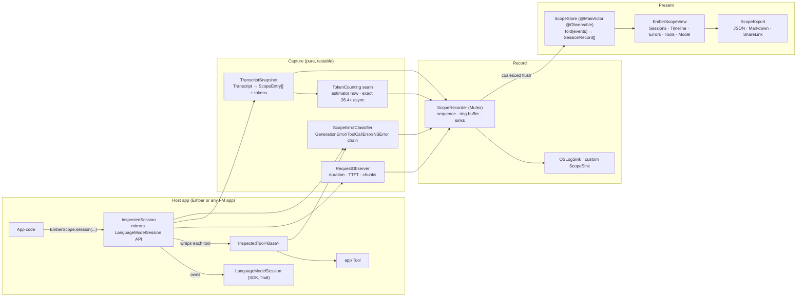

# EmberScope — an in-app inspector for Apple Foundation Models (design)

**Date:** 2026-09-02 · **Status:** design drafted in a non-interactive session — every decision below is the author's call and is flagged for user review in the last section · **Reference for ergonomics:** [netfox](https://github.com/kasketis/netfox) (`NFX.sharedInstance().start()`, shake to open, list → detail → share).
**SDK ground truth:** `FoundationModels.swiftinterface` from the macOS 26.5 SDK (Xcode 26.6). Every API named here was checked against it.

## Goal

Ship **EmberScope**: a drop-in, debug-time inspector for apps built on Apple's Foundation Models framework — "netfox for `LanguageModelSession`". Three lines to adopt, zero configuration, and an in-app SwiftUI console that shows, for every session the app creates:

- the **context window** exactly as the model sees it — instructions, tool definitions, prompts, responses, tool calls and outputs — with per-entry token cost (estimated live, exact on 26.4+) against `contextSize`, and the remaining headroom;
- every **request** (`respond` / `streamResponse`): prompt, `GenerationOptions`, guided-generation schema name, duration, time-to-first-token, chunk count, final output;
- every **tool call**: name, JSON arguments, output, duration, failures;
- every **error**, classified (context overflow, guardrail, refusal, rate-limit, concurrent requests, decoding, transient on-device generation failure, tool failure, cancellation) with Apple's `debugDescription`, `recoverySuggestion`, the underlying `NSError` chain, and a retryable flag;
- **model status**: availability, `contextSize`, exact-token-count support, supported-language count, OS;
- app **notes** (e.g. Ember's "retrieved 2 memories", "compacted context").

Ember becomes the first host and the showcase. Every hidden utility call Ember makes (title, structured summary, fact extraction) becomes visible next to the chat session.

## Why

Foundation Models traffic is invisible: there is no network to sniff (the model is in-process), `GenerationError` payloads are opaque one-liners, the 4,096-token window is the dominant failure mode, and multi-call features (RAG, compaction, titling) fan out into sessions nobody can see. Ember already proves the value of a Context inspector — but it is wired into Ember's own engine. Extracting the idea into a library that wraps the framework itself makes it reusable by any app, and makes Ember's own debugging complete (its inspector today shows the chat transcript, not the utility sessions, request timings, tool-call durations, or raw errors).

## Decisions (author's calls — override welcome)

| Decision | Choice | Why |
|---|---|---|
| Name | **EmberScope** (module and facade) | Self-explanatory ("scope" = inspection instrument), extends the Ember brand, no known collision. Renaming is a one-module change. |
| Packaging | New Tuist framework target `EmberScope` + `EmberScopeTests` in this repo, laid out as an SPM package (`Targets/EmberScope/{Sources,Tests,README.md}`); the `Package.swift` for extraction lives in the README, **not** in the repo | Consistent with the repo's build; the directory is extractable to its own repo unchanged. Tuist treats any nested `Package.swift` as a project manifest, so it cannot be checked in. |
| Dependency direction | `EmberScope` depends only on `FoundationModels`, `SwiftUI`, `os`, `Synchronization`. `FoundationChatKit` and `Ember` depend on `EmberScope`. | The library must be host-agnostic. Ember's provider is the natural integration point. |
| Interception | **Wrappers**: `InspectedSession` (owns a `LanguageModelSession`, mirrors its API) and `InspectedTool<Base: Tool>` (forwards `Tool`). Factory `EmberScope.session(...)` and sugar `.inspected()`. | `LanguageModelSession` is `final` and Swift has no swizzling; a mirror-API wrapper is the only faithful, safe hook. Tools passed to the factory are wrapped automatically. |
| Recording | Lock-protected `ScopeRecorder` (`Mutex`, monotonic sequence numbers, ring buffer of events, pluggable sinks) feeding a `@MainActor @Observable ScopeStore` that folds events into session records | Synchronous, ordered, testable without async; the UI observes the store. |
| Storage | **In-memory only.** Export is an explicit user action. | Privacy-first: prompts are user data. No disk, ever, unless the developer shares an export. |
| Default enablement | Enabled when the library is compiled with `DEBUG`, disabled otherwise; hosts are told to also wrap `start()` in `#if DEBUG` (netfox guidance). When disabled every wrapper records nothing and allocates no per-request state. | Shippable without fear; still opt-in-able for internal builds via `ScopeConfiguration(isEnabled: true)`. |
| Logging | `OSLogSink` on by default, **metadata only** (lengths, counts, kinds, error categories); content interpolation is `.private` and off unless `logContent = true` | Matches CONTRIBUTING's privacy rules while still giving Console.app a timeline. |
| UI | SwiftUI only, iOS 26 / macOS 26 (same floor as Foundation Models). Sheet presentation by default; shake on iOS, `⌘⇧E` via `EmberScopeCommands` on macOS/iPadOS; `EmberScopeView` exposed for custom placement | No legacy UIKit; Liquid Glass comes for free. |
| Ember integration depth | Chat + utility sessions go through the factory; engine records three notes (retrieval, compaction, retry); app gets shake/sheet on iOS and a `Window` + Debug menu on macOS; toolbar button in `ChatScene` under `#if DEBUG` | Complete picture of one turn without touching Ember's existing inspector. |
| Out of scope | Disk persistence, remote/network anything, reading unified logs, UIKit API, Objective-C, CocoaPods, profiling beyond durations, Apple Feedback Assistant integration (stretch only) | YAGNI; keep the first release small and correct. |

## Adoption — the netfox test

```swift
import EmberScope

// 1. At launch (DEBUG only)
#if DEBUG
EmberScope.start()                       // snapshots model status, starts recording, installs the OSLog sink
#endif

// 2. Create sessions through the factory — same API as LanguageModelSession
let session = EmberScope.session(tools: [WeatherTool()],
                                 instructions: "You are a concise assistant.",
                                 label: "chat")
let reply = try await session.respond(to: "Weather in Lisbon?")          // LanguageModelSession.Response<String>
for try await snapshot in session.streamResponse(to: "…") { … }          // same Snapshot type
// …or wrap a session you already have:
let wrapped = LanguageModelSession(instructions: "…").inspected(label: "title")

// 3. Show it
ContentView().emberScope()               // shake (iOS) opens the inspector; EmberScope.present() anywhere
WindowGroup { … }.commands { EmberScopeCommands() }   // macOS / iPadOS: Debug ▸ Ember Scope  ⌘⇧E
```

Wrapping an existing session still shows requests, errors and the transcript (tool calls appear from the transcript); only the **factory** gives live tool-call timing, because tools are bound inside the session at construction.

## Architecture



Four layers, each independently testable: **Capture** (wrappers + pure observers), **Record** (ordered event log), **Present** (fold + SwiftUI), **Export**.

## Components

### 1. `EmberScope` facade

```swift
public enum EmberScope {
    public static let recorder: ScopeRecorder                       // Sendable, lock-protected
    @MainActor public static let store: ScopeStore                  // observable projection
    public static var configuration: ScopeConfiguration { get }     // read from recorder
    public static var isRecording: Bool { get }

    public static func start(configuration: ScopeConfiguration = .init())   // idempotent; records .modelStatus
    public static func stop()                                                // pause recording (keeps data)
    public static func clear()                                               // drop all events/sessions

    public static func session(model: SystemLanguageModel = .default, tools: [any Tool] = [],
                               instructions: String? = nil, label: String? = nil) -> InspectedSession
    public static func session(model: SystemLanguageModel = .default, tools: [any Tool] = [],
                               instructions: Instructions?, label: String? = nil) -> InspectedSession
    public static func session(model: SystemLanguageModel = .default, tools: [any Tool] = [],
                               transcript: Transcript, label: String? = nil) -> InspectedSession
    public static func wrap(_ tools: [any Tool], sessionID: UUID? = nil) -> [any Tool]
    public static func note(_ text: String, session: UUID? = nil)
    public static func refreshModelStatus(_ model: SystemLanguageModel = .default)
    public static func addSink(_ sink: any ScopeSink)

    @MainActor public static func present()
    @MainActor public static func dismiss()
}
public extension LanguageModelSession {
    func inspected(label: String? = nil, model: SystemLanguageModel = .default, tools: [any Tool] = []) -> InspectedSession
}
public extension Tool { func inspected(sessionID: UUID? = nil) -> InspectedTool<Self> }
```

All mutable state lives in `ScopeRecorder` (Sendable) and `ScopeStore` (`@MainActor`), so the facade holds only `static let`s — Swift-6-clean even though the targets currently build in Swift 5 language mode.

### 2. `ScopeConfiguration`

```swift
public struct ScopeConfiguration: Sendable, Equatable {
    public var isEnabled: Bool            // default: true under #if DEBUG, false otherwise
    public var maxEvents: Int = 2_000     // ring buffer
    public var maxSessions: Int = 50      // oldest sessions evicted first
    public var captureContent: Bool = true    // false → text replaced by "«redacted · N chars»" at record time
    public var logToOSLog: Bool = true
    public var logContent: Bool = false       // OSLog content interpolation stays .private unless true
    public var streamProgressInterval: Duration = .milliseconds(250)   // throttle for .streamProgress events
}
```

### 3. Event model (all `Sendable`, `Codable`, `Equatable`, `Identifiable` where sensible)

```swift
public struct ScopeEvent {
    public let id: UUID; public let sequence: UInt64; public let timestamp: Date
    public let sessionID: UUID?            // nil for model status / global notes
    public let payload: Payload
    public enum Payload {
        case sessionCreated(SessionInfo)          // label, instructions text, tools [ToolInfo], contextSize, model description, restoredFromTranscript
        case prewarm
        case requestStarted(RequestStart)         // requestID, kind (.respond/.stream), prompt text, options (temperature, maximumResponseTokens, samplingDescription), responseFormat name?, includeSchemaInPrompt
        case streamProgress(RequestProgress)      // requestID, chunkCount, contentChars (throttled)
        case requestFinished(RequestEnd)          // requestID, status (.succeeded/.failed(errorID)/.cancelled), duration, timeToFirstToken?, chunkCount, output text/JSON, outputChars, appendedEntryCount
        case toolCallStarted(ToolCallStart)       // callID, requestID?, tool name, arguments JSON
        case toolCallFinished(ToolCallEnd)        // callID, duration, output text, status
        case error(ScopeErrorRecord)              // see §8; links requestID / callID
        case transcriptSnapshot(TranscriptSnapshot)   // see §7
        case tokenCountsResolved(TokenCounts)     // snapshotID, per-entry exact tokens, tools tokens
        case modelStatus(ModelStatus)             // availability, isAvailable, contextSize, supportsExactTokenCounts, supportedLanguageCount, osVersion
        case note(String)
    }
}
public struct ToolInfo { name, description, parametersJSON (JSONEncoder over GenerationSchema), includesSchemaInInstructions }
```

Options are captured as plain values: `temperature`, `maximumResponseTokens`, and `samplingDescription` (`"greedy"` when `sampling == .greedy`, `"random"` when non-nil and not greedy, `"default"` when nil — `SamplingMode` has no public cases, only `Equatable`).

### 4. `ScopeRecorder` + sinks

- `final class ScopeRecorder: Sendable` guarding `State { configuration, isRecording, nextSequence, events: Deque/ring, sinks }` with `Mutex`.
- `record(_ payload:, sessionID:)` — assigns `sequence` and `timestamp` under the lock, appends (evicting beyond `maxEvents`), applies redaction when `captureContent == false` (content fields *and* the four free-form error strings; see Privacy), forwards to sinks **outside** the lock, and schedules a coalesced `@MainActor` flush (`store.refresh()`), so hot paths never touch the main actor synchronously.
- `snapshot() -> [ScopeEvent]` (ordered), `clear()`, `setRecording(_:)`, `update(configuration:)`.
- `protocol ScopeSink: Sendable { func receive(_ event: ScopeEvent) }`. Built-in `OSLogSink` (subsystem `dev.iosunpi.emberscope`, categories `Session`, `Request`, `Tool`, `Error`, `Tokens`, `Model`; metadata-only by default).
- Disabled fast path: `isEnabled == false` → `record` returns immediately; wrappers still forward calls untouched.

### 5. `InspectedSession`, `InspectedResponseStream`, `RequestObserver`

```swift
public final class InspectedSession: Sendable {   // every stored property is Sendable; the SDK class is @unchecked Sendable
    public let id: UUID; public let label: String
    public let base: LanguageModelSession                      // escape hatch
    public var transcript: Transcript { base.transcript }
    public var isResponding: Bool { base.isResponding }

    public init(wrapping base: LanguageModelSession, model: SystemLanguageModel = .default,
                tools: [any Tool] = [], label: String? = nil, recorder: ScopeRecorder = EmberScope.recorder)
    // convenience inits mirror LanguageModelSession(model:tools:instructions:) / (…transcript:)
    // and wrap `tools` with InspectedTool(sessionID: id) before handing them to the SDK.

    public func prewarm(promptPrefix: Prompt? = nil)
    public func respond(to prompt: String, options: GenerationOptions = .init()) async throws -> LanguageModelSession.Response<String>
    public func respond(to prompt: Prompt,  options: GenerationOptions = .init()) async throws -> LanguageModelSession.Response<String>
    public func respond<Content: Generable>(to prompt: String, generating: Content.Type = Content.self,
                                            includeSchemaInPrompt: Bool = true, options: GenerationOptions = .init()) async throws -> LanguageModelSession.Response<Content>
    public func respond<Content: Generable>(to prompt: Prompt, generating: …) async throws -> LanguageModelSession.Response<Content>
    public func respond(to prompt: String, schema: GenerationSchema, includeSchemaInPrompt: Bool = true, options: …) async throws -> LanguageModelSession.Response<GeneratedContent>
    public func streamResponse(to prompt: String, options: GenerationOptions = .init()) -> InspectedResponseStream<String>
    public func streamResponse(to prompt: Prompt,  options: …) -> InspectedResponseStream<String>
    public func streamResponse<Content: Generable>(to prompt: String, generating: Content.Type = Content.self,
                                                   includeSchemaInPrompt: Bool = true, options: …) -> InspectedResponseStream<Content>
    public func logFeedbackAttachment(sentiment: LanguageModelFeedback.Sentiment?, issues: [LanguageModelFeedback.Issue] = [],
                                      desiredOutput: Transcript.Entry? = nil) -> Data   // forwarded
}
```

- Return types are the SDK's own (`Response<Content>`, `Snapshot`), so a call site changes only the type it constructs. `Prompt`-builder overloads are omitted (build the `Prompt` and pass it).
- `InspectedResponseStream<Content: Generable>: AsyncSequence` with `Element == LanguageModelSession.ResponseStream<Content>.Snapshot`; iterates the base stream, reports each snapshot to the `RequestObserver` (chunk count, `rawContent.jsonString.count` as content size, TTFT on the first), records finish/failure/cancellation when iteration ends; also `collect() async throws -> LanguageModelSession.Response<Content>`.
- `RequestObserver` (pure, `Sendable`, clock-injected): `start(...) -> RequestID`, `chunk(id, contentChars)`, `finish(id, output:, appendedEntries:)`, `fail(id, error:)`, `cancel(id)` — emits `.requestStarted / .streamProgress (throttled) / .requestFinished / .error`. All request math is unit-tested here without a model.
- After every finished or failed request, and at construction, the session records a `.transcriptSnapshot` of `base.transcript` and asks `TokenCounting` for exact counts asynchronously (§7).
- Errors: caught, classified (§8), recorded, **rethrown unchanged**. `CancellationError` → `.requestFinished(.cancelled)` with no `.error` event (the classifier still knows `.cancelled`, for the tool wrapper).
- Wrapper failures are swallowed: recording must never change the host's behavior (see *Error handling*).

### 6. `InspectedTool<Base: Tool>`

```swift
public struct InspectedTool<Base: Tool>: Tool {
    public typealias Arguments = Base.Arguments; public typealias Output = Base.Output
    public let base: Base; public let sessionID: UUID?
    public var name: String { base.name }; public var description: String { base.description }
    public var parameters: GenerationSchema { base.parameters }
    public var includesSchemaInInstructions: Bool { base.includesSchemaInInstructions }
    public func call(arguments: Arguments) async throws -> Output   // start → forward → finish/fail (rethrow)
}
```

- Arguments render as JSON when `Arguments` is `ConvertibleToGeneratedContent` (every `@Generable` type is), else `String(describing:)`. Output renders as the string itself, JSON for `ConvertibleToGeneratedContent`, else `String(describing:)`.
- `EmberScope.wrap(_ tools: [any Tool])` opens each existential into the generic wrapper (`func wrap<T: Tool>(_ t: T) -> any Tool`), preserving order and names — so `Transcript.ToolDefinition`s and token accounting are unaffected.

### 7. `TranscriptSnapshot` + `TokenCounting`

```swift
public struct TranscriptSnapshot: Sendable, Codable, Equatable, Identifiable {
    public let id: UUID; public let sessionID: UUID; public let takenAt: Date
    public let contextSize: Int
    public var entries: [ScopeEntry]                 // mirrors Transcript order
    public var toolsTokens: Int?                     // cost of the tool definitions (estimated, exact on 26.4+) — informational, already inside the instructions entry
    public var isExact: Bool                         // true once every entry has an exact count
    public var usedTokens: Int { entries.map(\.tokens).reduce(0,+) }   // tool definitions are counted inside the instructions entry; toolsTokens is informational
    public var remainingTokens: Int { max(0, contextSize - usedTokens) }
    public func tokens(by kind: ScopeEntry.Kind) -> Int
}
public struct ScopeEntry: Sendable, Codable, Equatable, Identifiable {
    public enum Kind: String, Codable { case instructions, prompt, response, toolCalls, toolOutput }
    public let id: String                 // Transcript.Entry.id (stable across snapshots)
    public let kind: Kind
    public let text: String               // segments joined; tool calls rendered "name(argsJSON)"
    public let structuredJSON: String?    // for .structure segments / tool arguments
    public let toolName: String?          // toolOutput / single tool call
    public let toolDefinitions: [ToolDefinitionInfo]   // instructions only: name + description (schema is not public on Transcript.ToolDefinition)
    public let options: RequestOptions?   // prompt only (temperature, maximumResponseTokens, samplingDescription)
    public let responseFormat: String?    // prompt only: guided-generation type name
    public var tokens: Int; public var isExact: Bool
}
```

- `TranscriptSnapshot.make(from: Transcript, sessionID:, contextSize:, estimator:)` is pure and covers all five `Transcript.Entry` cases and both `Segment` cases; `@unknown default` → a `.response` entry with the debug description (never crash on a new case).
- `ScopeTokenEstimator` (own copy of Ember's heuristic: ⌈non-CJK scalars / 3.5⌉ + 1 per CJK scalar) gives immediate numbers; `isExact = false`.
- `protocol TokenCounting: Sendable { var supportsExactCounts: Bool; func count(entry: Transcript.Entry) async throws -> Int; func count(tools: [any Tool]) async throws -> Int }`. `SystemTokenCounter` adapts `SystemLanguageModel.tokenCount(for:)` behind `#available(iOS 26.4, macOS 26.4, *)`; a `MockTokenCounter` drives tests. Resolution runs in a detached low-priority task per snapshot; on success it records `.tokenCountsResolved`, on failure it logs and leaves estimates in place.
- Ember-specific concepts (its `⟦memory⟧` block) are **not** special-cased: the library shows the prompt exactly as the model received it, which is the point.

### 8. `ScopeErrorClassifier`

```swift
public struct ScopeErrorRecord: Sendable, Codable, Equatable, Identifiable {
    public enum Kind: String, Codable, CaseIterable {
        case exceededContextWindowSize, assetsUnavailable, guardrailViolation, unsupportedGuide,
             unsupportedLanguageOrLocale, decodingFailure, rateLimited, concurrentRequests, refusal,
             toolCallFailed, transientGeneration, cancelled, unknown
    }
    public let id: UUID; public let kind: Kind; public let requestID: UUID?; public let toolCallID: UUID?
    public let toolName: String?
    public let message: String            // errorDescription ?? String(describing:)
    public let debugDescription: String?  // GenerationError.Context.debugDescription
    public let recoverySuggestion: String?; public let failureReason: String?
    public let underlyingChain: [String]  // "domain(code)" for NSUnderlyingErrorKey / NSMultipleUnderlyingErrorsKey, recursively
    public let isRetryable: Bool          // rateLimited, concurrentRequests, transientGeneration
}
```

Pure `classify(_ error: any Error) -> ScopeErrorRecord`: switches over every `LanguageModelSession.GenerationError` case (all nine, `@unknown default` → `.unknown`), `LanguageModelSession.ToolCallError` (tool name + underlying error), `CancellationError`, and the `com.apple.tokengeneration` NSError-chain heuristic that Ember already relies on (walks `NSUnderlyingErrorKey` and `NSMultipleUnderlyingErrorsKey`). Tested with synthetic errors — `GenerationError.Context(debugDescription:)`, `Refusal(transcriptEntries:)`, and `ToolCallError(tool:underlyingError:)` all have public initializers.

### 9. `ScopeStore` (fold)

`@MainActor @Observable public final class ScopeStore` holding `sessions: [SessionRecord]` (newest first), `timeline: [ScopeEvent]`, `errors: [ScopeErrorRecord]`, `tools: [ToolRegistryEntry]` (name → description, schema JSON, call count, mean duration, failures), `modelStatus: ModelStatus?`, `isRecording`, `isPresented`. `refresh()` pulls `recorder.snapshot()` and runs the pure `static func fold(_ events: [ScopeEvent]) -> Projection` so all grouping logic is unit-tested with fixtures. Requests fold `requestStarted + streamProgress + requestFinished + error` into one `RequestRecord`; tool calls likewise; the latest `transcriptSnapshot` per session is kept, with `tokenCountsResolved` applied on top. A `ScopeStore.preview` fixture powers SwiftUI previews and the README screenshots.

### 10. UI (`EmberScopeView` and screens)

Information architecture (single `NavigationStack`, tabs as a segmented picker on compact widths, sidebar list on regular widths):

- **Header card:** model status — availability badge (green/orange/red), `contextSize`, "exact token counts: yes/no (needs 26.4+)", supported languages, OS; record/pause toggle, Clear, Export.
- **Sessions:** row = label, created time, request count, error count, mini context bar. Detail:
  - *Context window* — stacked bar by entry kind (instructions / tools / prompts / responses / tool calls+outputs) vs `contextSize`, "used / size · remaining", "estimated" or "exact" badge, 4-tier color (reuses Ember's thresholds 50/75/90 %).
  - *Instructions & tools* — full instructions text (selectable), each tool with description, `includesSchemaInInstructions`, schema JSON in a monospaced disclosure.
  - *Transcript* — one row per `ScopeEntry`: kind badge (colors: instructions purple, prompt blue, response green, tools orange, errors red), text preview, tokens; tap → full text / JSON, copy.
  - *Requests* — kind icon, prompt preview, status, duration, TTFT, chunks, response format; tap → prompt, options, output, error, the appended transcript entries.
  - *Tool calls* — name, args, output, duration, status.
  - *Notes* — app annotations in order.
- **Timeline:** every event chronologically across sessions with kind icons, filter chips (Requests · Tools · Errors · Snapshots · Notes) and text search.
- **Errors:** grouped by kind with counts; row → detail (message, debugDescription, recovery suggestion, underlying chain, retryable, linked request/tool).
- **Tools:** registry across sessions (see §9), with schema JSON.
- **Export:** `ShareLink` for JSON (`ScopeArchive`) and Markdown report; Copy buttons on every detail screen.

Design notes: native `List`/`Section`/`Gauge`/SF Symbols, monospaced digits for numbers, `.textSelection(.enabled)` everywhere content is shown, redaction placeholder rendered in italics. Views take the store or plain records as inputs so previews work from `ScopeStore.preview`. Follow `swiftui-expert-skill`; keep it restrained.

**Shipped as (deviation, accepted in the final review):** the console is a four-`Tab` `TabView` — Sessions, Timeline, Errors, Tools — each tab a `NavigationStack`, rather than a single `NavigationStack` with a segmented picker / sidebar and a header card. Consequences: the model-status card lives inside the Sessions tab instead of a shared header, and the record / clear / export toolbar is applied to **each tab's root** (`.scopeToolbar(store)`), so it is present on every tab but not on pushed detail screens. Everything else in this section shipped as written.

### 11. Presentation triggers

- `View.emberScope()` — attaches `.sheet(isPresented:)` bound to `EmberScope.store.isPresented`, and on iOS subscribes to `Notification.Name.emberScopeShake`, posted by a `UIWindow` extension overriding `motionEnded(_:with:)` (the standard SwiftUI shake hook; compiled only when `canImport(UIKit)` **and** `DEBUG`). Attach it exactly once per scene. Presentation is gated on `EmberScope.isEnabled` only — never on `isRecording` — so a **paused** inspector still opens; the guard lives inside `present()`.
- `EmberScopeCommands: Commands` — "Debug ▸ Ember Scope" with `⌘⇧E`, calling `EmberScope.present()`.
- `EmberScope.present()/dismiss()` for buttons and gestures the host prefers.
- `EmberScopeView()` public for custom placement (Ember's macOS `Window`).

### 12. Export

`ScopeArchive: Codable` — `exportedAt`, `modelStatus`, `sessions` (records incl. requests, tool calls, errors, latest snapshot), `notes`. `ScopeExport.json(_:) -> Data` (pretty, sorted keys) and `ScopeExport.markdown(_:) -> String` (per session: header, context-window table, transcript, requests, tool calls, errors). Honors redaction. Delivered through `ShareLink` with `Transferable` (`.json` / `.plainText`).

### 13. Ember integration

- `FoundationModelProvider.makeSession(...)` builds `EmberScope.session(tools:instructions:label: "chat")` / `…transcript:` and `FoundationModelSession` stores the `InspectedSession` (its `map(_:)` error mapping is unchanged — EmberScope records the raw error before Ember maps it).
- Utility sessions use the factory with labels `"title"`, `"summary"`, `"summary.structured"`, `"extract"` (`ConversationTitler`, `MemoryExtractor`, `FoundationModelProvider.summarize/summarizeStructured`).
- `ConversationEngine` records notes: retrieval (`"retrieved N memories → prompt augmented (M chars)"` / `"no memory hits"`), compaction (both proactive and overflow paths, with entry counts), and the transient-error retry.
- `EmberApp`: `#if DEBUG EmberScope.start() #endif`; `RootView` gets `.emberScope()`; macOS adds `Window("Ember Scope", id: "emberscope") { EmberScopeView() }` + `EmberScopeCommands()`; `ChatScene` toolbar gets a `#if DEBUG` scope button (`"waveform.path.ecg"`) calling `EmberScope.present()` (iOS) / `openWindow` (macOS).
- `Project.swift`: `EmberScope` framework + tests targets; `FoundationChatKit` and `Ember` depend on `.target(name: "EmberScope")`.
- Ember's own Context/Tokens inspector stays untouched (it is product UI; EmberScope is developer tooling).

## Data flow — one streamed turn in Ember

1. `ChatCoordinator.makeEngine` → `FoundationModelProvider.makeSession` → `EmberScope.session(tools: [5 tools], instructions:, label: "chat")`: tools wrapped, SDK session created, `.sessionCreated` + `.transcriptSnapshot` (instructions + tool definitions, estimated tokens) recorded; exact counts resolve asynchronously → `.tokenCountsResolved`.
2. Engine retrieves memory → `EmberScope.note("retrieved 2 memories → prompt augmented (412 chars)")`.
3. `session.streamResponse(to:)` → `.requestStarted` (prompt incl. `⟦memory⟧` block, options); snapshots flow to the engine unchanged while the observer counts chunks and TTFT; the model calls `calculator` → `InspectedTool.call` records `.toolCallStarted/.toolCallFinished` (JSON args, output, duration).
4. Stream ends → `.requestFinished` (duration, chunks, output chars, appended entries) + fresh `.transcriptSnapshot`; or throws → `.error` (classified) + `.requestFinished(.failed)`, then the error is rethrown and Ember maps it as before.
5. Post-turn, `ConversationTitler`/`MemoryExtractor` create `"title"`/`"extract"` sessions — visible as separate sessions with their guided-generation format names and greedy options.
6. The user shakes the phone (or presses `⌘⇧E`) → `EmberScopeView` shows the chat session's context bar at, say, 1,812 / 4,096 exact, four sessions in the list, one orange tool call, zero errors.

## Error handling (of the inspector itself)

The inspector must never change host behavior: every recording call is wrapped so a failure inside EmberScope (encoding a schema, counting tokens, a sink throwing) is caught, logged at `.error` to OSLog, and dropped. Host errors are always rethrown as-is. When disabled, wrappers forward directly with no recording. Ring-buffer eviction is silent (the UI shows "older events evicted").

## Concurrency model

`ScopeRecorder` is the only shared mutable state on the hot path; it is `Sendable` and lock-protected (`Synchronization.Mutex`). Sinks are called outside the lock. `ScopeStore` is `@MainActor @Observable` and refreshed by a coalesced `Task { @MainActor in … }`. `InspectedSession` is `Sendable` (only immutable Sendable stored properties) and holds no mutable state of its own; async methods are nonisolated and run on the caller's context. Exact token counting runs in a detached `.utility` task and records a follow-up event rather than mutating shared records. Code is written to be Swift-6-strict-clean (Sendable payloads, no static vars) even though the targets build in Swift 5 language mode today.

## Privacy

In-memory only; nothing persisted. Content capture can be disabled (`captureContent = false`) for a metadata-only inspector: prompts, outputs, tool arguments, transcript text **and the free-form error strings** (`message`, `debugDescription`, `recoverySuggestion`, `failureReason` — Apple's and tool authors' messages can quote prompt text) are replaced by length placeholders; error `kind`, `isRetryable`, the underlying-error chain and all IDs stay. OSLog gets metadata by default; content interpolation is `.private` and opt-in. Export is user-initiated through the system share sheet. The library adds no entitlements and never touches the network — it lives inside Ember's zero-network boundary.

## Testing

TDD, Swift Testing, `EmberScopeTests` on macOS without Apple Intelligence:

- **Recorder:** ordering (sequence), ring-buffer eviction, disabled no-op, sinks receive, clear, redaction at record time.
- **Store fold:** requests/tool calls/errors pairing, latest snapshot + exact counts applied, tool registry stats, session eviction — from event fixtures.
- **TranscriptSnapshot:** synthetic `Transcript(entries:)` covering all five entry kinds, both segment kinds, tool definitions, options and response format; totals by kind; remaining vs `contextSize`.
- **Estimator:** Latin, CJK, empty.
- **Error classifier:** all nine `GenerationError` cases, `ToolCallError`, `CancellationError`, `com.apple.tokengeneration` chains (single and multiple underlying keys), unknown; retryable flags; user-facing strings.
- **InspectedTool:** forwards metadata; records JSON args + output + duration; failure recorded and rethrown; `wrap(_:)` preserves order/names.
- **RequestObserver:** start→chunks→finish math (TTFT, duration, throttled progress), fail, cancel.
- **Export:** JSON round-trip; Markdown contains the expected sections; redaction honored.
- **InspectedSession construction:** records `.sessionCreated` (instructions text, tool names, contextSize) and an initial snapshot. Runs only if constructing a `LanguageModelSession` in the test host is safe without the model — Task 0 probes this; otherwise these tests are gated on `SystemLanguageModel.default.isAvailable`.
- **UI:** no snapshot tests (none exist in the repo); build gate on macOS + iOS Simulator, plus `#Preview`s on every screen from `ScopeStore.preview`.
- **Ember:** existing 258 tests stay green; wrapped tools keep names (already covered by `Toolbox` tests); manual end-to-end on the simulator/Mac with screenshots for the README (best effort — depends on Apple Intelligence being enabled on this machine).

## Packaging & shipping

```
Targets/EmberScope/
  (no Package.swift in-repo: Tuist would treat it as a project manifest — the README carries it verbatim for extraction)
  README.md                     install, screenshots, API tour, privacy notes, FAQ
  Sources/EmberScope/
    Core/     EmberScope.swift · ScopeConfiguration · ScopeEvent(+payloads) · ScopeRecorder · ScopeSink/OSLogSink
              ScopeTokenEstimator · TokenCounting · TranscriptSnapshot · ScopeErrorClassifier
              RequestObserver · InspectedSession · InspectedResponseStream · InspectedTool · ScopeStore · ScopeExport
    UI/       EmberScopeView · ModelStatusCard · SessionListView · SessionDetailView · ContextWindowBar
              TranscriptEntryRow/Detail · RequestRow/Detail · ToolCallRow · TimelineView · ErrorsView · ToolsView
              Presentation (emberScope modifier, shake, EmberScopeCommands) · PreviewFixtures
  Tests/EmberScopeTests/        one file per Core type + fixtures
```

Tuist targets `EmberScope` (framework, bundle id `dev.iosunpi.emberscope`) and `EmberScopeTests`; the folder keeps the SPM `Sources/`/`Tests/` shape so it can be published as its own package later by adding the manifest printed in its README. The root README gains an "EmberScope" section; `CLAUDE.md`, `docs/ARCHITECTURE.md` and the diagrams index are updated (Mermaid source inline; no new PNG pipeline run).

## Out of scope

Disk persistence, history across launches, any network capability, reading unified logs, Objective-C/UIKit API, CocoaPods, Instruments-style profiling, per-token timing, editing/replaying prompts, Apple Feedback Assistant integration (the `logFeedbackAttachment` forward exists; a UI for it is a stretch goal).

## Risks / verify-then-use

1. **`LanguageModelSession` construction in unit tests** without Apple Intelligence — probe in Task 0; gate wrapper-construction tests if it traps or hangs.
2. **`ResponseStream` single-consumption** — the wrapper must not both iterate and `collect()`; `collect()` calls the base's `collect()` directly.
3. **Exact counting cost** — `tokenCount(for:)` per entry may take tens of milliseconds each; run at `.utility` priority, one snapshot at a time, skip when a newer snapshot exists.
4. **Shake hook** overrides `UIWindow.motionEnded` for the whole app — acceptable for a debug tool, documented; inactive until `start()`.
5. **`ToolDefinition.parameters` is not public** on the transcript — schema JSON comes from the `Tool` instances passed to the factory; wrapped-existing sessions show names/descriptions only.
6. **Swift 5 language mode** in this repo hides strict-concurrency errors a Swift-6-mode host would see — the library target sets `SWIFT_STRICT_CONCURRENCY = complete` so it stays adoptable by strict hosts.

## Flagged decisions for the user

1. **Name:** EmberScope — happy to rename (one module + README).
2. **Where it lives:** in-repo Tuist target laid out as an SPM package; extraction to its own repository is a follow-up.
3. **Debug-only default** with an explicit override, mirroring netfox.
4. **Wrapper (not swizzle) interception** — the only sound option with a `final` SDK class; call sites swap `LanguageModelSession(` for `EmberScope.session(`.
5. **FoundationChatKit depends on EmberScope** (three note call sites + the provider). Alternative: keep notes out and integrate only in the provider.
